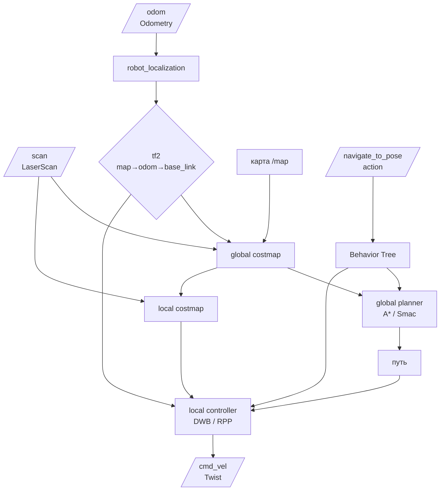

# Демонстрация-схема: Архитектурный мост к Nav2

## Цель

Показать архитектуру Nav2: (1) схема pipeline — как `/scan`, `/odom`, `/tf` и карта превращаются в `/cmd_vel` через planner, controller, costmaps; (2) action `/navigate_to_pose` — 7 строк Python для отправки робота в точку с обратной связью; (3) фрагмент `nav2_params.yaml` — planner_plugins, controller_frequency — всё настраивается в YAML, не в коде. Показать, как topic, action, tf2, parameters собираются в готовый навигационный стек.

## Подготовка до лекции

Открыт план Б: Mermaid-схема Nav2 pipeline, фрагмент YAML-конфига `nav2_params.yaml`, фрагмент кода action client. Если контейнер робота работает — запустить Nav2 и показать `rqt_graph` и action-клиент.

## Контекст для студентов

> «Nav2 — навигационный стек. Он использует все, что мы изучили: topics (`/scan`, `/odom`), actions (`/navigate_to_pose`), tf2 (`map → odom → base_link`), parameters (YAML-конфиг из 200 строк). Это не магия — это композиция базовых механизмов.»

## Что показать

### 1. Схема Nav2 pipeline



### 2. Входные данные (что Nav2 потребляет)

| Данные | Тип | Как проверить |
| --- | --- | --- |
| `/scan` | `sensor_msgs/LaserScan` | `ros2 topic echo /scan` |
| `/odom` | `nav_msgs/Odometry` | `ros2 topic echo /odom` |
| `/tf` | transforms | `ros2 run tf2_tools view_frames` |
| Карта | `nav_msgs/OccupancyGrid` | из SLAM или файла |

### 3. API: action `/navigate_to_pose`

```python
from nav2_msgs.action import NavigateToPose   # .action: PoseStamped goal → Geometry_msgs/PoseStamped

# Создаём goal (цель) — точку на карте в системе координат 'map'
goal = NavigateToPose.Goal()
goal.pose.header.frame_id = 'map'   # Система координат цели — карта робота
goal.pose.pose.position.x = 2.0     # Координата X цели, метры
goal.pose.pose.position.y = 1.5     # Координата Y цели

# Асинхронная отправка goal — не блокирует узел
# feedback_callback будет получать прогресс (оставшееся расстояние)
self.client.send_goal_async(goal, feedback_callback=self.feedback)

def feedback(self, msg):
    """Вызывается каждый раз, когда Nav2 присылает прогресс движения к цели"""
    remaining = msg.feedback.distance_remaining  # Оставшееся расстояние, метры
    self.get_logger().info(f'Distance to goal: {remaining:.2f} m')
```

### 4. Параметры: фрагмент `nav2_params.yaml`

```yaml
planner_server:
  ros__parameters:
    expected_planner_frequency: 1.0
    planner_plugins: ["GridBased"]
    GridBased:
      plugin: "nav2_smac_planner/SmacPlanner2D"

controller_server:
  ros__parameters:
    controller_frequency: 20.0
    controller_plugins: ["FollowPath"]
    FollowPath:
      plugin: "dwb_core::DWBLocalPlanner"
```

**Что сказать**: «Здесь десятки параметров. Частота планирования, алгоритм, размеры карт стоимости. Все настраивается в YAML — не в коде.»

## Что сказать (ключевые фразы)

- «Nav2 — не отдельная программа. Это набор ROS2-узлов, которые общаются через стандартные интерфейсы: topic, action, tf2, parameters.»
- «Action `/navigate_to_pose` — главный интерфейс. Вы отправляете goal с координатами в frame `map`, Nav2 сам строит маршрут и управляет скоростью.»
- «Без tf2 навигация невозможна. Лидар видит в `lidar_link`, costmap должна быть в `map`. tf2 связывает их автоматически.»
- «`ros2 topic echo /cmd_vel` покажет, какие команды Nav2 отправляет базе в реальном времени.»

## Ожидаемый результат

Студент понимает:
- Nav2 потребляет `/scan`, `/odom`, `/tf`, карту и выдает `/cmd_vel`
- Главный интерфейс — action `/navigate_to_pose`
- Все параметры в YAML, не в коде
- Это композиция базовых механизмов ROS2

## План Б (основной)

Если робот не запускается:
1. Показать схему Nav2 pipeline (выше).
2. Показать фрагмент кода action client (выше) — 7 строк Python.
3. Показать фрагмент YAML-конфига (выше) — как настраиваются planner и controller.
4. Показать скриншот `rqt_graph` с активными Nav2-узлами.

## Ссылки на материалы курса

- [Nav2 bridge — статья базы знаний](../2_knowledge/nav2_bridge.md)
- [Actions](../2_knowledge/actions.md) — `/navigate_to_pose` — это action
- [tf2](../2_knowledge/tf2.md) — дерево координат для навигации
- [Parameters](../2_knowledge/parameters.md) — YAML-конфиг Nav2

## Связь с роботом

В TIAGo:
- Конфиг: `pmb2_navigation/pmb2_2dnav/config/` — `nav2_params.yaml`
- Launch: `navigation_public_sim.launch.py`
- Карты: `pal_maps/` — 15 карт квартир и офисов
- Nodes: `planner_server`, `controller_server`, `bt_navigator`, `slam_toolbox`, `amcl`