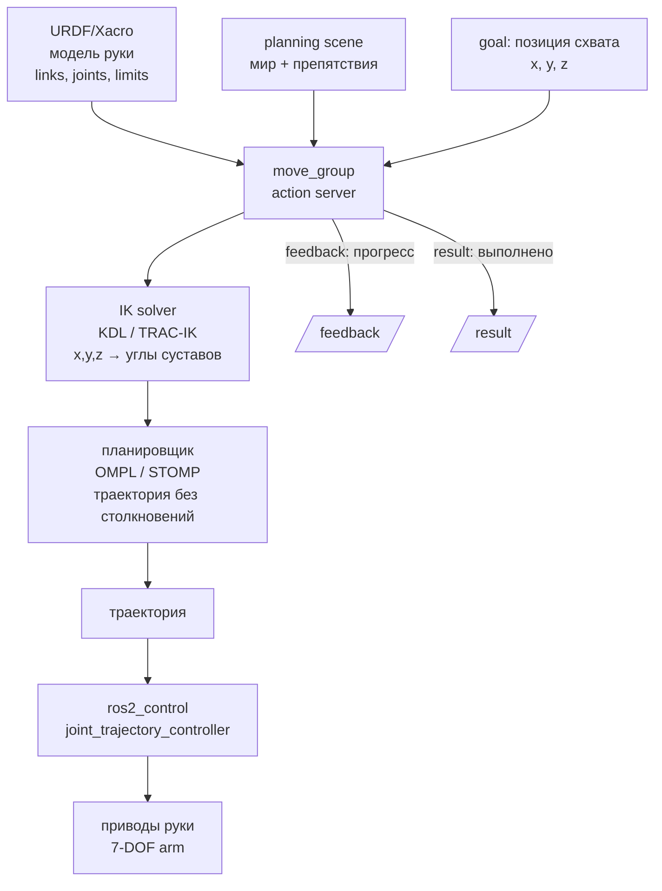

# Демонстрация-схема: Архитектурный мост к MoveIt2

## Цель

Показать архитектуру MoveIt2: (1) схема pipeline — URDF → IK solver → Planner (OMPL) → trajectory → ros2_control; (2) как MoveIt2 использует ROS2-механизмы: action (move_group — action server), tf2 (base_link → arm_1_link → ... → gripper_link), URDF (модель руки), parameters (kinematics.yaml, ompl_planning.yaml), ros2_control (joint_trajectory_controller); (3) Python API — 5 строк для перемещения схвата в точку (x,y,z) через `MoveGroupInterface`.

## Контекст для студентов

> «MoveIt2 — стек для планирования движений манипулятора. Рука не может просто "поехать в точку" — нужен план без столкновений, учет ограничений суставов и плавная траектория. Увидим, как это архитектурно устроено и как MoveIt2 использует ROS2-механизмы.»

## Что показать

### 1. Схема MoveIt2 pipeline



### 2. MoveIt2 и механизмы ROS2

| Механизм | Где в MoveIt2 |
| --- | --- |
| **Action** | `move_group` — action server. Succeed/abort = доехала/не доехала. |
| **tf2** | Цепочка: `base_link → arm_1_link → ... → arm_7_link → gripper_link` |
| **URDF** | Описание всех joints, limits, geometry |
| **Parameters** | `kinematics.yaml`, `ompl_planning.yaml` |
| **ros2_control** | Выполнение траектории |

### 3. Python API — минимальный пример

```python
from moveit_motion.planning_interface import MoveGroupInterface  # MoveIt2 Python API

class ArmController(Node):
    def __init__(self):
        super().__init__('arm_controller')
        # MoveGroupInterface — интерфейс к move_group (action server MoveIt2)
        # 'arm' — имя группы суставов (определено в SRDF)
        # 'robot_description' — параметр с URDF-моделью робота
        self.move_group = MoveGroupInterface(self, 'arm', 'robot_description')

    def reach_point(self, x, y, z):
        """Планирует и выполняет движение схвата в точку (x, y, z)"""
        goal = PoseStamped()
        goal.header.frame_id = 'base_link'   # Координаты цели относительно базы робота
        goal.pose.position.x = x
        goal.pose.position.y = y
        goal.pose.position.z = z
        self.move_group.set_pose_target(goal)  # IK: x,y,z → углы 7 суставов
        success = self.move_group.move()        # Планирование + выполнение
        return success  # True — рука доехала, False — не удалось (вне рабочей зоны / коллизия)
```

**Что сказать**: «5 строк Python — и рука планирует траекторию и выполняет. Все остальное (IK, collision checking, smoothing) делает MoveIt2. Вы только задаете цель.»

### 4. Конфиги MoveIt2

```
tiago_moveit_config/
├── config/
│   ├── srdf/                  ← группа суставов, коллизии
│   ├── kinematics.yaml        ← IK-солвер (KDL / TRAC-IK)
│   ├── ompl_planning.yaml     ← планировщик (OMPL)
│   └── moveit2_controllers.yaml ← связь с ros2_control
├── launch/
│   └── move_group.launch.py
└── ...
```

## Что сказать (ключевые фразы)

- «MoveIt2 — это не один узел. Это action server `move_group` + планировщик + IK-солвер + ros2_control. Все вместе — через стандартные ROS2-механизмы.»
- «Обратная кинематика (IK) превращает "схват в точку (x,y,z)" в углы 7 суставов. Это сложная математика — MoveIt2 делает ее за вас.»
- «MoveIt2 использует action — точно так же, как Nav2. Вы отправляете goal и получаете feedback и result.»
- «Если рука не может дотянуться до цели — MoveIt2 вернет `move() = False`. Вы обрабатываете это в коде.»

## Ожидаемый результат

Студент понимает:
- MoveIt2 pipeline: URDF → IK → planner → trajectory → ros2_control
- move_group — action server
- All joints, limits, kinematics — в YAML-конфигах
- 5 строк Python API для перемещения схвата

## План Б (основной)

Если MoveIt2 не запущен:
1. Показать схему pipeline (выше).
2. Показать фрагмент кода Python API (выше).
3. Показать структуру конфигов `tiago_moveit_config/`.
4. Показать скриншот rviz2 с MoveIt2-планированием.

## Ссылки на материалы курса

- [MoveIt2 bridge — статья базы знаний](../2_knowledge/moveit2_bridge.md)
- [URDF/Xacro](../2_knowledge/urdf_xacro.md) — модель руки
- [ros2_control](../2_knowledge/ros2_control.md) — выполнение траекторий
- [Actions](../2_knowledge/actions.md) — move_group — action server

## Связь с роботом

В TIAGo:
- Конфиг: `tiago_moveit_config/`
- Манипулятор: 7-DOF arm (arm_1..arm_7) + gripper
- Планировщик: OMPL, IK: KDL
- Связь с ros2_control: `moveit2_controllers.yaml`
- Launch: `move_group.launch.py`