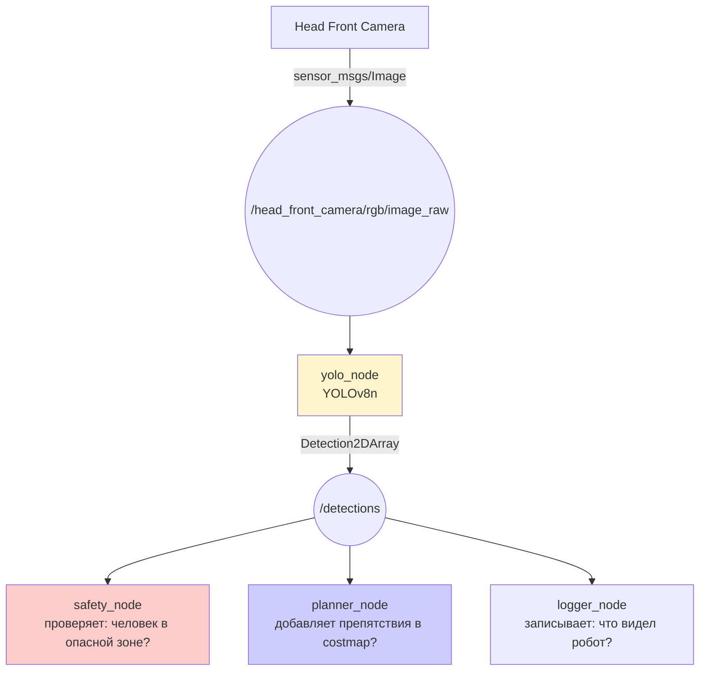

# Демонстрация-схема: Архитектурный мост к YOLO

## Цель

Показать архитектуру YOLO-узла в ROS2: (1) подписка на `/camera/image_raw` (`sensor_msgs/Image`), (2) детекция YOLO (модель → bounding boxes), (3) публикация результатов в `/detections` (`Detection2DArray`). Ключевой акцент — **граница perception/control**: YOLO только публикует факты, не управляет движением. Perception и control — разные зоны ответственности с жёсткой границей.

## Контекст для студентов

> «Робот должен видеть: где человек, где препятствие, где искомый объект. YOLO — это зрение робота. Но YOLO только сообщает факты, а не принимает решений. Увидим, как это архитектурно устроено.»

## Что показать

### Архитектурная схема



### Точка восприятия vs точка принятия решений

На слайде — два блока с жирной границей:

| Perception (публикует факты) | Control (принимает решения) |
| --- | --- |
| YOLO: «вижу человека, conf=0.95» | Safety: «стоп — человек в опасной зоне» |
| YOLO: «вижу чашку, conf=0.87» | Planner: «цель для манипулятора» |
| YOLO: «вижу дым, conf=0.72» | Safety: «аварийная остановка» |

### Фрагмент кода YOLO-узла

```python
# yolo_node.py — упрощенный фрагмент
class YoloNode(Node):
    def __init__(self):
        super().__init__('yolo_node')
        # Подписка на видеопоток камеры — каждое изображение → callback
        self.sub = self.create_subscription(
            Image, '/camera/image_raw', self.callback, 10)
        # Publisher для результатов детекции — другие узлы подписываются на /detections
        self.pub = self.create_publisher(
            Detection2DArray, '/detections', 10)

    def callback(self, msg):
        # Конвертация ROS2 Image → OpenCV (cv::Mat) для обработки моделью
        cv_img = bridge.imgmsg_to_cv2(msg)
        # Запуск YOLO: модель возвращает bounding boxes, confidence, class_ids
        results = model(cv_img)
        # Конвертация результатов детекции в ROS2-сообщение Detection2DArray
        det_msg = self._to_detection_msg(results, msg.header)
        # Публикация — всё, YOLO закончил. Дальше safety_node решает, что делать
        self.pub.publish(det_msg)
        # ⛔ ВСЕ. YOLO ничего больше не делает.
        # Не вызывает /navigate_to_pose, не отправляет /cmd_vel, не управляет приводами
```

### Граница безопасности — явный акцент

> «Обратите внимание: YOLO не вызывает `/navigate_to_pose`, не отправляет `/cmd_vel`, не управляет приводами. Он только публикует факты в `/detections`. Это архитектурное правило: perception не управляет движением. Управление — только через safety layer.»

## Что сказать

- «YOLO в ROS2 — обычный узел. Подписан на `/camera/image_raw`, публикует в `/detections`. Никакой магии.»
- «Зачем делить perception и control? Если YOLO ошибется — максимум лишний bounding box. Если бы YOLO управлял движением — ложное срабатывание = авария.»
- «То же правило действует для LLM bridge в следующем блоке.»
- «В роботе TIAGo камера уже публикует изображение в Gazebo. YOLO-узел будет добавлен как изолированный пакет `tiago_yolo`.»

## Ожидаемый результат

Студент понимает:
- YOLO — perception-узел, подписан на камеру, публикует `/detections`
- Perception и control — разные зоны ответственности с жесткой границей
- Тип сообщения: `vision_msgs/Detection2DArray`

## План Б

Если YOLO-узел не готов к запуску:
1. Показать схему pipeline.
2. Показать фрагмент кода YOLO-узла.
3. Показать структуру `vision_msgs/Detection2DArray`.
4. Сказать: «В вашем проекте вы сможете добавить YOLO как отдельный узел, не трогая навигацию и манипуляцию. Именно для этого нужна модульная архитектура ROS2.»

## Ссылки на материалы курса

- [YOLO bridge — статья базы знаний](../2_knowledge/yolo_bridge.md)
- [Topics](../2_knowledge/topics.md) — YOLO использует topic для связи
- [LLM bridge — демонстрация](demo8_llm_bridge_safety.md) — такой же принцип безопасности

## Связь с роботом

В TIAGo:
- Камера: `/head_front_camera/rgb/image_raw` — уже работает в Gazebo
- YOLO: пакет `tiago_yolo` (запланирован)
- Типы сообщений: `pal_detection_msgs` — bounding box, confidence
- Архитектура: yolo_node изолирован — не трогает навигацию, не трогает манипуляцию