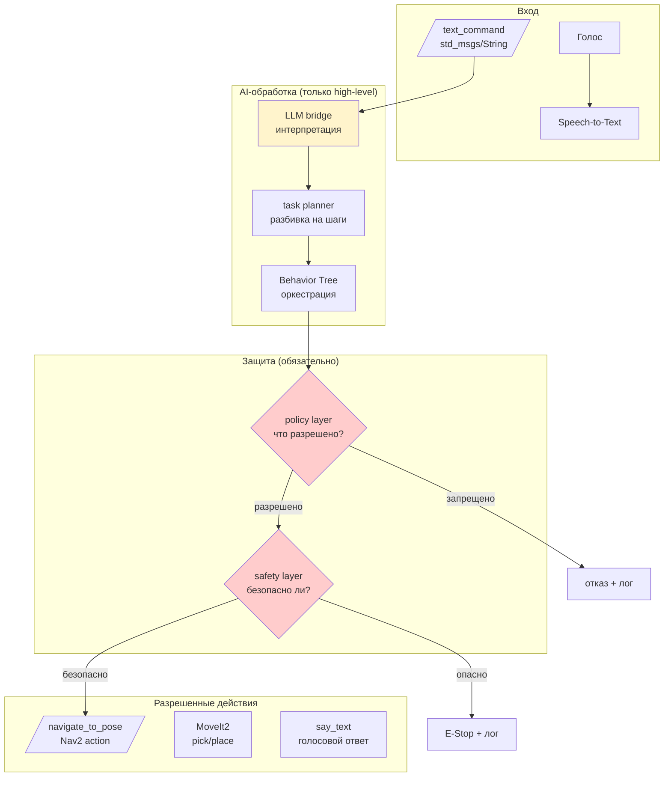

# Демонстрация-схема: Архитектурный мост к LLM Bridge

## Цель

Показать полную архитектуру LLM bridge: цепочка «голос/текст → LLM интерпретация → task planner → Behavior Tree → **policy layer** (что разрешено?) → **safety layer** (безопасно ли сейчас?) → ROS2 actions (Nav2, MoveIt2)». Ключевой акцент — **два слоя защиты**: LLM не имеет прямого доступа к моторам. Показать фрагмент кода bridge-узла с фиксированным словарём команд и двумя проверками (policy_check + safety_check).

## Контекст для студентов

> «Мы подошли к самой амбициозной части архитектуры: голосовое управление роботом. Вы говорите "принеси тапочки", и робот выполняет. Но здесь критична безопасность: LLM может предложить опасное действие. Как мы это предотвращаем? Увидим архитектуру с двумя уровнями защиты.»

## Что показать

### Полная архитектурная схема



### Два слоя защиты — детально

**Policy layer** (белый список):
- Разрешено: `navigate_to_pose`, `pick_object`, `place_object`, `say_text`
- Запрещено: прямое управление скоростью, доступ к GPIO, выключение safety
- Проверка: «Это действие есть в списке разрешенных?»

**Safety layer** (аварийная защита):
- Проверки: заряд батареи > 20%? нет препятствий в опасной зоне? E-stop не активен?
- Действие при нарушении: остановка всех моторов, публикация `/emergency_stop`

### Аналогия с двумя охранниками

> «Представьте: переводчик (LLM) переводит команду с иностранного языка. Первый охранник (policy) проверяет: разрешено ли это действие вообще? Второй охранник (safety) проверяет: безопасно ли это прямо сейчас? Только после обоих — действие выполняется.»

### Фрагмент кода: минимальный bridge с фиксированным словарем

```python
# Белый список разрешённых команд. Любая команда вне списка → игнорируется с WARN
COMMANDS = {
    'go to kitchen': {'action': 'navigate', 'x': 3.0, 'y': 1.5},
    'go to bedroom': {'action': 'navigate', 'x': 5.0, 'y': 2.0},
    'stop': {'action': 'emergency_stop'},
    'battery': {'action': 'get_battery'},
}

class CommandBridge(Node):
    """Bridge-узел: текстовая команда → policy check → safety check → ROS2 action"""

    def __init__(self):
        super().__init__('command_bridge')
        # Подписка на текстовые команды (в будущем — от STT или LLM)
        self.sub = self.create_subscription(
            String, '/text_command', self.on_command, 10)

    def on_command(self, msg):
        """Обработка команды: поиск в словаре → policy → safety → выполнение"""
        cmd = msg.data.lower().strip()
        # Шаг 1: команда есть в белом списке?
        if cmd not in COMMANDS:
            self.get_logger().warn(f'Unknown command: {cmd}')
            return  # Незнакомая команда — игнорируем

        # Шаг 2: POLICY LAYER — разрешено ли это действие?
        action = COMMANDS[cmd]
        if not self.policy_check(action):
            return  # Действие не в белом списке → отказ

        # Шаг 3: SAFETY LAYER — безопасно ли выполнять прямо сейчас?
        if not self.safety_check():
            return  # Батарея < 20% / препятствие / E-stop активен → остановка

        # Шаг 4: выполнение через ROS2 action (navigate_to_pose / emergency_stop)
        self.execute(action)
```

### Граница безопасности — жирным шрифтом на слайде

```
LLM НЕ УПРАВЛЯЕТ: моторами, PWM, током, /cmd_vel, сервоприводами
LLM ТОЛЬКО ФОРМИРУЕТ: high-level request → policy → safety → ROS2 action
```

## Что сказать

- «LLM bridge — это мост, а не контроллер. Он переводит "принеси тапочки" в цепочку действий, но каждое действие проходит двойную проверку.»
- «Policy layer — белый список. Safety layer — аварийная защита. Это два независимых уровня. Даже если LLM предложит опасное действие, оно будет заблокировано.»
- «В учебной версии мы используем фиксированный словарь команд вместо настоящего LLM. Это безопасно и достаточно для демонстрации архитектуры.»

## Ожидаемый результат

Студент понимает:
- LLM bridge переводит команду в high-level действия
- Policy layer — белый список разрешенных действий
- Safety layer — аварийная защита (батарея, препятствия, E-stop)
- LLM не имеет прямого доступа к моторам — только через ROS2 actions

## План Б

Если bridge-узел не готов к запуску:
1. Показать полную схему pipeline с двумя слоями защиты.
2. Показать фрагмент кода bridge-а с фиксированным словарем.
3. Показать таблицу «разрешено / запрещено».
4. Сказать: «В вашем проекте вы можете начать с фиксированного словаря из 5-10 команд, затем подключить настоящий LLM через API. Архитектура с policy и safety слоями остается той же.»

## Ссылки на материалы курса

- [LLM bridge — статья базы знаний](../2_knowledge/llm_bridge.md)
- [YOLO bridge — демонстрация](demo7_yolo_perception.md) — тот же принцип границы безопасности
- [Actions](../2_knowledge/actions.md) — high-level команды через actions

## Связь с роботом

В TIAGo:
- Пакет `tiago_llm_bridge` (запланирован)
- Узлы: `llm_bridge_node`, `task_planner`, `behavior_tree_engine`, `safety_node`, `policy_node`
- Интерфейсы: `/voice_command` и `/text_command` (вход), goal для Nav2/MoveIt2 (выход)
- Safety: `/emergency_stop` service, `/battery_state` topic