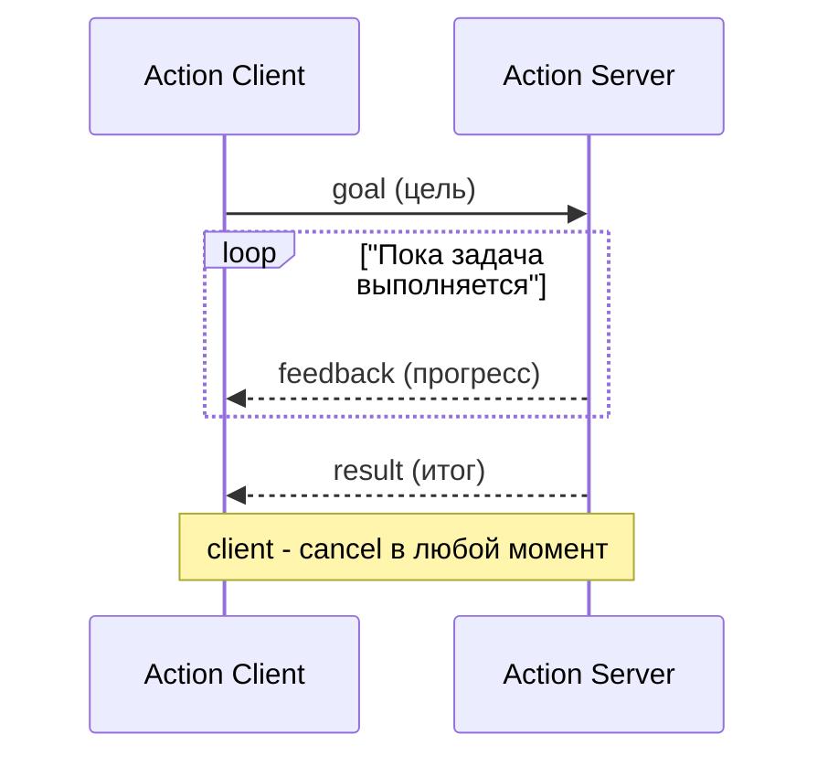
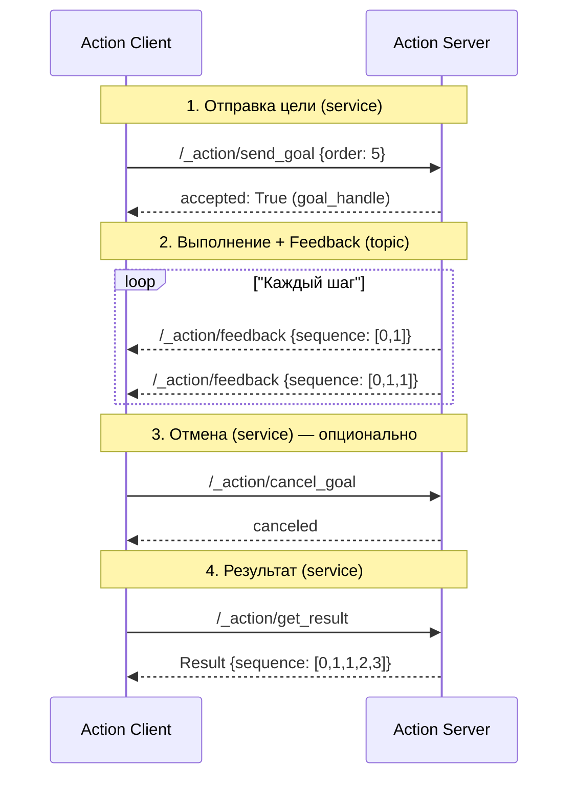

# Action — длительная задача в ROS2

## Коротко

Action — механизм для длительной задачи, у которой есть цель (goal), прогресс (feedback), итог (result) и возможность отмены (cancel). В отличие от service, action не блокирует client на время выполнения.

> *Официальное определение*: «Actions — это форма клиент-серверного общения в графе ROS 2, предназначенная для длительных задач.» — [Actions](https://docs.ros.org/en/jazzy/Concepts/Basic/About-Actions.html)

## Что такое action

Action состоит из четырех элементов:



- **Goal** — что нужно сделать. Например, `navigate_to_pose` с координатами цели.
- **Feedback** — промежуточный прогресс. Например, «осталось 2 метра».
- **Result** — итог выполнения. Например, «достиг цели» или «не удалось».
- **Cancel** — отмена задачи. Client просит server прекратить выполнение.

## Зачем нужно

Есть задачи, которые длятся секунды или минуты:

- **Навигация** — доехать до точки (5-30 секунд), сообщать оставшееся расстояние
- **Манипуляция** — поднять предмет (3-10 секунд), сообщать прогресс траектории
- **Зарядка** — доехать до станции и подключиться (30-60 секунд)

Topic не подходит — нет ответа. Service не подходит — блокирует client на все время выполнения. Action решает обе проблемы: client свободен, прогресс приходит асинхронно, задачу можно отменить.

## Аналогия

Action — **доставка пиццы**:
- Вы делаете заказ — **goal** («пицца Маргарита, адрес X»)
- Курьер сообщает: «выехал», «подъезжаю» — **feedback**
- Пицца доставлена — **result** (успех)
- Вы можете отменить заказ — **cancel**

## Как работает в ROS2

### Action server

```python
# Импортируем тип действия Fibonacci из стандартной библиотеки примеров
from example_interfaces.action import Fibonacci  
# Fibonacci - это действие, которое содержит:
# - Goal (цель): поле order (сколько чисел Фибоначчи вычислить)
# - Feedback (обратная связь): поле sequence (текущая последовательность)
# - Result (результат): поле sequence (итоговая последовательность)
import rclpy  # Основная библиотека ROS 2 для Python
from rclpy.action import ActionServer  # Класс для создания сервера действий
from rclpy.node import Node  # Базовый класс для создания узлов
import time  # Библиотека для работы со временем (задержки)

class FibonacciServer(Node):  # Объявляем класс сервера действий, наследник от Node
    """
    Класс-сервер для выполнения действия Fibonacci
    Действие - это асинхронный механизм, который позволяет:
    - Отправить цель (goal)
    - Получать промежуточные результаты (feedback)
    - Получить финальный результат (result)
    - Отменить выполнение (cancel)
    """
    
    def __init__(self):  # Конструктор класса (вызывается при создании объекта)
        # Вызываем конструктор родительского класса Node с именем узла 'fibonacci_server'
        super().__init__('fibonacci_server')  
        # Это имя будет отображаться в системе ROS 2
        
        # Создаем сервер действий
        self.action_server = ActionServer(
            self,  # Передаем текущий узел (self)
            Fibonacci,  # Тип действия (содержит Goal, Feedback, Result)
            '/fibonacci',  # Имя действия - по этому адресу клиенты будут обращаться
            self.execute_callback  # Функция обратного вызова для выполнения цели
        )
        # ActionServer() - создает сервер действий
        # В отличие от сервиса, действие может выполняться долго и давать промежуточные результаты
        # execute_callback - вызывается при получении новой цели от клиента
        
        # Выводим сообщение о готовности сервера действий
        self.get_logger().info('Action server /fibonacci is ready')
        # get_logger() - объект для логирования
        # info() - выводит информационное сообщение
    def execute_callback(self, goal_handle):
        """
        Основной метод выполнения действия
        Вызывается при получении новой цели от клиента
        
        Аргументы:
            goal_handle - объект-дескриптор цели, содержит:
            - goal_handle.request - запрос от клиента (с полем order)
            - goal_handle.publish_feedback() - отправка промежуточных результатов
            - goal_handle.is_cancel_requested - проверка, не запрошена ли отмена
            - goal_handle.canceled() - подтверждение отмены
            - goal_handle.succeed() - подтверждение успешного завершения
        
        Возвращает:
            Fibonacci.Result(sequence=sequence) - финальный результат
        """
        
        # Логируем полученную цель (order - сколько чисел Фибоначчи нужно вычислить)
        self.get_logger().info(f'Received goal: {goal_handle.request.order}')
        # goal_handle.request - объект запроса с полем order
        # f-строка для форматированного вывода
        
        # Отправляем начальную обратную связь (первые два числа последовательности)
        goal_handle.publish_feedback(
            Fibonacci.Feedback(sequence=[0, 1]))
        # publish_feedback() - отправляет промежуточные результаты клиенту
        # Fibonacci.Feedback(sequence=[0, 1]) - создаем объект обратной связи
        # sequence=[0, 1] - начальные числа Фибоначчи
        
        # Инициализируем последовательность первыми двумя числами
        sequence = [0, 1]
        # Это список, который будет расти с каждым шагом
        
        # Начинаем цикл вычисления чисел Фибоначчи
        # range(1, goal_handle.request.order) - от 1 до order-1
        # Например, если order=5, то цикл выполнится для i=1,2,3,4
        for i in range(1, goal_handle.request.order):
            # Проверяем, не запросил ли клиент отмену действия
            if goal_handle.is_cancel_requested:
                # is_cancel_requested - свойство, которое становится True,
                # если клиент вызвал отмену (cancel)
                
                # Подтверждаем отмену цели
                goal_handle.canceled()
                # canceled() - сообщает системе, что цель отменена
                # Возвращает текущую последовательность (на момент отмены)
                self.get_logger().info('Goal canceled')
                # Логируем отмену
                
                # Возвращаем результат с тем, что успели вычислить
                return Fibonacci.Result(sequence=sequence)
                # Result(sequence=sequence) - создаем объект результата с текущей последовательностью
            
            # Вычисляем следующее число Фибоначчи
            sequence.append(sequence[i] + sequence[i - 1])
            # append() - добавляет элемент в конец списка
            # sequence[i] + sequence[i-1] - сумма двух предыдущих чисел
            # Например, если sequence=[0,1,1], то добавляем 1+1=2
            
            # Отправляем обновленную последовательность как обратную связь
            goal_handle.publish_feedback(
                Fibonacci.Feedback(sequence=sequence))
            # Клиент может получать обновления на каждом шаге
            # Это позволяет показывать прогресс выполнения
            
            # Имитируем длительную операцию (например, сложные вычисления)
            time.sleep(1.0)
            # sleep(1.0) - приостанавливает выполнение на 1 секунду
            # В реальных проектах здесь могут быть сложные вычисления
            # или взаимодействие с оборудованием
        
        # Если цикл завершился без отмены, отмечаем цель как успешно выполненную
        goal_handle.succeed()
        # succeed() - сообщает системе, что действие выполнено успешно
        # После этого клиент получит финальный результат
        
        # Возвращаем финальный результат (полную последовательность)
        return Fibonacci.Result(sequence=sequence)
        # Result(sequence=sequence) - создаем объект результата
        # sequence - итоговая последовательность чисел Фибоначчи
def main(args=None):  # Главная функция, точка входа в программу
    # Инициализируем ROS 2
    rclpy.init(args=args)
    # args - аргументы командной строки
    # Инициализация должна быть выполнена до создания любых узлов
    
    # Создаем объект сервера действий
    node = FibonacciServer()
    # При создании объекта автоматически выполняется __init__
    # Сервер действий регистрируется в системе
    
    # Запускаем цикл обработки событий (spin)
    rclpy.spin(node)
    # spin() - блокирующий цикл, который обрабатывает входящие события
    # Без этого execute_callback не будет вызван!
    # Обрабатывает запросы на выполнение действий и отмену
    
    # Уничтожаем узел (освобождаем ресурсы)
    node.destroy_node()
    # destroy_node() - корректно завершает работу узла
    
    # Завершаем работу ROS 2
    rclpy.shutdown()
    # shutdown() - освобождает ресурсы
# Проверяем, запущен ли файл как основная программа
if __name__ == '__main__':
    main()  # Вызываем главную функцию

```

Ключевые моменты:

| Строка | Что делает |
| --- | --- |
| `ActionServer(self, Fibonacci, '/fibonacci', ...)` | Создает action server |
| `execute_callback(self, goal_handle)` | Вызывается при получении goal |
| `goal_handle.publish_feedback(...)` | Отправляет клиенту прогресс |
| `goal_handle.is_cancel_requested` | Проверяет, попросил ли client отмену |
| `goal_handle.canceled()` | Сообщает, что задача отменена |
| `goal_handle.succeed()` | Сообщает, что задача выполнена успешно |
| `return Fibonacci.Result(...)` | Возвращает итоговый результат |

### Action client

```python
# Импортируем тип действия Fibonacci из стандартной библиотеки примеров
from example_interfaces.action import Fibonacci  
# Fibonacci - это действие, которое содержит:
# - Goal (цель): поле order (сколько чисел Фибоначчи вычислить)
# - Feedback (обратная связь): поле sequence (текущая последовательность)
# - Result (результат): поле sequence (итоговая последовательность)
from rclpy.action import ActionClient  # Класс для создания клиента действий
# ActionClient позволяет отправлять цели, получать обратную связь и результаты
class FibonacciClient(Node):  # Объявляем класс клиента действий, наследник от Node
    """
    Класс-клиент для вызова действия Fibonacci
    Действие - это асинхронный механизм, который позволяет:
    - Отправить цель (goal)
    - Получать промежуточные результаты (feedback)
    - Получить финальный результат (result)
    - Отменить выполнение (cancel)
    """
    
    def __init__(self):  # Конструктор класса (вызывается при создании объекта)
        # Вызываем конструктор родительского класса Node с именем узла 'fibonacci_client'
        super().__init__('fibonacci_client')  
        # Это имя будет отображаться в системе ROS 2
        
        # Создаем клиента для действия типа Fibonacci с именем '/fibonacci'
        self.client = ActionClient(self, Fibonacci, '/fibonacci')
        # ActionClient() - создает клиента действий
        # self - текущий узел
        # Fibonacci - тип действия
        # '/fibonacci' - имя действия, по которому клиент будет искать сервер
        
        # Ожидаем появления сервера действий в системе
        self.client.wait_for_server()
        # wait_for_server() - блокирующий вызов, ждет пока сервер станет доступен
        # Если сервер не появится, клиент не продолжит выполнение
        # Это гарантирует, что цель не будет отправлена в пустоту
        
        # Отправляем цель с параметром order=5 (вычислить 5 чисел Фибоначчи)
        self.send_goal(5)
        # Вызываем метод отправки цели
        
    def send_goal(self, order):
        """
        Метод для отправки цели серверу действий
        
        Аргументы:
            order - количество чисел Фибоначчи для вычисления
        """
        
        # Создаем объект цели (Goal)
        goal_msg = Fibonacci.Goal()
        # Fibonacci.Goal() - создает пустой объект цели
        # У цели есть поле order (определено в файле .action)
        
        # Заполняем поле order переданным значением
        goal_msg.order = order
        # Устанавливаем, сколько чисел Фибоначчи нужно вычислить
        
        # Отправляем цель асинхронно с обратным вызовом для обратной связи
        self.client.send_goal_async(
            goal_msg,  # Цель, которую отправляем
            feedback_callback=self.feedback_callback  # Колбэк для получения обратной связи
        ).add_done_callback(self.goal_response_callback)
        # send_goal_async() - асинхронно отправляет цель серверу
        # Возвращает Future-объект, который завершится, когда сервер примет/отклонит цель
        # feedback_callback - будет вызываться каждый раз, когда сервер отправляет обратную связь
        # add_done_callback() - добавляет обработчик на завершение отправки цели
        # self.goal_response_callback - вызывается, когда сервер ответил на запрос цели
        
    def goal_response_callback(self, future):
        """
        Колбэк, вызываемый когда сервер принял или отклонил цель
        
        Аргументы:
            future - объект Future, содержащий ответ от сервера
        """
        
        # Получаем дескриптор цели из future
        goal_handle = future.result()
        # future.result() - возвращает объект GoalHandle
        # GoalHandle - это дескриптор, через который можно управлять целью
        # (получить результат, отменить, проверить статус)
        
        # Проверяем, принял ли сервер цель
        if not goal_handle.accepted:
            # accepted - свойство, True если цель принята, False если отклонена
            self.get_logger().info('Goal rejected')
            # Логируем, что цель отклонена
            return  # Выходим из метода, т.к. цель не принята
            
        # Если цель принята, логируем это
        self.get_logger().info('Goal accepted')
        # Логируем принятие цели
        
        # Запрашиваем финальный результат асинхронно
        goal_handle.get_result_async().add_done_callback(self.result_callback)
        # get_result_async() - отправляет запрос на получение результата
        # Возвращает Future, который завершится, когда сервер завершит выполнение
        # add_done_callback() - добавляет обработчик на завершение
        # self.result_callback - вызывается, когда результат готов
        
    def feedback_callback(self, feedback_msg):
        """
        Колбэк для обработки обратной связи от сервера
        Вызывается каждый раз, когда сервер отправляет промежуточный результат
        
        Аргументы:
            feedback_msg - объект, содержащий обратную связь
            feedback_msg.feedback.sequence - текущая последовательность чисел
        """
        
        # Извлекаем текущую последовательность из сообщения обратной связи
        seq = feedback_msg.feedback.sequence
        # feedback_msg.feedback - поле с обратной связью
        # sequence - поле с последовательностью чисел Фибоначчи
        
        # Выводим текущую последовательность в лог
        self.get_logger().info(f'Feedback: {seq}')
        # f-строка для форматированного вывода
        # Клиент видит прогресс выполнения действия
        
    def result_callback(self, future):
        """
        Колбэк для обработки финального результата
        Вызывается, когда сервер завершил выполнение действия
        
        Аргументы:
            future - объект Future, содержащий результат
        """
        
        # Получаем финальный результат из future
        result = future.result().result
        # future.result() - возвращает объект ClientResult
        # .result - поле с финальным результатом (Fibonacci.Result)
        # В результате есть поле sequence (итоговая последовательность)
        
        # Выводим финальный результат в лог
        self.get_logger().info(f'Result: {result.sequence}')
        # result.sequence - итоговая последовательность чисел Фибоначчи
def main(args=None):  # Главная функция, точка входа в программу
    # Инициализируем ROS 2
    rclpy.init(args=args)
    # args - аргументы командной строки
    # Инициализация должна быть выполнена до создания любых узлов
    
    # Создаем объект клиента действий
    node = FibonacciClient()
    # При создании объекта автоматически выполняется __init__
    # Клиент создается, ждет сервер, отправляет цель
    # Затем добавляет колбэки для обработки ответов
    
    # Запускаем цикл обработки событий (spin)
    rclpy.spin(node)
    # spin() - блокирующий цикл, который обрабатывает входящие события
    # БЕЗ ЭТОГО колбэки (feedback_callback, result_callback) НЕ ВЫЗОВУТСЯ!
    # spin() будет работать, пока узел не будет остановлен (Ctrl+C)
    # Обрабатывает обратную связь, результаты и другие асинхронные события
    
    # Уничтожаем узел (освобождаем ресурсы)
    node.destroy_node()
    # destroy_node() - корректно завершает работу узла
    
    # Завершаем работу ROS 2
    rclpy.shutdown()
    # shutdown() - освобождает ресурсы
# Проверяем, запущен ли файл как основная программа
if __name__ == '__main__':
    main()  # Вызываем главную функцию
```

Ключевые callback-и:

| Callback | Когда вызывается |
| --- | --- |
| `feedback_callback` | При каждом feedback от server |
| `goal_response_callback` | Когда server принял или отклонил goal |
| `result_callback` | Когда server завершил задачу |

## Как action устроен внутри

Снаружи action выглядит как единый механизм: отправил goal → получаешь feedback → дождался result. Внутри action — это комбинация **трёх топиков** и **трёх сервисов**.

### Топики (потоковые данные)

| Топик | Тип | Назначение |
|---|---|---|
| `.../_action/feedback` | `ActionFeedback` | Сервер публикует промежуточные результаты для всех клиентов |
| `.../_action/status` | `GoalStatusArray` | Сервер публикует статус цели (принята, выполняется, отменена) |

### Сервисы (одноразовые запросы)

| Сервис | Тип | Назначение |
|---|---|---|
| `.../_action/send_goal` | `SendGoal` | Клиент отправляет цель, сервер подтверждает |
| `.../_action/get_result` | `GetResult` | Клиент запрашивает финальный результат |
| `.../_action/cancel_goal` | `CancelGoal` | Клиент отправляет запрос на отмену |

### Полный протокол



Проверить внутренние топики можно через CLI:

```bash
# посмотреть все топики action
ros2 topic list | grep fibonacci
# /fibonacci/_action/feedback
# /fibonacci/_action/status

# посмотреть все сервисы action
ros2 service list | grep fibonacci
# /fibonacci/_action/send_goal
# /fibonacci/_action/get_result
# /fibonacci/_action/cancel_goal
```

**Вывод**: action — это высокоуровневая абстракция, построенная поверх тех же механизмов (topic + service). ROS2 скрывает эту сложность за единым API.

## Выбор: topic, service или action

| Критерий | Topic | Service | Action |
| --- | --- | --- | --- |
| **Связь** | Многие ко многим | Один к одному | Один к одному |
| **Ответ** | Нет | Один ответ | Прогресс + итог |
| **Длительность** | Непрерывно | Мгновенно (< 1 сек) | Секунды/минуты |
| **Отмена** | Нет | Нет | Есть |
| **Пример** | `/scan` | `/emergency_stop` | `/navigate_to_pose` |

**Правило выбора**:
1. Если данные идут потоком и получателей много → **Topic**
2. Если нужен короткий запрос-ответ → **Service**
3. Если задача длится долго, нужен прогресс и отмена → **Action**

## CLI-команды для action

```bash
# Список всех actions
ros2 action list

# Информация об action
ros2 action info /fibonacci

# Отправка goal из командной строки с feedback
ros2 action send_goal /fibonacci example_interfaces/action/Fibonacci "{order: 5}" --feedback
# Вывод: показывает feedback (последовательности) и финальный result
```

## Пример в роботе

В роботе TIAGo actions — ядро системы:

| Action | Что делает | Feedback |
| --- | --- | --- |
| `/navigate_to_pose` | Ехать к точке на карте | Оставшееся расстояние |
| `/follow_path` | Ехать по пути из waypoints | Текущая точка пути |
| MoveIt2 action | Планирование и выполнение траектории руки | Прогресс траектории |

Nav2 и MoveIt2 построены вокруг actions. Без action навигация и манипуляция были бы невозможны.

## Привязка к трем уровням

- **Уровень 1 (лекция)**: преподаватель показывает `ros2 action send_goal --feedback`, демонстрирует cancel, сравнивает с topic и service.
- **Уровень 2 (самостоятельно)**: эта статья + [практика 05](../2_practice/05_action.md) — написать Fibonacci action с feedback и cancel.
- **Уровень 3 (робот TIAGo)**: Nav2 `/navigate_to_pose` и MoveIt2 actions — длительные задачи с прогрессом.

## Типичные ошибки

| Ошибка | Симптом | Исправление |
| --- | --- | --- |
| Server не отправляет feedback | Client не видит прогресс | `goal_handle.publish_feedback(...)` в цикле выполнения |
| Cancel не обрабатывается | Client отправил cancel, server продолжает | Проверять `goal_handle.is_cancel_requested` в цикле |
| Server долго не вызывает `succeed()` | Client висит в ожидании result | Вызвать `goal_handle.succeed()` или `goal_handle.abort()` |
| Забыли `spin()` | Server не принимает goals | `rclpy.spin(server)` |
| Client не ждет server | Goal не отправляется | `self.client.wait_for_server()` перед `send_goal_async()` |

### Пример в реальном роботе

Робот TIAGo (PAL Robotics) использует actions как ядро навигации и манипуляции.
Навигационный action [`/navigate_to_pose`](../../3_Robot/TIAgo_humble/docs/navigation.md) отправляет робота в точку на карте с обратной связью оставшегося расстояния.
Манипуляционный action [`/arm_controller/follow_joint_trajectory`](../../3_Robot/TIAgo_humble/docs/manipulation.md) управляет 7-DOF рукой через MoveIt2.
Оба action поддерживают отмену и прогресс — именно те сценарии, для которых action спроектирован.

## Связанные темы

- [Topics](topics.md) — потоковая передача данных
- [Services](services.md) — короткий запрос-ответ
- [Nav2 bridge](nav2_bridge.md) — как `/navigate_to_pose` использует action
- [MoveIt2 bridge](moveit2_bridge.md) — как MoveIt2 использует action

## Источники

- [Understanding ROS2 Actions](https://docs.ros.org/en/jazzy/Tutorials/Beginner-CLI-Tools/Understanding-ROS2-Actions/Understanding-ROS2-Actions.html)
- [Writing an action server/client (Python)](https://docs.ros.org/en/jazzy/Tutorials/Intermediate/Writing-an-Action-Server-Client/Py.html)