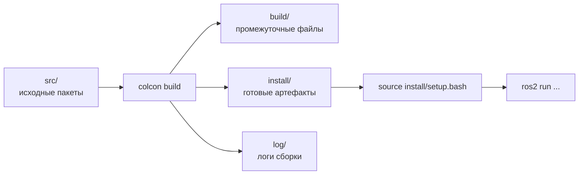

# colcon — сборщик ROS2-проекта

## Коротко

`colcon` (collective construction) — инструмент, который собирает все пакеты в workspace одной командой. Аналог `make`, но для ROS2.

> *Официальное определение*: «colcon — это мета-инструмент сборки, который упорядочивает пакеты по топологическому порядку зависимостей и собирает (или тестирует) их в правильной последовательности.» — [colcon](https://docs.ros.org/en/jazzy/Tutorials/Beginner-Client-Libraries/Colcon-Tutorial.html)

## Что такое colcon

`colcon` обходит все пакеты в `src/`, проверяет зависимости, компилирует C++-пакеты, устанавливает Python-пакеты и раскладывает результаты по `build/`, `install/`, `log/`.

## Зачем нужно

В проекте может быть десятки пакетов. Без `colcon` нужно вручную собирать каждый пакет, следить за порядком (зависимости!) и раскладывать результаты. `colcon` делает это автоматически.

## Аналогия

`colcon` — **конвейер на заводе**: подаете детали (`src/`), конвейер собирает (`build/`), на выходе — готовые изделия (`install/`), а все операции записываются в журнал (`log/`).

## Схема сборки



## Основные команды

```bash
# Базовая сборка всего workspace
colcon build

# Сборка конкретного пакета (быстрее)
colcon build --packages-select my_pkg

# Сборка с символьными ссылками (изменения Python-кода видны без пересборки)
colcon build --symlink-install

# Очистить и собрать заново
rm -rf build/ install/ log/
colcon build

# Сборка только пакетов, которые изменились
colcon build --packages-up-to my_pkg
```

## source install/setup.bash

После `colcon build` пакеты **установлены**, но **не видны** ROS2. Нужно активировать workspace:

```bash
source ~/ros2_ws/install/setup.bash
```

Эта команда добавляет пути к установленным пакетам в переменные окружения:
- `PATH` — чтобы работал `ros2 run`;
- `PYTHONPATH` — чтобы работал `import`;
- `AMENT_PREFIX_PATH` — чтобы `ros2 pkg list` видел пакеты.

**Рекомендация**: добавьте `source ~/ros2_ws/install/setup.bash` в `~/.bashrc`, чтобы не делать это вручную каждый раз.

## Результаты сборки

После успешной сборки:

```text
~/ros2_ws/
├── src/       ← ваши пакеты (my_first_pkg, ...)
├── build/     ← промежуточные файлы (не трогать)
├── install/   ← готовые пакеты (не трогать)
└── log/       ← логи сборки (можно смотреть при ошибках)
```

### Что в install/

```
install/
├── setup.bash           ← скрипт активации
├── setup.sh
├── my_first_pkg/
│   └── share/
│       └── my_first_pkg/
│           └── ...      ← ваши установленные файлы
└── ...
```

## Типичные ошибки

| Ошибка | Симптом | Исправление |
| --- | --- | --- |
| `colcon build` не из корня workspace | Ошибка: «no packages found» | `cd ~/ros2_ws && colcon build` |
| Забыли `source setup.bash` | `ros2 run` не находит пакет | `source ~/ros2_ws/install/setup.bash` |
| Ошибка в `setup.py` | Сборка падает | Проверить синтаксис `setup.py`, особенно `entry_points` |
| Пакет не в `src/` | `colcon build` не видит пакет | Переместить папку пакета в `~/ros2_ws/src/` |
| Зависимость не объявлена | `ImportError` при запуске | Добавить `<depend>` в `package.xml` и пересобрать |
| Старая версия кода в `install/` | Изменения кода не применяются | Пересобрать (`colcon build`) или использовать `--symlink-install` |

## Советы

- Для разработки на Python используйте `--symlink-install` — изменения кода в `src/` сразу видны без пересборки.
- Если сборка падает с непонятной ошибкой — очистите `build/`, `install/`, `log/` и соберите заново.
- Если нужно пересобрать только один пакет — `colcon build --packages-select my_pkg`.

### Пример в реальном роботе

Робот TIAGo содержит **64 пакета** в одном workspace (`ros2_ws/`) из 18 репозиториев PAL Robotics.
Весь workspace собирается одной командой `colcon build` в контейнере.
В [`3_Robot/TIAgo_humble/docs/tiago_architecture.md`](../../3_Robot/TIAgo_humble/docs/tiago_architecture.md) показана структура пакетов
и порядок сборки.

## Связанные темы

- [Workspace и окружение](workspace.md) — создание workspace
- [Пакеты](packages.md) — устройство пакета
- [Nodes](nodes.md) — код узла в пакете

## Источники

- [Using colcon](https://docs.ros.org/en/jazzy/Tutorials/Beginner-Client-Libraries/Colcon-Tutorial.html)
- [colcon documentation](https://colcon.readthedocs.io/)