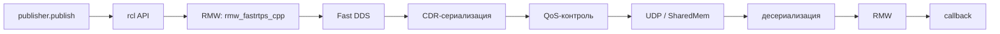

# DDS: протокол, транспорт и выбор реализации

## Коротко

DDS (Data Distribution Service) — промышленный стандарт OMG для обмена данными в реальном времени. ROS2 использует DDS как транспорт: publisher сериализует сообщение, DDS доставляет его subscriber-ам по сети с заданным качеством обслуживания (QoS).

> *Официальное определение*: «ROS 2 построен поверх DDS/RTPS в качестве middleware, который обеспечивает обнаружение, сериализацию и транспортировку.» — [DDS](https://docs.ros.org/en/jazzy/Concepts/Intermediate/About-Different-Middleware-Vendors.html)

## Что это

DDS — publish/subscribe middleware, который берёт на себя:

- сериализацию данных (CDR — Common Data Representation);
- discovery — обнаружение publisher/subscriber в сети;
- QoS — настройку надёжности, истории, долговечности;
- транспорт — UDP multicast/unicast, Shared Memory, TCP;
- безопасность — шифрование, аутентификацию, контроль доступа (DDS Security).

RTPS (Real-Time Publish-Subscribe) — wire-протокол DDS. Это формат байтов, который реально идёт по сети. ROS2 не использует DDS API напрямую — он работает через RTPS.

## Зачем нужно

Если бы ROS2 писал свой транспорт, пришлось бы заново решать:

- как обнаруживать узлы в сети;
- как сериализовать сложные структуры;
- как гарантировать доставку критичных сообщений;
- как шифровать трафик.

DDS — готовое, стандартизированное (OMG) и зрелое решение, используемое в авиации, обороне, промышленности. ROS2 берёт его целиком.

## Аналогия

DDS — **почтовая служба доставки**. RTPS — **формат конверта и правила адресации**. RMW — **стойка приёма** в вашем офисе: вы отдаёте письмо, а какая именно служба (FedEx, DHL, Почта России) его заберёт — решается настройкой.

- Адрес = Topic
- Тип конверта = Message type
- Срочность = QoS
- Уведомление о получении = Reliability

## Как работает в ROS2 Jazzy

### Цепочка вызова

Когда Publisher вызывает `publish(msg)`, происходит:

1. **rcl / rclcpp / rclpy** — ROS2 API собирает сообщение в буфер.
2. **RMW** — адаптер передаёт буфер в DDS.
3. **DDS**:
   - сериализует в RTPS-формат (CDR);
   - проверяет QoS (reliable/best-effort, history depth);
   - отправляет через транспорт (по умолчанию UDP Shared Memory для одного хоста);
   - получатель десериализует обратно.
4. **Callback subscriber-а** получает готовое сообщение.



### Устройство сети

DDS использует **UDP** как базовый транспорт:

| Тип трафика | Адрес | Порт (domain=0) |
|---|---|---|
| Discovery multicast | 239.255.0.1 | 7400 |
| Discovery unicast | IP участника | 7410 + 2×participant |
| User data multicast | 239.255.0.1 | 7401 |
| User data unicast | IP участника | 7411 + 2×participant |

Формула расчёта портов (Fast DDS):

```
discovery multicast = 7400 + 250 × domainId + 0
discovery unicast   = 7400 + 250 × domainId + 10 + 2 × participantId
user multicast      = 7400 + 250 × domainId + 1
user unicast        = 7400 + 250 × domainId + 11 + 2 × participantId
```

Максимальный `ROS_DOMAIN_ID` — **232** (иначе порт > 65535).

### Shared Memory Transport

Когда publisher и subscriber на одном хосте, Fast DDS и Cyclone DDS автоматически используют Shared Memory Transport вместо UDP. Это даёт:

- нулевую копию данных (zero-copy);
- задержку < 10 микросекунд;
- отсутствие нагрузки на сетевой стек.

Отключается через XML-конфигурацию Fast DDS.

## Сравнение реализаций DDS

| Реализация | Лицензия | RMW-пакет | RTPS | SharedMem | Discovery Server | Когда выбирать |
|---|---|---|---|---|---|---|
| **Fast DDS** | Apache 2.0 | `rmw_fastrtps_cpp` | да | да | да (v2) | Дефолт Jazzy. Всё включено. Для учебных задач и большинства роботов. |
| **Cyclone DDS** | Eclipse Public License | `rmw_cyclonedds_cpp` | да | да | нет | Лёгкий, быстрый, без лишних зависимостей. Для embedded и production. |
| **Connext DDS** | Коммерческая (RTI) | `rmw_connextdds` | да | да | да | Safety-critical (DO-178C, SIL4). Для certified-систем. |
| **GurumDDS** | Коммерческая | `rmw_gurumdds_cpp` | да | нет | нет | IoT, маломощные устройства, малый размер. |
| **Zenoh** | Apache 2.0 | `rmw_zenoh_cpp` | нет | нет | — | Облачные/удалённые сценарии. Работает через QUIC/TCP. |

### Как выбрать

| Сценарий | Рекомендация |
|---|---|
| Учебные проекты, курс, прототип | Fast DDS (дефолт, ничего не менять) |
| Продакшен-робот, embedded | Cyclone DDS (лёгкий, стабильный) |
| Сертифицируемая система (авиация, медицина) | Connext DDS |
| IoT, ограниченные ресурсы | GurumDDS |
| Удалённое управление через интернет | Zenoh |

## Команды

```bash
# проверить, какой DDS используется
ros2 doctor --report

# или напрямую
printenv RMW_IMPLEMENTATION  # если не установлена — дефолт Fast DDS

# переключиться на Cyclone DDS
export RMW_IMPLEMENTATION=rmw_cyclonedds_cpp

# установить другой RMW
sudo apt update
sudo apt install ros-jazzy-rmw-cyclonedds-cpp

# посмотреть DDS traffic (требует sudo)
sudo tcpdump -i any -X udp port 7400
```

## Ожидаемый результат

- `ros2 doctor --report` показывает имя выбранного RMW/DDS.
- `tcpdump` отображает RTPS-пакеты с именем узла в открытом виде.
- При смене `RMW_IMPLEMENTATION` узлы продолжают нормально общаться.

## Типичные ошибки

| Симптом | Причина | Исправление |
|---|---|---|
| Узлы не видят друг друга | `ROS_DOMAIN_ID` различается | Выставить одинаковый `ROS_DOMAIN_ID` |
| DDS-пакеты не проходят через firewall | Заблокированы UDP-порты 7400-7500 | Открыть порты или использовать Discovery Server на одном порту |
| Падение производительности на WiFi | DDS использует multicast, который плохо работает по WiFi | Переключить на unicast через XML-конфиг |
| Ошибка "calculated port number is too high" | domainId > 232 | Снизить domainId |
| При >100 узлах discovery падает | `mutation_tries` Fast DDS (дефолт 100) | Увеличить `mutation_tries` в XML-профиле |

### Пример в реальном роботе

Робот TIAGo использует **CycloneDDS** (`RMW_IMPLEMENTATION=rmw_cyclonedds_cpp`) — лёгкую реализацию DDS, рекомендованную PAL Robotics для multi-robot сценариев.
В [`3_Robot/TIAgo_humble/docs/rmw_dds.md`](../../3_Robot/TIAgo_humble/docs/rmw_dds.md) описана настройка RMW, порты и конфигурация
ROS_DOMAIN_ID в симуляции TIAGo.

## Связанные темы

- [RMW: ROS Middleware Wrapper](rmw.md) — как работает слой адаптации
- [Discovery: автоматическое обнаружение узлов](discovery.md) — SPDP, EDP, Discovery Server
- [QoS: настройки доставки сообщений](qos.md) — reliability, history, durability
- [Управление флотом: ROS_DOMAIN_ID](robots_communication.md) — multi-robot сети

## Источники

- [About DDS and RMW vendors (ROS2 Jazzy)](https://docs.ros.org/en/jazzy/Concepts/Intermediate/About-Different-Middleware-Vendors.html)
- [About the Domain ID (ROS2 Jazzy)](https://docs.ros.org/en/jazzy/Concepts/Intermediate/About-Domain-ID.html)
- [DDS tuning information (ROS2 Jazzy)](https://docs.ros.org/en/jazzy/How-To-Guides/DDS-tuning.html)
- [Examining network traffic (ROS2 Jazzy)](https://docs.ros.org/en/jazzy/Tutorials/Advanced/Security/Examine-Traffic.html)
- [Fast DDS documentation: Port calculation](https://fast-rtps.docs.eprosima.com/en/2.10.x/fastdds/transport/listening_locators.html)
- [OMG DDS Standard](https://www.omg.org/spec/DDS/)
- [REP-2000: DDS/RMW vendors per distro](https://www.ros.org/reps/rep-2000.html)
