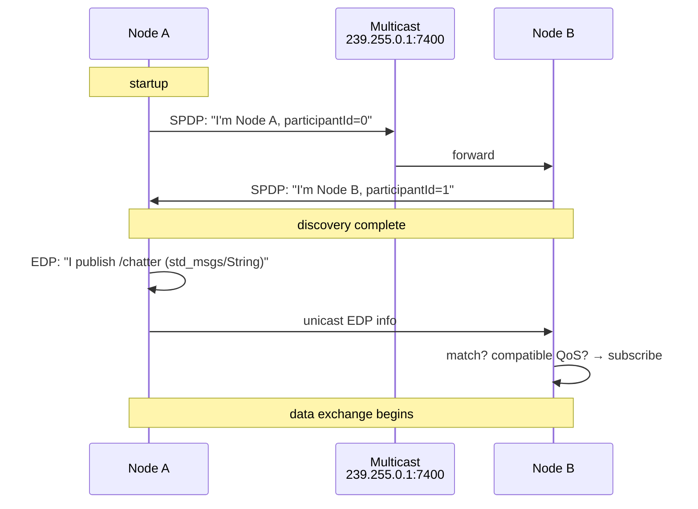
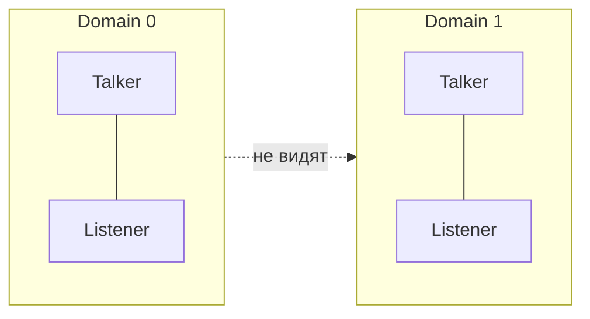

# Discovery: автоматическое обнаружение узлов

## Коротко

Discovery — это механизм, с помощью которого узлы ROS2 находят друг друга в сети без ручного указания адресов. Когда вы запускаете узел, он автоматически объявляет о себе, и все совместимые узлы узнают, как с ним связаться.

> *Официальное определение*: «Граф ROS 2 обнаруживается во время выполнения. Это позволяет участникам находить друг друга и устанавливать соединения по мере их появления.» — [Discovery](https://docs.ros.org/en/jazzy/Concepts/Basic/About-Discovery.html)

## Что это

Discovery в ROS2 состоит из двух уровней:

- **SPDP** (Simple Participant Discovery Protocol) — кто есть в сети: участники DDS представляются, обмениваясь multicast-сообщениями.
- **EDP** (Endpoint Discovery Protocol) — кто какие topics/services использует: после SPDP участники обмениваются детальной информацией о своих endpoint-ах (publisher/subscriber).

Оба уровня реализованы внутри DDS. ROS2 не управляет discovery напрямую — он лишь предоставляет настройки через `ROS_DOMAIN_ID`, XML-конфиги и `ROS_DISCOVERY_SERVER`.

## Зачем нужно

Без discovery каждый запуск узла требовал бы ручного указания адресов всех участников обмена. Discovery делает систему **plug-and-play**: запустил узел — он сам нашёл, с кем общаться.

## Аналогия

Конференция: участники (узлы) заходят в зал и громко представляются (SPDP — multicast). Те, кому интересно, подходят и обмениваются визитками (EDP — unicast). Дальше общаются напрямую.

## Как работает

### Simple Discovery Protocol (дефолтный)



1. При старте узел отправляет UDP multicast на **239.255.0.1:7400** (для domain 0).
2. Все узлы в том же domain отвечают unicast-сообщением: имя узла, participant ID, метаданные.
3. После SPDP-рукопожатия начинается EDP: узлы обмениваются информацией о своих endpoint-ах (publisher/subscriber/service).
4. Если типы сообщений и QoS совместимы — устанавливается соединение.

Периодичность: узлы повторяют объявление каждые **30 секунд** (по умолчанию), чтобы новые узлы могли подключиться.

### Fast DDS Discovery Server (альтернатива)

Вместо multicast-лавины используется центральный сервер:

```bash
# запустить discovery server
fastdds discovery --server-id 0 --ip-address 127.0.0.1 --port 11811

# запустить узлы-клиенты
export ROS_DISCOVERY_SERVER="127.0.0.1:11811"
ros2 run demo_nodes_cpp talker
```

Особенности Discovery Server v2:

- клиент-серверная архитектура вместо распределённой;
- **фильтрация по topic**: узлы получают информацию только о тех topic, которые им нужны;
- **Super Client** — специальный режим, в котором клиент получает все данные (нужен для CLI-инструментов).

Когда использовать Discovery Server:

- > 50 узлов на одной сети;
- multicast запрещён (firewall, WiFi);
- нужно точное знание, кто с кем общается.

### ROS_DOMAIN_ID — изоляция discovery

Каждый domain ID — отдельная логическая сеть DDS. Узлы на domain 0 не видят узлов на domain 1.

```bash
# терминал 1
export ROS_DOMAIN_ID=0
ros2 run demo_nodes_cpp talker

# терминал 2 (не видит talker)
export ROS_DOMAIN_ID=1
ros2 run demo_nodes_cpp listener  # ничего не получит
```



### Проблема >100 participants

Fast DDS имеет параметр `mutation_tries` (дефолт 100). Это максимальное количество попыток найти уникальный unicast-порт для каждого нового DDS participant. Когда participants становится больше 100, порты кончаются, и новые узлы не могут слушать — они «глохнут».

Исправление: увеличить `mutation_tries` в XML-конфигурации Fast DDS:

```xml
<?xml version="1.0" encoding="UTF-8" ?>
<dds>
    <profiles xmlns="http://www.eprosima.com/XMLSchemas/fastRTPS_Profiles">
        <participant profile_name="default" is_default_profile="true">
            <rtps>
                <port>
                    <mutation_tries>300</mutation_tries>
                </port>
            </rtps>
        </participant>
    </profiles>
</dds>
```

## Команды

```bash
# проверить discovery
ros2 doctor --report

# посмотреть, что узлы видят друг друга
ros2 node list          # все узлы в текущем domain
ros2 topic list         # все topics
ros2 topic info /chatter # кто publisher, кто subscriber

# изолировать discovery
export ROS_DOMAIN_ID=42

# использовать Discovery Server
export ROS_DISCOVERY_SERVER="127.0.0.1:11811"
fastdds discovery --server-id 0 --ip-address 127.0.0.1 --port 11811

# смотреть DDS-трафик discovery
sudo tcpdump -i any -X udp port 7400
```

## Ожидаемый результат

- После запуска talker и listener `ros2 node list` показывает оба узла.
- При разных `ROS_DOMAIN_ID` узлы не видят друг друга.
- `tcpdump` показывает multicast-пакеты с именем узла на порту 7400.

## Типичные ошибки

| Симптом | Причина | Исправление |
|---|---|---|
| `ros2 node list` пуст | Другой `ROS_DOMAIN_ID` или RMW | Проверить `echo $ROS_DOMAIN_ID` и `echo $RMW_IMPLEMENTATION` |
| Узлы на разных хостах не видят друг друга | Multicast заблокирован сетью | Использовать Discovery Server или открыть UDP 7400-7500 |
| Новые узлы не отвечают, старые работают | Исчерпаны порды (>100 participants) | Увеличить `mutation_tries` |
| CLI-инструменты не видят nodes при Discovery Server | Daemon не в режиме Super Client | Настроить `super_client_profile` для ROS daemon |

### Пример в реальном роботе

В TIAGo discovery работает через CycloneDDS с ROS_DOMAIN_ID=56 (фиксированный для контейнера).
Узлы находят друг друга через SPDP/EDP по UDP multicast.
Если два контейнера TIAGo запустить с разными ROS_DOMAIN_ID — они не увидят друг друга.
Подробнее: [`3_Robot/TIAgo_humble/docs/rmw_dds.md`](../../3_Robot/TIAgo_humble/docs/rmw_dds.md).

## Связанные темы

- [DDS: протокол, транспорт и выбор реализации](dds_protocol.md) — как работают порты и RTPS
- [RMW: ROS Middleware Wrapper](rmw.md) — адаптер к конкретной DDS
- [Управление флотом: ROS_DOMAIN_ID](robots_communication.md) — multi-robot и изоляция
- [Архитектура ROS2](ros_architecture.md) — общая схема

## Источники

- [About Discovery (ROS2 Jazzy)](https://docs.ros.org/en/jazzy/Concepts/Basic/About-Discovery.html)
- [Fast DDS Discovery Server tutorial (ROS2 Jazzy)](https://docs.ros.org/en/jazzy/Tutorials/Advanced/Discovery-Server/Discovery-Server.html)
- [About the Domain ID (ROS2 Jazzy)](https://docs.ros.org/en/jazzy/Concepts/Intermediate/About-Domain-ID.html)
- [Fast DDS DiscoveryProtocol enum](https://docs.ros.org/en/ros2_packages/rolling/api/fastdds/generated/enum_namespaceeprosima_1_1fastdds_1_1rtps_1a4d4132a2201ed41211057887af366bb9.html)
- [rmw_discovery_options_s API](https://docs.ros.org/en/ros2_packages/jazzy/api/rmw/generated/structrmw__discovery__options__s.html)
