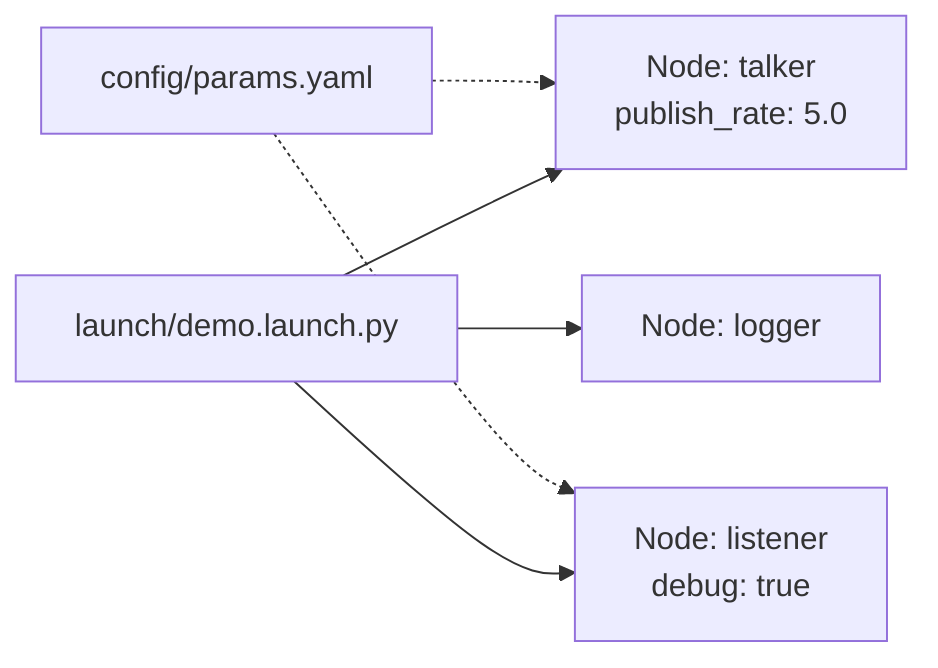

# Launch — запуск системы в ROS2

## Коротко

Launch — сценарий, который запускает несколько узлов, задает им параметры и аргументы одной командой. Без launch каждый узел запускается вручную в отдельном терминале.

> *Официальное определение*: «Launch-файлы позволяют одновременно запускать и настраивать несколько исполняемых файлов, содержащих узлы ROS 2.» — [Launch](https://docs.ros.org/en/jazzy/Concepts/Basic/About-Launch.html)

## Что такое launch

Launch-файл — это Python-скрипт, который описывает, какие узлы запустить и с какими настройками:



Launch решает задачи:
- **Запуск нескольких узлов** одной командой — `ros2 launch pkg file.launch.py`
- **Передача параметров** из YAML в узлы
- **Установка переменных окружения** для узлов
- **Условный запуск** узлов в зависимости от аргументов

## Зачем нужно

В роботе десятки узлов. Запускать каждый вручную невозможно. Launch-файл `tiago_gazebo.launch.py` запускает Gazebo, контроллеры, сенсоры, навигацию, MoveIt2 — одной командой с 22 аргументами.

## Аналогия

Launch — **сценарий театральной постановки**: свет, звук, актеры выходят по программе. Launch-файл — это сценарий запуска робота: моторы, камеры, навигация, манипулятор — все стартует по плану.

## Как работает в ROS2

### Минимальный launch-файл

```python
# launch/demo.launch.py
from launch import LaunchDescription      # описание запуска: список узлов
from launch_ros.actions import Node        # действие: запуск ROS2-узла


def generate_launch_description():         # функция обязательно должна иметь это имя
    return LaunchDescription([             # возвращаем список запускаемых узлов
        Node(
            package='my_pkg',             # ROS2-пакет, в котором лежит узел
            executable='talker',           # имя исполняемого файла (entry_point)
            name='talker'                  # имя узла в ROS Graph (переопределяет код)
        ),
        Node(
            package='my_pkg',
            executable='listener',
            name='listener'
        ),
    ])
```

**Каждый `Node(...)` — один запускаемый узел.** `LaunchDescription` — список узлов, которые запускаются одновременно.

### Launch с параметрами из YAML

```python
from launch import LaunchDescription
from launch_ros.actions import Node
from launch.substitutions import PathJoinSubstitution         # склеивание пути
from launch_ros.substitutions import FindPackageShare         # поиск пути пакета


def generate_launch_description():
    # собираем путь: install/my_pkg/share/my_pkg/config/params.yaml
    config = PathJoinSubstitution([
        FindPackageShare('my_pkg'),      # корень установленного пакета
        'config', 'params.yaml'           # относительный путь внутри пакета
    ])

    return LaunchDescription([
        Node(
            package='my_pkg',
            executable='talker',
            parameters=[config]           # передаём YAML-файл с параметрами
        ),
        Node(
            package='my_pkg',
            executable='listener',
            parameters=[config]
        ),
    ])
```

Ключевые функции:

| Функция | Что делает |
| --- | --- |
| `FindPackageShare('my_pkg')` | Находит путь к `install/my_pkg/share/my_pkg/` |
| `PathJoinSubstitution([...])` | Собирает путь из частей |
| `parameters=[config]` | Передает YAML-файл узлу |

### Launch с аргументами

```python
from launch import LaunchDescription
from launch.actions import DeclareLaunchArgument          # аргумент командной строки
from launch.substitutions import LaunchConfiguration      # читает значение аргумента
from launch_ros.actions import Node


def generate_launch_description():
    # объявляем аргумент publish_rate со значением по умолчанию '1.0'
    rate_arg = DeclareLaunchArgument(
        'publish_rate', default_value='1.0',
        description='Publish rate in Hz'
    )

    node = Node(
        package='my_pkg',
        executable='talker',
        parameters=[{
            # LaunchConfiguration подставит значение из командной строки
            'publish_rate': LaunchConfiguration('publish_rate')
        }]
    )

    return LaunchDescription([rate_arg, node])
```

Запуск с аргументом:

```bash
ros2 launch my_pkg demo.launch.py publish_rate:=5.0
```

## Установка launch-файла в setup.py

Чтобы `ros2 launch` нашел файл, нужно добавить его в `data_files` в `setup.py`:

```python
import os
from glob import glob                           # поиск файлов по шаблону
from setuptools import setup

package_name = 'my_pkg'

setup(
    # ... остальные поля ...
    data_files=[
        # индекс для ament: указывает, что пакет установлен
        ('share/ament_index/resource_index/packages',
            ['resource/' + package_name]),
        ('share/' + package_name, ['package.xml']),
        # все .launch.py → устанавливаются в share/my_pkg/launch/
        (os.path.join('share', package_name, 'launch'),
            glob('launch/*.launch.py')),
        # все .yaml → устанавливаются в share/my_pkg/config/
        (os.path.join('share', package_name, 'config'),
            glob('config/*.yaml')),
    ],
    # ... entry_points ...
)
```

## CLI-команды

```bash
# Запуск launch-файла
ros2 launch my_pkg demo.launch.py

# Запуск с аргументом
ros2 launch my_pkg demo.launch.py publish_rate:=5.0

# Проверка синтаксиса launch-файла (без запуска)
ros2 launch -s my_pkg demo.launch.py

# Просмотр аргументов launch-файла
ros2 launch my_pkg demo.launch.py --show-args
```

## Типичная структура пакета с launch

```text
my_pkg/
├── package.xml
├── setup.py
├── setup.cfg
├── resource/
│   └── my_pkg
├── my_pkg/
│   ├── __init__.py
│   └── talker.py
├── config/
│   ├── params_talker.yaml
│   └── params_listener.yaml
└── launch/
    └── demo.launch.py
```

**Важно**: папки `config/` и `launch/` должны быть перечислены в `data_files` в `setup.py`. Иначе `ros2 launch` не найдет файлы после сборки.

## Python launch vs XML launch

| | Python (`*.launch.py`) | XML (`*.launch.xml`) |
| --- | --- | --- |
| Использование в курсе | **Основной** | Только ссылкой |
| Гибкость | Полный Python: циклы, условия, функции | Ограниченная |
| Где используется | Новые проекты | Nav2, legacy-пакеты |

**В курсе используем Python launch.** XML launch упоминается для совместимости с Nav2, где он еще встречается.

## Привязка к трем уровням

- **Уровень 1 (лекция)**: преподаватель показывает `ros2 launch`, запускает два узла с параметрами, демонстрирует `--show-args`.
- **Уровень 2 (самостоятельно)**: эта статья + [практика 06](../2_practice/06_launch.md) — создать launch-файл для pub/sub с YAML.
- **Уровень 3 (робот TIAGo)**: `tiago_gazebo.launch.py` (22 аргумента), `bringup.launch.py`, `navigation_public_sim.launch.py` — реальные launch-файлы промышленного робота.

## Типичные ошибки

| Ошибка | Симптом | Исправление |
| --- | --- | --- |
| Launch-файл не установлен в `setup.py` | `ros2 launch` не находит файл | Добавить `('share/.../launch', glob('launch/*.launch.py'))` в `data_files` |
| YAML не скопирован при сборке | Узел запускается с параметрами по умолчанию | Добавить `('share/.../config', glob('config/*.yaml'))` в `data_files` |
| Неверный путь к YAML в launch | `ros2 launch` падает с ошибкой | Использовать `FindPackageShare` + `PathJoinSubstitution` |
| Забыли `source setup.bash` | Launch не видит пакет | `source ~/ros2_ws/install/setup.bash` |
| Перепутаны `package` и `executable` в `Node()` | Launch падает с «executable not found» | `package` — имя пакета; `executable` — имя из `entry_points` |

### Пример в реальном роботе

Робот TIAGo использует **56 launch-файлов** и **170+ YAML-конфигов**.
Основной launch-файл `tiago_gazebo.launch.py` принимает 22 аргумента и через include-дерево запускает все подсистемы.
В [`3_Robot/TIAgo_humble/docs/launch_params.md`](../../3_Robot/TIAgo_humble/docs/launch_params.md) показана архитектура запуска и примеры YAML-конфигов.

## Связанные темы

- [Parameters](parameters.md) — настройки узлов через YAML
- [Nodes](nodes.md) — устройство узла
- [Topics](topics.md) — обмен сообщениями

## Источники

- [Creating a launch file](https://docs.ros.org/en/jazzy/Tutorials/Intermediate/Launch/Creating-Launch-Files.html)
- [Launch file examples](https://docs.ros.org/en/jazzy/How-To-Guides/Launch-file-different-formats.html)