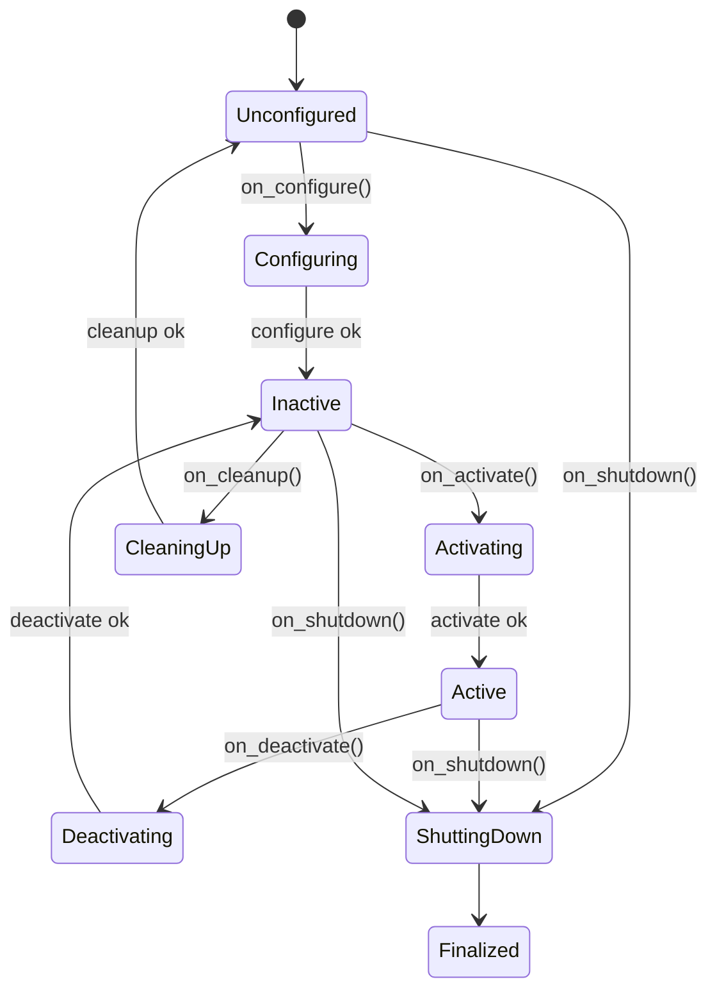

# Lifecycle — управляемый жизненный цикл узла

## Коротко

Lifecycle node — узел, который проходит через предопределенные состояния: создание, настройка, активация, остановка, завершение. Это гарантирует, что узел полностью готов к работе, прежде чем начнет принимать данные.

> *Официальное определение*: «ROS 2 вводит понятие управляемых узлов (managed nodes), также называемых lifecycle nodes. Эти узлы гарантируют, что ресурсы корректно инициализированы и настроены.» — [Lifecycle](https://docs.ros.org/en/jazzy/Concepts/Intermediate/About-Lifecycle.html)

## Что такое lifecycle node

Обычный узел запускается и сразу начинает работать: публиковать, подписываться, принимать запросы. Но что если:
- драйвер мотора еще не настроил порт?
- камера еще не инициализировала сенсор?
- лидар еще не провел самодиагностику?

Lifecycle node имеет явные состояния и переходы между ними:



**Ключевое правило**: узел не принимает данные, пока не перешел в состояние `Active`. Это защита от работы с непроинициализированными ресурсами.

## Зачем нужно

- **Драйвер мотора**: сначала настроить порт (configure), затем активировать контроль (activate), и только потом принимать `/cmd_vel`. Нельзя ехать с ненастроенным контроллером.
- **Драйвер лидара**: сначала проверить устройство (configure), затем начать сканирование (activate).
- **Камера**: сначала открыть устройство (configure), затем начать захват (activate).

Без lifecycle драйверы стартуют «как есть» и могут работать с неинициализированным железом.

## Аналогия

Lifecycle — **запуск автомобиля**:
1. Ключ в замке (Unconfigured)
2. Поворот ключа — бортовая электроника просыпается (Configuring → Inactive)
3. Запуск двигателя — стартер крутит, двигатель заводится (Activating → Active)
4. Автомобиль готов ехать — можно нажимать педали (Active, принимает `/cmd_vel`)
5. Глушим двигатель (Deactivating → Inactive → Finalized)

Нельзя поехать на шаге 2. Нельзя завести двигатель, не повернув ключ.

## Как работает в ROS2

### Lifecycle node

```python
import rclpy
from rclpy.lifecycle import LifecycleNode, State           # базовый класс узла с состояниями
from rclpy.lifecycle import TransitionCallbackReturn       # возвращаемые значения переходов


class ManagedNode(LifecycleNode):                           # вместо Node используем LifecycleNode

    def __init__(self):
        super().__init__('managed_node')

    # вызывается при переходе Unconfigured → Inactive
    def on_configure(self, state: State) -> TransitionCallbackReturn:
        self.get_logger().info('Configuring...')
        return TransitionCallbackReturn.SUCCESS              # SUCCESS → переход выполнен

    # вызывается при переходе Inactive → Active
    def on_activate(self, state: State) -> TransitionCallbackReturn:
        self.get_logger().info('Activating...')
        return TransitionCallbackReturn.SUCCESS

    # вызывается при переходе Active → Inactive
    def on_deactivate(self, state: State) -> TransitionCallbackReturn:
        self.get_logger().info('Deactivating...')
        return TransitionCallbackReturn.SUCCESS

    # вызывается при переходе Inactive → Unconfigured
    def on_cleanup(self, state: State) -> TransitionCallbackReturn:
        self.get_logger().info('Cleaning up...')
        return TransitionCallbackReturn.SUCCESS

    # вызывается при завершении узла из любого состояния
    def on_shutdown(self, state: State) -> TransitionCallbackReturn:
        self.get_logger().info('Shutting down...')
        # Завершение работы
        return TransitionCallbackReturn.SUCCESS
```

Важно: `LifecycleNode` наследуется от `rclpy.lifecycle.LifecycleNode`, а не от `rclpy.node.Node`. Lifecycle node не использует `rclpy.spin()` — вместо этого управление состояниями происходит через CLI или launch.

### Управление состояниями через CLI

```bash
# Список lifecycle nodes
ros2 lifecycle list
# /managed_node [Inactive]

# Переходы
ros2 lifecycle set /managed_node configure
# Transitioning state: Configuring → Inactive

ros2 lifecycle set /managed_node activate
# Transitioning state: Activating → Active

ros2 lifecycle set /managed_node deactivate
# Transitioning state: Deactivating → Inactive

ros2 lifecycle set /managed_node shutdown
# Transitioning state: ShuttingDown → Finalized
```

**Порядок обязателен**: нельзя перейти из Unconfigured в Active, минуя Inactive.

## Привязка к трем уровням

- **Уровень 1 (лекция)**: схема состояний на слайде, объяснение «почему драйвер мотора не должен сразу принимать `/cmd_vel`».
- **Уровень 2 (самостоятельно)**: эта статья — прочитать, понять концепцию. Полноценная практика с lifecycle manager — в расширенных материалах.
- **Уровень 3 (робот TIAGo)**: драйверы лидара, моторов, камеры — lifecycle nodes. `controller_manager` из `ros2_control` управляет lifecycle контроллеров.

## Типичные ошибки

| Ошибка | Симптом | Исправление |
| --- | --- | --- |
| Переход Unconfigured → Activate | Ошибка: нельзя перейти | Порядок: configure → activate |
| Забыли `configure()` перед `activate()` | Узел не активируется | Сначала `ros2 lifecycle set /node configure` |
| Узел в Finalized | Не принимает переходы | Перезапустить узел |
| Обычный `spin()` вместо lifecycle управления | Узел работает как простой Node | Использовать `ros2 lifecycle set` или lifecycle manager в launch |
| Lifecycle node запущен через `ros2 run` | Висит в Unconfigured, ждет команд | Добавить lifecycle manager в launch-файл |

### Пример в реальном роботе

Все узлы Nav2 в TIAGo — lifecycle nodes: `planner_server`, `controller_server`, `bt_navigator`, `amcl`.
Ими управляет `lifecycle_manager`, который активирует их в строгом порядке.
В [`3_Robot/TIAgo_humble/docs/lifecycle_nodes.md`](../../3_Robot/TIAgo_humble/docs/lifecycle_nodes.md) показана цепочка активации
и bond (heartbeat) для контроля жизни узлов.

## Связанные темы

- [Nodes](nodes.md) — обычный узел vs lifecycle node
- [QoS](qos.md) — качество доставки сообщений
- [Parameters](parameters.md) — настройка lifecycle node

## Источники

- [Managed nodes (lifecycle)](https://docs.ros.org/en/jazzy/Tutorials/Intermediate/Managing-Nodes/Managed-Nodes.html)
- [About managed nodes](https://docs.ros.org/en/jazzy/Concepts/Intermediate/About-Managed-Nodes.html)