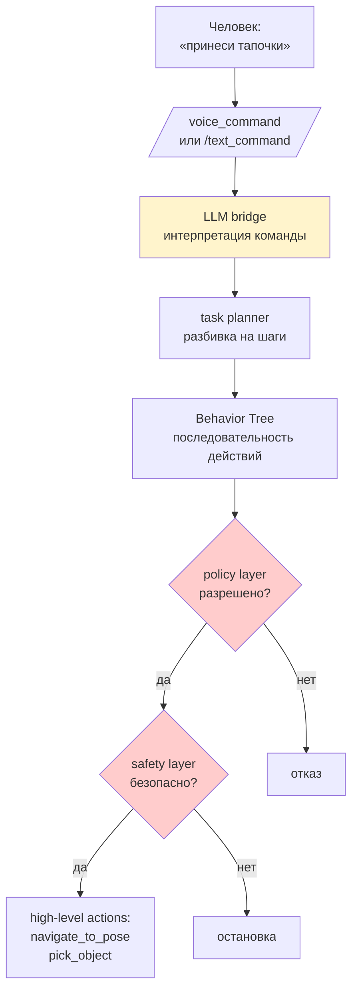
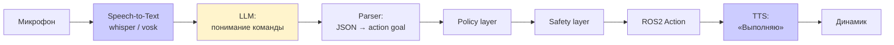

# LLM Bridge — голосовое управление роботом

## Коротко

LLM bridge — узел или набор узлов, который переводит текстовую или голосовую команду человека в разрешенные высокоуровневые действия робота.

**Ключевое правило безопасности**: LLM не управляет моторами, PWM, током, скоростью колес или сервоприводами. LLM формирует только high-level request, который проходит через policy layer (что разрешено?) и safety layer (безопасно ли сейчас?).

## Что такое LLM bridge

LLM (Large Language Model) bridge — это мост между человеческой речью и действиями робота:



Пример цепочки: «принеси тапочки» →
1. LLM интерпретирует: найти тапочки, подъехать, взять, привезти
2. Task planner разбивает на шаги: locate → navigate → pick → navigate
3. Behavior Tree оркеструет выполнение
4. Policy layer проверяет: разрешено ли брать предметы с пола?
5. Safety layer проверяет: есть ли препятствия? достаточен ли заряд батареи?
6. Действия: goal для `/navigate_to_pose`, goal для MoveIt2

## Зачем нужно

Без LLM bridge управление роботом — это:
- «Открой rviz2, поставь goal в (1.5, 2.3), отправь `/navigate_to_pose`»
- Или голосовые команды с жестко закодированным словарем из 5 фраз

С LLM bridge — «Робот, принеси чашку с кухни». Робот сам планирует и выполняет.

## Аналогия

LLM bridge — **переводчик с повседневного языка на язык действий робота**, но с двумя суровыми охранниками:
- Первый охранник (policy) проверяет: «А разрешено ли это действие?»
- Второй охранник (safety) проверяет: «А безопасно ли это сейчас?»

Переводчик (LLM) может предложить что угодно. Охранники пропускают только разрешенное и безопасное.

## Граница безопасности

```
ЗАПРЕЩЕНО: LLM → /cmd_vel (прямое управление моторами)
ЗАПРЕЩЕНО: LLM → PWM (низкоуровневое управление)
ЗАПРЕЩЕНО: LLM → GPIO (пины напрямую)

РАЗРЕШЕНО: LLM → policy → safety → ROS2 action (navigate, pick, place)
РАЗРЕШЕНО: LLM → service (запрос статуса, диагностика)
```

**Почему это критично**: LLM может галлюцинировать, неправильно понять команду или сгенерировать опасное действие. Policy layer — это белый список разрешенных действий. Safety layer — это аварийная защита: E-stop, контроль заряда, препятствия.

## Минимальный bridge-узел без LLM

На первом этапе — фиксированный словарь команд:

```python
COMMANDS = {
    'go to kitchen': {'action': 'navigate', 'x': 3.0, 'y': 1.5},
    'go to bedroom': {'action': 'navigate', 'x': 5.0, 'y': 2.0},
    'stop': {'action': 'emergency_stop'},
    'battery status': {'action': 'get_battery'},
}


class CommandBridge(Node):

    def __init__(self):
        super().__init__('command_bridge')
        self.sub = self.create_subscription(
            String, '/text_command', self.on_command, 10)
        # clients для Nav2, MoveIt2, emergency_stop

    def on_command(self, msg):
        cmd = msg.data.lower().strip()
        if cmd not in COMMANDS:
            self.get_logger().warn(f'Unknown command: {cmd}')
            return
        action = COMMANDS[cmd]
        self.get_logger().info(f'Executing: {cmd}')
        self.execute(action)
```

## Как подключить LLM к ROS2

Есть три способа интеграции LLM в ROS2-узел:

### 1. Внешний API (OpenAI, Anthropic, OpenRouter)

Узел отправляет HTTP-запрос к API и получает JSON-ответ.

```python
import requests
import json
from rclpy.node import Node
from std_msgs.msg import String
from example_interfaces.action import Fibonacci
from rclpy.action import ActionClient

OPENAI_API_KEY = os.getenv('OPENAI_API_KEY')

SYSTEM_PROMPT = """
Ты — интерпретатор команд для мобильного робота.
Отвечай строго JSON-объектом без пояснений:
{"action": "navigate", "params": {"x": float, "y": float}}
{"action": "pick", "params": {"object": str}}
{"action": "status"}
{"action": "stop"}
Доступные действия: navigate, pick, status, stop.
"""

class LLMBridge(Node):

    def __init__(self):
        super().__init__('llm_bridge')
        self.sub = self.create_subscription(
            String, '/voice_command', self.on_command, 10)
        self.nav_client = ActionClient(
            self, NavigateToPose, '/navigate_to_pose')

    def on_command(self, msg):
        response = requests.post(
            'https://api.openai.com/v1/chat/completions',
            headers={
                'Authorization': f'Bearer {OPENAI_API_KEY}',
                'Content-Type': 'application/json',
            },
            json={
                'model': 'gpt-4o-mini',
                'messages': [
                    {'role': 'system', 'content': SYSTEM_PROMPT},
                    {'role': 'user', 'content': msg.data},
                ],
                'temperature': 0,
            },
            timeout=10,
        )
        result = response.json()
        cmd = json.loads(
            result['choices'][0]['message']['content'])
        self.execute(cmd)

    def execute(self, cmd):
        if cmd['action'] == 'navigate':
            goal = NavigateToPose.Goal()
            goal.pose.pose.position.x = cmd['params']['x']
            goal.pose.pose.position.y = cmd['params']['y']
            self.nav_client.send_goal_async(goal)
        elif cmd['action'] == 'stop':
            # вызвать emergency_stop service
            pass
```

Плюсы: не нужна локальная GPU. Минусы: нужен интернет, задержка 1-3 сек.

### 2. Локальная модель (Ollama)

`ollama run llama3.2` на том же хосте или соседнем ПК.

```python
# вместо requests к OpenAI — к localhost:11434
response = requests.post(
    'http://localhost:11434/api/chat',
    json={
        'model': 'llama3.2',
        'messages': [{'role': 'user', 'content': msg.data}],
        'stream': False,
        'format': 'json',  # Ollama поддерживает JSON mode
    },
)
```

Плюсы: без интернета, данные не уходят. Минусы: нужен ПК с 8+ GB RAM.

### 3. Embedded (llama.cpp, llama-cpp-python)

Библиотека загружает модель прямо в процесс ROS2-узла.

```python
from llama_cpp import Llama

llm = Llama(model_path="/models/llama-3.2-3b-q4.gguf")

def on_command(self, msg):
    output = llm.create_chat_completion(
        messages=[{'role': 'user', 'content': msg.data}],
        response_format={"type": "json_object"},
    )
    cmd = json.loads(
        output['choices'][0]['message']['content'])
    self.execute(cmd)
```

Плюсы: минимальная задержка, полная автономность. Минусы: до 4 GB RAM, медленнее API.

## Tool calling (function calling)

OpenAI и Ollama поддерживают tool calling — модель сама решает, какую ROS2-функцию вызвать и с какими аргументами.

```python
import json

tools = [{
    "type": "function",
    "function": {
        "name": "navigate_to_pose",
        "description": "Ехать к точке на карте",
        "parameters": {
            "type": "object",
            "properties": {
                "x": {"type": "number"},
                "y": {"type": "number"},
            },
            "required": ["x", "y"],
        },
    },
}, {
    "type": "function",
    "function": {
        "name": "get_status",
        "description": "Запросить статус робота",
        "parameters": {"type": "object", "properties": {}},
    },
}]

# ответ модели:
# {
#   "tool_calls": [{
#     "function": {"name": "navigate_to_pose", "arguments": "{\"x\": 3.0, \"y\": 1.5}"}
#   }]
# }
```

Tool calling безопаснее свободного текста: модель выбирает из предопределённых действий, а не генерирует произвольный JSON.

## STT → LLM → TTS pipeline

Полная цепочка голосового управления:



| Компонент | Инструмент | ROS2-интеграция |
|---|---|---|
| STT | whisper.cpp, Vosk, Google STT | `audio_capture` → `whisper_ros` → `/text_command` |
| LLM | OpenAI, Ollama, llama.cpp | `/text_command` → `llm_bridge` → JSON |
| TTS | piper-tts, gTTS, ESPnet | JSON result → `tts_node` → `/audio_output` |

## Системный промпт для робота

Шаблон промпта определяет всё поведение LLM:

```
Ты — интерпретатор команд для домашнего робота TIAGo.

ПРАВИЛА:
- Отвечай ТОЛЬКО JSON-объектом.
- Если команда неразборчива → {"action": "clarify", "params": {"question": "что именно принести?"}}
- Если команда опасна → {"action": "reject", "params": {"reason": "нельзя включать плиту"}}
- Доступные действия: navigate, pick, place, find_object, status, stop, clarify, reject
- Координаты в метрах относительно карты робота.
- Если объект не указан — запроси уточнение.

Примеры:
  Пользователь: «принеси чашку с кухни»
  Ответ: {"action": "navigate", "params": {"location": "kitchen", "x": 3.0, "y": 1.5}}

  Пользователь: «стоп»
  Ответ: {"action": "stop"}
```

## Привязка к трем уровням

- **Уровень 1 (лекция)**: схема pipeline «команда → LLM → policy → safety → actions». Фрагмент кода bridge-а. Объяснение границ безопасности.
- **Уровень 2 (самостоятельно)**: эта статья + демонстрация bridge-узла с фиксированным словарем.
- **Уровень 3 (робот TIAGo)**: пакет `tiago_llm_bridge` (запланирован). Узлы: `llm_bridge_node`, `task_planner`, `behavior_tree_engine`, `safety_node`, `policy_node`.

### Пример в реальном роботе

В TIAGo пакет `tiago_llm_bridge` (в разработке) принимает текстовую команду через сервис `/llm_command`,
отправляет её в OpenAI API и выполняет полученные действия: предзаписанные движения через play_motion2,
навигацию через Nav2, манипуляцию через MoveIt2.
В [`3_Robot/TIAgo_humble/docs/llm_bridge.md`](../../3_Robot/TIAgo_humble/docs/llm_bridge.md) показана архитектура bridge
и список разрешённых движений play_motion2 как safety envelope.

## Связанные темы

- [Safety layer](safety.md) — защита от опасных действий
- [ROS Architecture](ros_architecture.md) — подсистемы LLM Bridge и Safety
- [Actions](actions.md) — high-level команды через actions
- [YOLO bridge](yolo_bridge.md) — LLM использует YOLO для понимания окружения
- [Nav2 bridge](nav2_bridge.md) — navigate_to_pose
- [MoveIt2 bridge](moveit2_bridge.md) — pick/place

## Источники

- [ROS2 Behavior Trees](https://navigation.ros.org/behavior_trees/index.html)
- [MCP Specification](https://modelcontextprotocol.io/)