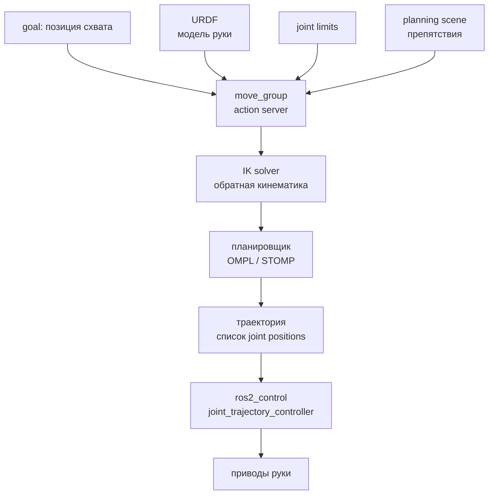

# MoveIt2 — планирование движений манипулятора

## Коротко

MoveIt2 — стек ROS2 для планирования движений манипулятора. Принимает цель (позиция схвата), строит траекторию без столкновений, учитывая модель робота, ограничения суставов и препятствия. Отправляет траекторию в `ros2_control` для выполнения.

## Что такое MoveIt2

MoveIt2 решает задачу: как переместить схват из точки A в точку B, не врезавшись в себя и окружение?



### Ключевые компоненты

| Компонент          | Что делает                                                                      |
| ------------------ | ------------------------------------------------------------------------------- |
| **move_group**     | Центральный action server. Принимает goal, возвращает траекторию или выполняет. |
| **IK solver**      | Обратная кинематика: пересчитывает «схват в точке (x,y,z)» → углы суставов.     |
| **Planner**        | OMPL, STOMP, CHOMP — строит траекторию без столкновений.                        |
| **Planning scene** | Мир вокруг робота: препятствия, стол, объекты.                                  |
| **ros2_control**   | Выполняет траекторию на реальных или симулируемых приводах.                     |

## Зачем нужно

Рука робота не может просто «поехать в точку». Нужно:
- решить обратную кинематику (какие углы?);
- проверить столкновения (не врежется ли в себя?);
- учесть ограничения суставов (максимальный угол);
- построить плавную траекторию с учетом скоростей и ускорений.

MoveIt2 делает все это автоматически.

## Аналогия

MoveIt2 — **диспетчер движения руки**. Вы говорите «возьми чашку», диспетчер (MoveIt2) проверяет: где чашка (planning scene), как дотянуться (IK), не задеть ли стол (planner). Затем выдает команды каждому суставу (ros2_control).

## Как использовать MoveIt2

### Python API

```python
from moveit_msgs.msg import PoseStamped
from moveit_motion.planning_interface import MoveGroupInterface  # API MoveIt2


class ArmController(Node):

    def __init__(self):
        super().__init__('arm_controller')
        # интерфейс к группе суставов 'arm' (в SRDF описано, какие joint-ы входят)
        self.move_group = MoveGroupInterface(
            self, 'arm', 'robot_description')

    def move_to(self, x, y, z):
        goal = PoseStamped()                 # задаём целевую позицию схвата
        goal.header.frame_id = 'base_link'   # относительно базы робота
        goal.pose.position.x = x
        goal.pose.position.y = y
        goal.pose.position.z = z
        self.move_group.set_pose_target(goal)  # IK: x,y,z → углы суставов
        self.move_group.move()                 # планирование + выполнение
```

Типичный запуск MoveIt2:

```bash
ros2 launch tiago_moveit_config move_group.launch.py
```

## Привязка к трем уровням

- **Уровень 1 (лекция)**: схема MoveIt2 pipeline, фрагмент кода Python API, объяснение что IK и planner делают.
- **Уровень 2 (самостоятельно)**: эта статья + будущая практика с MoveIt2 и демо-роботом (Panda).
- **Уровень 3 (робот TIAGo)**: `tiago_moveit_config/` — конфиги для 7-DOF руки. SRDF, kinematics.yaml, OMPL-планировщик, joint limits.

## MoveIt2 и другие механизмы ROS2

| Механизм ROS2 | Где в MoveIt2 |
| --- | --- |
| **Action** | `move_group` — action server. Goal → траектория, feedback → прогресс. |
| **Parameters** | `kinematics.yaml`, `ompl_planning.yaml` — сотни параметров. |
| **tf2** | Все координаты: `base_link → arm_1_link → ... → gripper_link`. |
| **URDF** | Модель руки: joints, limits, geometry. |
| **ros2_control** | Выполнение траектории через `joint_trajectory_controller`. |

## Типичные ошибки

| Ошибка | Симптом | Исправление |
| --- | --- | --- |
| Цель вне рабочей области | Планирование падает | Проверить reachability: может ли рука дотянуться? |
| Self-collision | Рука планирует «сквозь себя» | Проверить ACM (Allowed Collision Matrix) в SRDF |
| IK не находит решение | MoveIt2 висит на планировании | Упростить цель или использовать другой IK solver |
| controller не активирован | Траектория спланирована, но не выполняется | Проверить `ros2_control` controllers |

### Пример в реальном роботе

TIAGo оснащён 7-DOF манипулятором, MoveIt2 планирует траектории с учётом модели, столкновений и ограничений суставов.
В [`3_Robot/TIAgo_humble/docs/manipulation.md`](../../3_Robot/TIAgo_humble/docs/manipulation.md) показана конфигурация
move_group, OMPL-планировщики, kinematics.yaml и play_motion2 с 10 предзаписанными движениями.

## Связанные темы

- [URDF/Xacro](urdf_xacro.md) — модель руки для MoveIt2
- [ros2_control](ros2_control.md) — выполнение траекторий
- [Actions](actions.md) — MoveGroup — action server
- [tf2](tf2.md) — координаты звеньев руки

## Источники

- [MoveIt2 Documentation](https://moveit.picknik.ai/main/index.html)
- [MoveIt2 Tutorials](https://moveit.picknik.ai/main/doc/tutorials/tutorials.html)