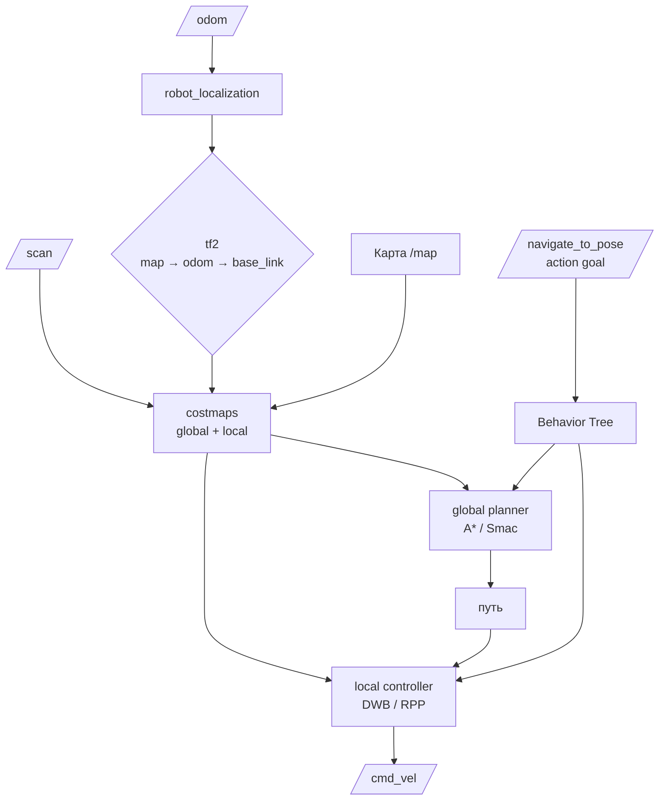

# Nav2 — навигация мобильного робота

## Коротко

Nav2 (Navigation2) — стек ROS2, который позволяет мобильному роботу самостоятельно доехать до цели: строит маршрут, объезжает препятствия, корректирует движение. Использует topic, action, tf2, parameters — все, что вы уже знаете.

## Что такое Nav2

Nav2 — набор ROS2-узлов, которые вместе решают задачу навигации:



### Компоненты Nav2

| Компонент | Что делает | ROS2-механизм |
| --- | --- | --- |
| **Global planner** | Строит маршрут от текущей позиции до цели (A*, Smac) | Внутренний (не ROS2-интерфейс) |
| **Local controller** | Управляет скоростью, объезжает препятствия (DWB, RPP) | Внутренний |
| **Costmaps** | Карты «стоимости»: где можно ехать, где препятствие | Подписка на `/scan`, `/map` |
| **Behavior Tree** | Оркеструет навигацию: план → контроль → восстановление | Логика внутри `bt_navigator` |
| **AMCL / SLAM** | Локализация: где робот на карте | Публикует `map → odom` в tf2 |

## Зачем нужно

Без Nav2 каждый раз пишем свой планировщик пути и контроллер. Nav2 дает:
- готовые планировщики (A*, Smac);
- готовые контроллеры (DWB, RPP);
- карты стоимости (global + local costmaps);
- поддержку SLAM (slam_toolbox) и локализации (AMCL);
- стандартный action-интерфейс `/navigate_to_pose`.

## Аналогия

Nav2 — **навигатор в автомобиле**:
- карта (map) — то же, что в навигаторе;
- global planner — строит маршрут из точки А в точку Б;
- local controller — рулит, объезжает пробки/препятствия;
- goal — «поехали на ул. Ленина, 5» (action `/navigate_to_pose`).

## Как использовать Nav2

### Входные данные

| Данные | Тип | Откуда |
| --- | --- | --- |
| `/scan` | `sensor_msgs/LaserScan` | Лидар |
| `/odom` | `nav_msgs/Odometry` | Контроллер моторов (через ros2_control) |
| `/tf` | transforms | `robot_state_publisher` + AMCL/SLAM |
| Карта | `nav_msgs/OccupancyGrid` | SLAM или загруженная карта |

### Выход: action `/navigate_to_pose`

```python
from geometry_msgs.msg import PoseStamped
from nav2_msgs.action import NavigateToPose   # action для навигации


class NavigatorClient(Node):

    def __init__(self):
        super().__init__('navigator_client')
        # создаём action client для Nav2: тип NavigateToPose, сервер на /navigate_to_pose
        self.client = ActionClient(self, NavigateToPose, '/navigate_to_pose')
        self.client.wait_for_server()          # ждём, пока Nav2 запустится

    def go_to(self, x, y, yaw):
        goal = NavigateToPose.Goal()           # создаём цель
        goal.pose.header.frame_id = 'map'      # координаты в системе карты
        goal.pose.pose.position.x = x
        goal.pose.pose.position.y = y
        # yaw (угол) можно задать в goal.pose.pose.orientation

        self.client.send_goal_async(goal, feedback_callback=self.feedback)

    def feedback(self, msg):
        remaining = msg.feedback.distance_remaining
        self.get_logger().info(f'Distance to goal: {remaining:.2f} m')
```

Типичный запуск Nav2:

```bash
ros2 launch nav2_bringup navigation_launch.py \
  params_file:=config/nav2_params.yaml \
  map:=maps/my_map.yaml
```

## Привязка к трем уровням

- **Уровень 1 (лекция)**: схема Nav2 pipeline, объяснение `/navigate_to_pose` action, демонстрация кода action client.
- **Уровень 2 (самостоятельно)**: эта статья + будущая практика с TurtleBot в симуляции.
- **Уровень 3 (робот TIAGo)**: `pmb2_navigation/` — конфиги Nav2 (`nav2_params.yaml`), launch-файлы, 15 карт в `pal_maps/`. `/navigate_to_pose` используется для отправки робота в любую точку квартиры.

## Типичные ошибки

| Ошибка | Симптом | Исправление |
| --- | --- | --- |
| Нет карты | Nav2 не стартует или робот не едет | Запустить SLAM или загрузить карту |
| Нет `/scan` | Планировщик не видит препятствия | Проверить лидар: `ros2 topic echo /scan` |
| Неправильное tf2-дерево | Робот едет не туда | `view_frames` — проверить `map → odom → base_link` |
| Забыли `use_sim_time:=true` | В симуляции Nav2 не работает | Добавить `use_sim_time:=true` в launch/параметры |
| Goal в неправильном frame | Робот пытается ехать в (0,0) | `goal.pose.header.frame_id = 'map'` |

### Пример в реальном роботе

TIAGo использует Nav2 для автономной навигации: `planner_server` (NavfnPlanner), `controller_server` (DWB), `amcl`.
В [`3_Robot/TIAgo_humble/docs/navigation.md`](../../3_Robot/TIAgo_humble/docs/navigation.md) показана архитектура Nav2
в TIAGo: costmaps, velocity_smoother, два источника одометрии (DiffDriveController / DLO).
Action `/navigate_to_pose` — основной интерфейс для отправки робота в точку.

## Связанные темы

- [Actions](actions.md) — `/navigate_to_pose` — это action
- [tf2](tf2.md) — Nav2 использует tf2 для всех координатных преобразований
- [ros2_control](ros2_control.md) — `/cmd_vel` из Nav2 идет через ros2_control
- [URDF/Xacro](urdf_xacro.md) — модель робота

## Источники

- [Nav2 Documentation](https://docs.nav2.org/)
- [Nav2 Getting Started](https://docs.nav2.org/getting_started/index.html)
- [Nav2 Concepts](https://docs.nav2.org/concepts/index.html)