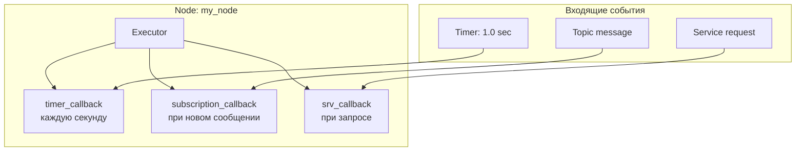

# Node — программа робота в ROS2

## Коротко

Node — выполняемый компонент ROS2, который решает одну задачу и общается с другими узлами через topics, services и actions.

> *Официальное определение*: «Узел — это участник графа ROS 2, который использует клиентскую библиотеку для общения с другими узлами.» — [Nodes](https://docs.ros.org/en/jazzy/Concepts/Basic/About-Nodes.html)

## Что такое node

Каждая программа в ROS2 — это node. Примеры из робота:
- `camera_node` — захватывает кадры и публикует их в `/camera/image_raw`;
- `motor_controller` — принимает `/cmd_vel` и управляет колесами, публикует `/odom`;
- `yolo_node` — получает изображение и публикует найденные объекты в `/detections`.

**Один узел = одна ответственность.** Не пишите узел, который одновременно читает камеру, считает одометрию и управляет моторами.

## Зачем нужно

Разделение на узлы дает:
- **модульность** — можно переписать узел камеры, не трогая навигацию;
- **параллелизм** — каждый узел работает в своем потоке или процессе;
- **отказоустойчивость** — падение одного узла не рушит всю систему;
- **распределенность** — узлы могут работать на разных компьютерах.

## Аналогия

Node — **сотрудник в офисе**. У каждого свой стол и своя задача. Сотрудники общаются через:
- общий канал (topic) — объявление на доске;
- прямой запрос (service) — вопрос коллеге;
- поручение с отчетом (action) — задача с контролем выполнения.

Executor — **секретарь** сотрудника. Он разбирает входящие сообщения и вызывает нужные обработчики (callbacks).

## Как работает в ROS2

### Executor и callbacks



- **Executor** — цикл, который ждет событий (таймер, сообщение, запрос) и вызывает соответствующий callback.
- **Callback** — ваша функция, которая выполняется при событии. Например, `timer_callback` срабатывает по таймеру, `subscription_callback` — при получении сообщения.
- **spin()** — запускает Executor. **Без `spin()` ни один callback не вызовется.**

### spin() — почему это важно

```python
rclpy.init()
node = MyNode()
# Без spin() узел создается, но сразу завершается — callbacks не вызываются
rclpy.spin(node)  # ← вот эта строка запускает цикл обработки событий
```

Если забыть `spin()`, узел запустится, выведет сообщение конструктора и завершится. Timer не сработает, сообщения не придут.

## Минимальный узел

```python
# my_node.py
import rclpy                         # библиотека ROS 2 для Python
from rclpy.node import Node          # базовый класс узла


class MyNode(Node):

    def __init__(self):
        super().__init__('my_node')  # регистрируем узел с именем 'my_node'
        self.count = 0
        # таймер: раз в 1 секунду вызывает timer_callback
        self.timer = self.create_timer(1.0, self.timer_callback)
        self.get_logger().info('Node started')  # аналог print() с меткой узла

    def timer_callback(self):
        self.count += 1
        self.get_logger().info(f'Tick #{self.count}')


def main(args=None):
    rclpy.init(args=args)            # инициализация ROS 2 (обязательно!)
    node = MyNode()                  # создаём узел
    rclpy.spin(node)                 # запуск цикла событий — без него не работают callbacks
    node.destroy_node()              # освобождаем ресурсы узла
    rclpy.shutdown()                 # корректное завершение ROS 2
```

### Разбор ключевых строк

| Строка | Что делает |
| --- | --- |
| `super().__init__('my_node')` | Регистрирует узел в ROS2 с именем `my_node` |
| `self.create_timer(1.0, self.timer_callback)` | Создает таймер: раз в секунду вызывает `timer_callback` |
| `self.get_logger().info(...)` | Печатает сообщение в лог ROS2 (аналог `print`, но с метаданными) |
| `rclpy.init(args=args)` | Инициализирует клиентскую библиотеку ROS2 для Python |
| `rclpy.spin(node)` | Запускает Executor — бесконечный цикл ожидания событий |
| `rclpy.shutdown()` | Корректно завершает работу |

### setup.py — точка входа

Чтобы `ros2 run` знал, какой файл запускать:

```python
# setup.py (фрагмент)
entry_points={
    'console_scripts': [
        'my_node = my_first_pkg.my_node:main',
        # имя_команды = пакет.файл:функция
    ],
},
```

После этого:

```bash
ros2 run my_first_pkg my_node
# Вывод:
# [INFO] [...] Node started
# [INFO] [...] Tick #1
# [INFO] [...] Tick #2
```

## CLI-команды для отладки узлов

```bash
# Список всех запущенных узлов
ros2 node list
# Вывод: /my_node

# Информация об узле: подписки, публикации, сервисы
ros2 node info /my_node

# Визуализация ROS Graph
rqt_graph
```

## Типичные ошибки

| Ошибка | Симптом | Исправление |
| --- | --- | --- |
| Забыли `spin()` | Узел создается и сразу завершается, callback не срабатывает | Добавить `rclpy.spin(node)` в `main()` |
| Блокирующий код в callback | Таймер перестает срабатывать, узел зависает | Callback должен выполняться быстро. Долгие операции выносить в отдельный поток. |
| `entry_points` не обновлен | `ros2 run` не находит команду | Проверить `setup.py` → `entry_points` → `console_scripts` |
| Имя узла уже занято | Ошибка при запуске второго экземпляра | Каждый узел должен иметь уникальное имя. Использовать переопределение имени при запуске. |
| Забыли `rclpy.init()` | `RuntimeError: rclpy.init() has not been called` | Добавить `rclpy.init(args=args)` перед созданием узла |

### Пример в реальном роботе

Базовый запуск TIAGo содержит **~15 узлов**: `robot_state_publisher`, `controller_manager`, `DiffDriveController`,
`twist_mux`, `joint_state_broadcaster`, `gazebo_ros`, `rviz2` и другие.
В [`3_Robot/TIAgo_humble/docs/tiago_architecture.md`](../../3_Robot/TIAgo_humble/docs/tiago_architecture.md) показан полный граф узлов
и их распределение по подсистемам.

## Связанные темы

- [Пакеты](packages.md) — в каком пакете создать узел
- [colcon](colcon.md) — сборка узла
- [Topics](topics.md) — следующий шаг: publisher и subscriber
- [Services](services.md) — запрос-ответ
- [Actions](actions.md) — длительные задачи

## Источники

- [Understanding ROS2 Nodes](https://docs.ros.org/en/jazzy/Tutorials/Beginner-CLI-Tools/Understanding-ROS2-Nodes/Understanding-ROS2-Nodes.html)
- [About Executors](https://docs.ros.org/en/jazzy/Concepts/Intermediate/About-Executors.html)