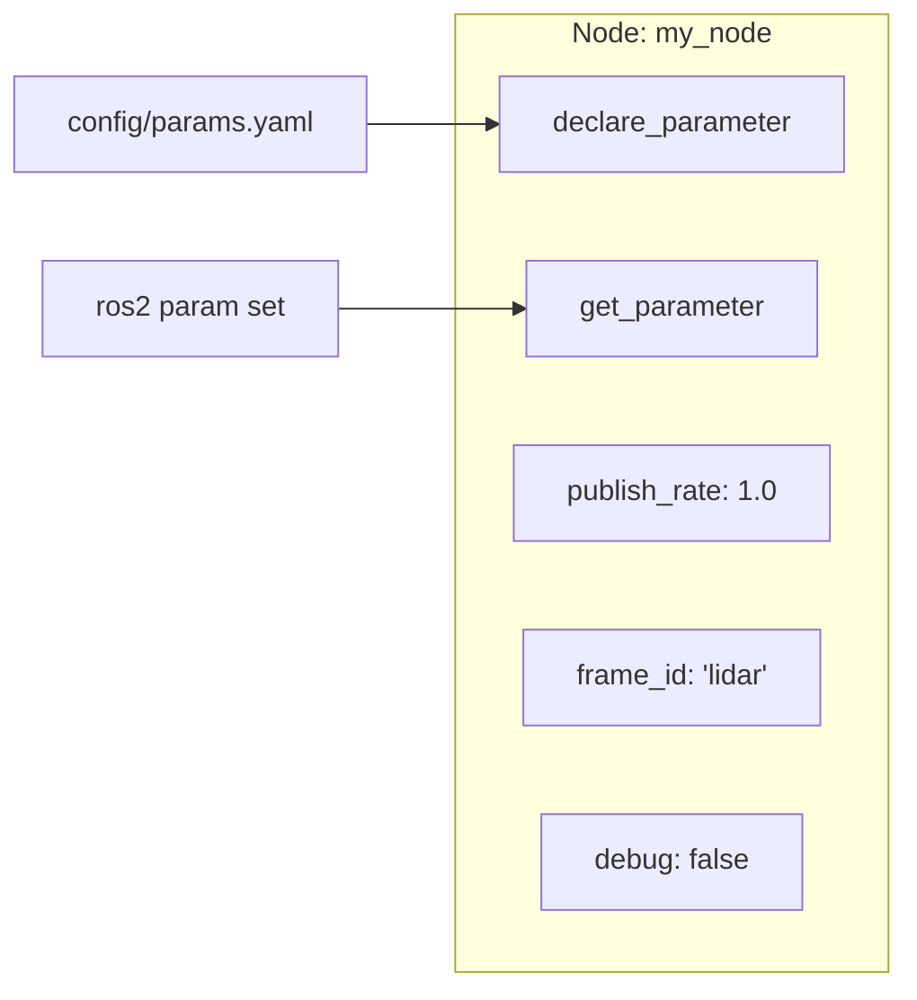

# Parameters — настройки узлов в ROS2

## Коротко

Parameter — именованное значение в узле, которое меняется без перекомпиляции. Задается в YAML-файле, через командную строку или в launch-файле.

> *Официальное определение*: «Параметр — это конфигурационное значение для узла.» — [Parameters](https://docs.ros.org/en/jazzy/Concepts/Basic/About-Parameters.html)

## Что такое parameter

Parameter — пара «ключ-значение» внутри узла:



Узел объявляет (declares) параметры при инициализации и получает (gets) их в runtime. Значения могут приходить из:
- **YAML-файла** — основной способ для production-конфигураций;
- **Аргументов командной строки** — `ros2 run ... --ros-args -p publish_rate:=2.0`;
- **CLI на лету** — `ros2 param set /my_node publish_rate 2.0`;
- **Launch-файла** — передача параметров при запуске системы.

## Зачем нужно

Без параметров каждое изменение поведения требует правки кода и пересборки. С параметрами:
- частота публикации лидара меняется в YAML (не в коде);
- порог срабатывания safety-узла настраивается без перекомпиляции;
- уровень логирования меняется на лету при отладке.

В роботе TIAGo сотни параметров: настройки Nav2, контроллеров, камер, лидара — все в YAML.

## Аналогия

Parameters — **настройки телефона**: яркость экрана, громкость, язык интерфейса. Вы меняете их через меню (YAML / CLI), а не перепрошиваете телефон (не перекомпилируете).

## Как работает в ROS2

### Объявление и получение

```python
class MyNode(Node):

    def __init__(self):
        super().__init__('my_node')

        # объявляем параметры с именем и значением по умолчанию
        self.declare_parameter('publish_rate', 1.0)   # частота публикации, Гц
        self.declare_parameter('frame_id', 'lidar')   # имя системы координат

        # читаем значение параметра: get_parameter() → value
        rate = self.get_parameter('publish_rate').value
        self.get_logger().info(f'Publish rate: {rate} Hz')
```

### YAML-конфигурация

```yaml
# config/params.yaml
my_node:
  ros__parameters:
    publish_rate: 2.0
    frame_id: "camera_link"
```

Запуск с YAML:

```bash
ros2 run my_pkg my_node --ros-args --params-file config/params.yaml
```

### Динамическое изменение

```bash
# Посмотреть все параметры узла
ros2 param list

# Прочитать значение
ros2 param get /my_node publish_rate

# Изменить на лету (если узел читает параметр в цикле)
ros2 param set /my_node publish_rate 5.0

# Сохранить текущие параметры в YAML
ros2 param dump /my_node > saved_params.yaml

# Загрузить параметры из YAML в работающий узел
ros2 param load /my_node config/params.yaml
```

## CLI-команды

| Команда | Что делает | Когда использовать |
| --- | --- | --- |
| `ros2 param list` | Список параметров всех узлов | Быстро увидеть, какие настройки есть |
| `ros2 param get /node param` | Прочитать значение | Проверить, что параметр загрузился |
| `ros2 param set /node param value` | Изменить на лету | Отладка: поменять порог, частоту |
| `ros2 param dump /node` | Сохранить все параметры в YAML | Зафиксировать рабочую конфигурацию |
| `ros2 param load /node file.yaml` | Загрузить параметры из YAML | Применить новую конфигурацию |

## Параметры в launch-файле

```python
from launch import LaunchDescription
from launch_ros.actions import Node
from launch.substitutions import PathJoinSubstitution
from launch_ros.substitutions import FindPackageShare


def generate_launch_description():
    config = PathJoinSubstitution([
        FindPackageShare('my_pkg'),
        'config', 'params.yaml'
    ])

    node = Node(
        package='my_pkg',
        executable='talker',
        parameters=[config]    # ← YAML подключается здесь
    )

    return LaunchDescription([node])
```

## Пример в коде: узел с настраиваемой частотой

```python
import rclpy
from rclpy.node import Node
from std_msgs.msg import String


class TimedTalker(Node):

    def __init__(self):
        super().__init__('timed_talker')
        self.declare_parameter('publish_rate', 1.0)
        self.declare_parameter('message_prefix', 'Hello')

        rate = self.get_parameter('publish_rate').value
        prefix = self.get_parameter('message_prefix').value

        self.publisher = self.create_publisher(String, '/chatter', 10)
        self.count = 0
        period = 1.0 / rate if rate > 0 else 1.0
        self.timer = self.create_timer(period, self.callback)
        self.get_logger().info(
            f'Started: rate={rate} Hz, prefix="{prefix}"')

    def callback(self):
        prefix = self.get_parameter('message_prefix').value
        msg = String()
        msg.data = f'{prefix} #{self.count}'
        self.publisher.publish(msg)
        self.count += 1
```

Запуск с YAML — частота 5 Гц, префикс «Msg»:

```yaml
timed_talker:
  ros__parameters:
    publish_rate: 5.0
    message_prefix: "Msg"
```

## Привязка к трем уровням

- **Уровень 1 (лекция)**: преподаватель показывает `ros2 param list` / `set` / `get`, меняет параметр на лету и демонстрирует изменение поведения.
- **Уровень 2 (самостоятельно)**: эта статья + [практика 06](../2_practice/06_launch.md) — узел с параметром + YAML + launch.
- **Уровень 3 (робот TIAGo)**: 170 YAML-файлов в `3_Robot/TIAgo_humble/ros2_ws/src/*/config/`. `nav2_params.yaml`, `arm_controller.yaml`, `camera_params.yaml`.

## Типичные ошибки

| Ошибка | Симптом | Исправление |
| --- | --- | --- |
| Параметр не объявлен | `ros2 param list` не показывает параметр | Вызвать `self.declare_parameter()` в `__init__` |
| Неверный путь к YAML | Ошибка «file not found» | Использовать `FindPackageShare` в launch или полный путь |
| Параметр прочитан один раз в `__init__` | `ros2 param set` не меняет поведение | Читать `get_parameter().value` в callback, а не в `__init__` |
| Неправильный синтаксис YAML | Ошибка парсинга | `node_name:\n  ros__parameters:\n    key: value` — важен отступ (2 пробела) |
| Забыли добавить YAML в `setup.py` | Launch не находит файл | Добавить `('share/.../config', ['config/params.yaml'])` в `data_files` |

### Пример в реальном роботе

TIAGo использует **170+ YAML-конфигов** для настройки всех подсистем: `nav_public_sim.yaml` (Nav2),
`arm_controller.yaml` (манипуляция), `twist_mux.yaml` (безопасность).
В [`3_Robot/TIAgo_humble/docs/launch_params.md`](../../3_Robot/TIAgo_humble/docs/launch_params.md) показаны основные конфиги
и команды `ros2 param` для работы с параметрами на лету.

## Связанные темы

- [Launch](launch.md) — запуск системы с параметрами
- [Nodes](nodes.md) — устройство узла
- [Topics](topics.md) — обмен сообщениями
- [QoS](qos.md) — параметры качества доставки

## Источники

- [Understanding ROS2 Parameters](https://docs.ros.org/en/jazzy/Tutorials/Beginner-CLI-Tools/Understanding-ROS2-Parameters/Understanding-ROS2-Parameters.html)
- [Using parameters in a class (Python)](https://docs.ros.org/en/jazzy/Tutorials/Beginner-Client-Libraries/Using-Parameters-In-A-Class-Python.html)