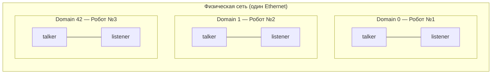
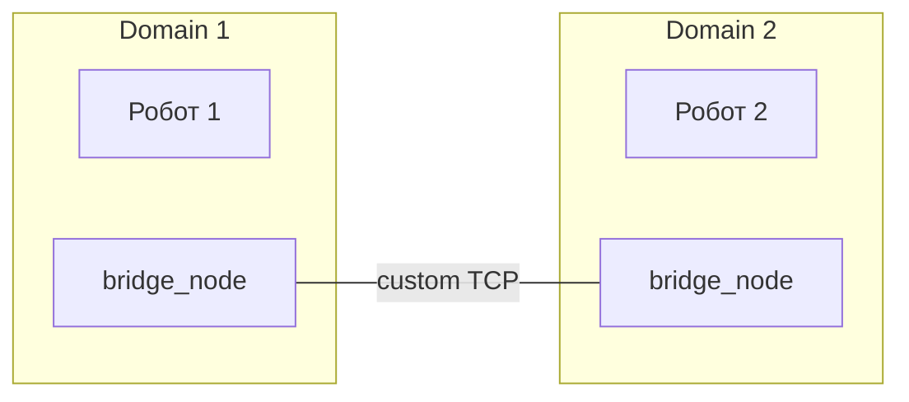

# Управление флотом роботов: ROS_DOMAIN_ID

## Коротко

`ROS_DOMAIN_ID` — это номер логической сети DDS. Узлы с одинаковым `ROS_DOMAIN_ID` видят друг друга. Узлы с разными ID — нет. Это основной механизм изоляции ROS2 для multi-robot систем.

> *Официальное определение*: «Domain ID используется DDS для вычисления UDP-портов, которые будут использоваться для обнаружения и обмена данными.» — [Domain ID](https://docs.ros.org/en/jazzy/Concepts/Intermediate/About-Domain-ID.html)

## Что это

`ROS_DOMAIN_ID` — переменная окружения, которая задаёт domain ID для DDS participant-а. DDS использует domain ID для:

- расчёта UDP-портов discovery и данных;
- фильтрации multicast-трафика (разные domain → разные multicast-адреса).

В одном физическом сегменте сети может одновременно работать несколько ROS2-флотов — по одному на каждый domain ID — полностью изолированно.

## Зачем нужно

Представьте лабораторию с 10 мобильными роботами TIAGo. Если все работают на domain 0:

- узлы робота №1 будут пытаться подписаться на `/cmd_vel` робота №2;
- произойдёт коллизия команд, одометрии, карт.

`ROS_DOMAIN_ID` изолирует каждого робота в свою логическую сеть.

## Аналогия

`ROS_DOMAIN_ID` — **этаж в здании**. На каждом этаже своя вечеринка (флот роботов). Участники с разных этажей не слышат друг друга, хотя находятся в одном здании (физической сети).

## Как работает

### Формула портов

DDS рассчитывает UDP-порты по формуле:

```
discovery multicast = 7400 + 250 × domainId + 0
discovery unicast   = 7400 + 250 × domainId + 10 + 2 × participantId
user multicast      = 7400 + 250 × domainId + 1
user unicast        = 7400 + 250 × domainId + 11 + 2 × participantId
```

Для разных domain ID получаются разные порты — поэтому трафик не пересекается.

Пример:

| Domain ID | Discovery multicast | User multicast | Доступно participants |
|---|---|---|---|
| 0 | 7400 | 7401 | 0–119 |
| 1 | 7650 | 7651 | 0–119 |
| 42 | 17900 | 17901 | 0–119 |
| 232 | 65400 | 65401 | 0–119 |

Максимальный domain ID — **232** (при 233 порт > 65535).

### Изоляция: проверка на практике

```bash
# терминал 1 — domain 0
export ROS_DOMAIN_ID=0
ros2 run demo_nodes_cpp talker
# видно в ros2 node list

# терминал 2 — domain 1 (НЕ видит talker)
export ROS_DOMAIN_ID=1
ros2 node list  # пусто — изоляция работает
ros2 run demo_nodes_cpp listener  # ничего не получит
```



### Сценарии multi-robot

**1. Полная изоляция** — каждый робот имеет уникальный `ROS_DOMAIN_ID`.

```bash
# на каждом роботе в .bashrc
export ROS_DOMAIN_ID=$ROBOT_ID  # 1, 2, 3, ...
```

Плюс: нет пересечения трафика. Минус: роботы не видят друг друга.

**2. Общий domain + namespace** — все роботы в одном domain, но каждый использует свой namespace.

```bash
export ROS_DOMAIN_ID=0
# запуск узлов с namespace
ros2 run my_pkg camera_node --ros-args -r __ns:=/robot1
ros2 run my_pkg camera_node --ros-args -r __ns:=/robot2
```

Топики: `/robot1/scan`, `/robot2/scan`, `/robot1/cmd_vel`, `/robot2/cmd_vel`.

Плюс: роботы могут обмениваться данными (координация флота). Минус: трафик смешан, нужна дисциплина namespace.

**3. Гибрид** — каждому роботу свой domain + bridge-узел для cross-domain связи.



Bridge-узел подписывается в своём domain и перепубликует в другом через сокет или ROS2 bag.

### Firewall и ROS_DOMAIN_ID

Если сеть защищена firewall, нужно открыть UDP-порты для нужного domain:

```bash
# для domain 42:
# discovery multicast: 17900
# user multicast: 17901
# discovery unicast: 17910 + 2×pId
# user unicast: 17911 + 2×pId

sudo ufw allow proto udp from any to 239.255.0.0/24 port 17900:17920
```

Упрощённый вариант — открыть все порты DDS:

```bash
sudo ufw allow proto udp from any to any port 7400:7500  # domain 0
sudo ufw allow proto udp from 192.168.0.0/16 to any port 17900:17920  # domain 42
```

### Discovery Server для multi-robot

Если multicast недоступен (WiFi, облако,跨-сеть), используется Discovery Server:

```bash
# общий сервер для флота
fastdds discovery --server-id 0 --ip-address 192.168.1.100 --port 11811

# на каждом роботе
export ROS_DOMAIN_ID=42
export ROS_DISCOVERY_SERVER="192.168.1.100:11811"
```

Все роботы регистрируются на одном сервере, но discovery-трафик идёт только через него.

## Команды

```bash
# установить domain
export ROS_DOMAIN_ID=5
echo "export ROS_DOMAIN_ID=5" >> ~/.bashrc  # навсегда

# проверить текущий domain
echo $ROS_DOMAIN_ID

# посмотреть, какие node в вашем domain
ros2 node list

# проверить, что изоляция работает (два терминала)
# терминал 1:
ROS_DOMAIN_ID=0 ros2 run demo_nodes_cpp talker
# терминал 2:
ROS_DOMAIN_ID=1 ros2 run demo_nodes_cpp listener  # тишина
ROS_DOMAIN_ID=0 ros2 run demo_nodes_cpp listener  # работает
```

## Ожидаемый результат

- Узлы с разными `ROS_DOMAIN_ID` не видят друг друга (`ros2 node list` пуст).
- `tcpdump` показывает разные порты для разных domain ID.
- После записи `ROS_DOMAIN_ID` в `.bashrc` изоляция сохраняется между перезапусками.

## Типичные ошибки

| Симптом | Причина | Исправление |
|---|---|---|
| Два робота управляют друг другом | Оба на domain 0 | Раздать уникальные `ROS_DOMAIN_ID` |
| `ros2 node list` не показывает узлы на соседнем ПК | Разные `ROS_DOMAIN_ID` | Проверить `echo $ROS_DOMAIN_ID` на обоих хостах |
| После перезагрузки изоляция пропала | `ROS_DOMAIN_ID` не добавлен в `.bashrc` | Добавить `export ROS_DOMAIN_ID=N` в `.bashrc` |
| Ошибка "calculated port number is too high" | domain ID > 232 | Снизить до 0–232 |
| Не работает на WiFi | Multicast отфильтрован | Использовать Discovery Server |
| Конфликт участников при >120 nodes на одном хосте | Переполнение портов domain | Снизить количество participants или увеличить `mutation_tries` |

## Привязка к роботу

**TIAGo** в `3_Robot/TIAgo_humble/` по умолчанию использует `ROS_DOMAIN_ID=0`. В лаборатории с 10 TIAGo каждому должен быть назначен уникальный domain ID.

```bash
# пример fleet-запуска для робота №3
export ROBOT_ID=3
export ROS_DOMAIN_ID=$((ROBOT_ID + 100))  # domain 103
export ROS_NAMESPACE="/robot${ROBOT_ID}"
ros2 launch tiago_bringup tiago_main.launch.py
```

### Пример в реальном роботе

Для multi-robot сценариев с TIAGo каждый робот запускается с уникальным ROS_DOMAIN_ID.
В [`3_Robot/TIAgo_humble/docs/rmw_dds.md`](../../3_Robot/TIAgo_humble/docs/rmw_dds.md) показан пример с двумя экземплярами
симуляции TIAGo, изолированными через домены 56 и 57.

## Связанные темы

- [DDS: протокол, транспорт и выбор реализации](dds_protocol.md) — расчёт портов, RTPS
- [Discovery: автоматическое обнаружение узлов](discovery.md) — как узлы находят друг друга внутри domain
- [RMW: ROS Middleware Wrapper](rmw.md) — смена DDS-реализации
- [Architecture ROS2](ros_architecture.md) — общее устройство

## Источники

- [About the Domain ID (ROS2 Jazzy)](https://docs.ros.org/en/jazzy/Concepts/Intermediate/About-Domain-ID.html)
- [Fast DDS Discovery Server tutorial (ROS2 Jazzy)](https://docs.ros.org/en/jazzy/Tutorials/Advanced/Discovery-Server/Discovery-Server.html)
- [Fast DDS Port documentation](https://fast-rtps.docs.eprosima.com/en/2.10.x/fastdds/transport/listening_locators.html)
- [ROS2 multi-robot book (OSRF)](https://osrf.github.io/ros2multirobotbook/)
