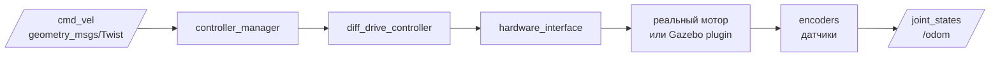

# ros2_control — управление приводами робота

## Коротко

`ros2_control` — стандартный слой между ROS2-командами и реальными (или симулируемыми) приводами. Получает `/cmd_vel` или команду траектории, передает их в моторы, публикует `/joint_states` и `/odom`.

## Что такое ros2_control

`ros2_control` решает проблему: как превратить ROS2-сообщение в электрический сигнал на моторе? Ответ — через цепочку:



- **Controller manager** — управляет жизненным циклом контроллеров. Загружает, активирует, переключает.
- **Controller** — алгоритм, который преобразует ROS2-команды в усилия/скорости суставов. Например, `diff_drive_controller` берет `/cmd_vel` и считает скорости колес.
- **Hardware interface** — абстракция над железом. В симуляции это Gazebo-плагин, на реальном роботе — драйвер моторов.

## Зачем нужно

Без `ros2_control` каждый разработчик пишет свой слой между ROS2 и моторами. Результат:
- несовместимость между симуляцией и реальностью;
- дублирование кода в каждом проекте;
- отсутствие стандартной конфигурации.

`ros2_control` дает стандартный YAML-конфиг и набор готовых контроллеров.

## Аналогия

`ros2_control` — **коробка передач** автомобиля. Вы (ROS2) даете команду «ехать быстрее». Коробка передач (ros2_control) решает, какие обороты двигателя и какая передача нужны, и передает усилие на колеса (моторы). Вы не думаете о передаточных числах — только о скорости.

## YAML-конфиг: diff_drive_controller

```yaml
controller_manager:
  ros__parameters:
    update_rate: 50

    diff_drive_controller:
      type: diff_drive_controller/DiffDriveController

    joint_state_broadcaster:
      type: joint_state_broadcaster/JointStateBroadcaster

diff_drive_controller:
  ros__parameters:
    left_wheel_names: ['left_wheel_joint']
    right_wheel_names: ['right_wheel_joint']
    wheel_separation: 0.3
    wheel_radius: 0.05
    publish_rate: 50.0
```

Этот конфиг:
- объявляет два контроллера: `diff_drive_controller` (управление) и `joint_state_broadcaster` (публикация состояний);
- задает геометрию базы: расстояние между колесами (`wheel_separation`) и радиус колес.

## Стандартные контроллеры

| Контроллер | Что делает | Вход |
| --- | --- | --- |
| `diff_drive_controller` | Дифференциальный привод (два колеса) | `/cmd_vel` (Twist) |
| `joint_trajectory_controller` | Траектория сустава (для манипуляторов) | JointTrajectory action |
| `joint_state_broadcaster` | Публикует `/joint_states` | Данные с энкодеров |
| `imu_sensor_broadcaster` | Публикует `/imu/data` | Данные с IMU |
| `forward_command_controller` | Прямое управление позицией/скоростью сустава | Float64 |

## Привязка к трем уровням

- **Уровень 1 (лекция)**: схема pipeline `/cmd_vel` → controller → motors → `/odom`.
- **Уровень 2 (самостоятельно)**: эта статья + будущая практика с `diff_drive_controller` в Gazebo.
- **Уровень 3 (робот TIAGo)**: `tiago_controller_configuration/config/` — YAML-конфиги для `diff_drive_controller`, `arm_controller`, `gripper_controller`. Все контроллеры и hardware interface — готовые.

## Типичные ошибки

| Ошибка | Симптом | Исправление |
| --- | --- | --- |
| Имена joints в URDF ≠ имена в YAML | Контроллер не активируется | Сверить имена: `left_wheel_joint` в URDF и YAML должны совпадать |
| Забыли `gazebo_ros2_control` plugin | Gazebo не реагирует на команды | Добавить plugin в URDF внутри `<gazebo>` |
| Неправильная геометрия | Робот едет криво, не туда | Проверить `wheel_separation` и `wheel_radius` |
| Контроллер не загружен | `/cmd_vel` игнорируется | Проверить `controller_manager` в конфиге |

### Пример в реальном роботе

TIAGo использует `ros2_control` через `controller_manager` с контроллерами: `DiffDriveController` (база),
`arm_controller` (7-DOF рука), `torso_controller`, `gripper_controller`.
В [`3_Robot/TIAgo_humble/docs/ros2_control.md`](../../3_Robot/TIAgo_humble/docs/ros2_control.md) показана
архитектура ros2_control, YAML-конфиги и Hardware Interfaces симуляции Gazebo.

## Связанные темы

- [URDF/Xacro](urdf_xacro.md) — joints из URDF = joints для ros2_control
- [Simulation](simulation.md) — ros2_control в Gazebo
- [MoveIt2 bridge](moveit2_bridge.md) — MoveIt2 отправляет траектории через ros2_control
- [Nav2 bridge](nav2_bridge.md) — Nav2 отправляет `/cmd_vel` через ros2_control

## Источники

- [ros2_control Documentation (Jazzy)](https://control.ros.org/jazzy/index.html)
- [ros2_controllers](https://control.ros.org/jazzy/doc/ros2_controllers/doc/controllers_index.html)