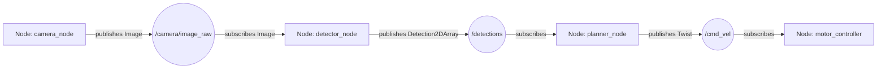
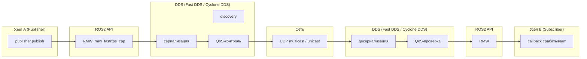
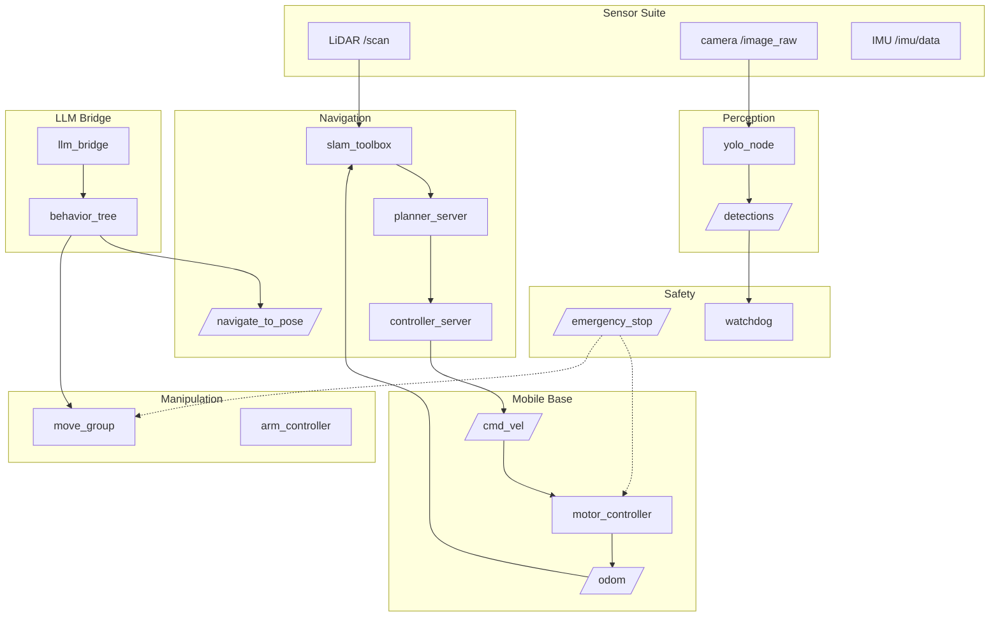

# Архитектура ROS2

## Коротко

ROS2 — среда, в которой отдельные программы робота обмениваются сообщениями. Без ROS2 каждый раз пишем свой протокол, сериализацию и обнаружение узлов. С ROS2 — только бизнес-логику робота.

> *Официальное определение*: «ROS (Robot Operating System) — это набор программных библиотек и инструментов для создания робототехнических приложений.» — [ROS](https://docs.ros.org/en/jazzy/)

## Что такое ROS2

ROS2 — это middleware (промежуточный слой) для робототехнических приложений.

Он не библиотека вроде OpenCV и не операционная система. Это **среда**, которая берет на себя:
- доставку сообщений между программами;
- обнаружение узлов в сети (discovery);
- сериализацию и транспорт данных;
- настройку качества доставки (QoS);
- координатные преобразования (tf2);
- запуск системы из многих узлов (launch).

## Зачем нужно

Робот — это десятки независимых программ: драйвер камеры, лидара, моторов, навигация, детектор объектов, планировщик движений руки. Без middleware нужно каждый раз писать:
- свой протокол передачи данных;
- свой механизм обнаружения (кто в сети?);
- свою сериализацию структур данных;
- свое логирование и мониторинг.

ROS2 дает готовые решения для всего этого.

## Аналогия

ROS2 — **городская инфраструктура**: дороги, почта, адреса, светофоры. Программы робота — жители города. Жители пользуются готовой инфраструктурой, а не строят дороги и почту заново для каждой поездки.

- Дороги = DDS (транспорт сообщений)
- Почта = RMW (адаптер к конкретной службе доставки)
- Адреса = Topics (именованные каналы)
- Светофоры = QoS (правила движения)

## Как устроен ROS2: ROS Graph

### Node — программа робота

Node — выполняемый компонент, который решает одну задачу. Примеры:
- `camera_node` — читает камеру и публикует изображения;
- `motor_controller` — принимает команды скорости и управляет моторами;
- `navigator` — строит маршрут и едет к цели.

### ROS Graph — карта связей

Во время работы ROS2-системы узлы и связи между ними образуют **ROS Graph** — динамическую карту: кто с кем общается, через какие каналы, с какими типами данных.



### Три способа связи

| Механизм    | Когда использовать                       | Аналогия            | Пример в роботе                          |
| ----------- | ---------------------------------------- | ------------------- | ---------------------------------------- |
| **Topic**   | Поток данных, много получателей          | Telegram-канал      | `/scan`, `/cmd_vel`, `/camera/image_raw` |
| **Service** | Короткий запрос-ответ, точка-точка       | Звонок в справочную | `/emergency_stop`, запрос статуса        |
| **Action**  | Длительная задача с прогрессом и отменой | Доставка пиццы      | `/navigate_to_pose`, движение руки       |

## Middleware: как сообщение доходит до адресата

Когда вы пишете `publisher.publish(msg)`, ROS2 не отправляет данные напрямую. Работает цепочка middleware:



По шагам:

1. **Вы вызываете** `publisher.publish(msg)`.
2. **RMW** (ROS Middleware Wrapper) — тонкий слой, который переводит ROS2-команды в вызовы конкретного DDS. Это адаптер: `rmw_fastrtps_cpp` для Fast DDS, `rmw_cyclonedds_cpp` для Cyclone DDS.
3. **DDS** (Data Distribution Service) — протокол, который реально передает данные по сети: сериализует сообщение, проверяет QoS, отправляет через UDP.
4. **Сеть** — сообщение идет по UDP (multicast для обнаружения, unicast для данных).
5. **На стороне получателя** DDS десериализует сообщение, RMW передает его в ROS2 API, и срабатывает ваш callback.

### DDS — служба доставки

DDS берет на себя:
- **сериализацию** — превращает структуру в последовательность байт;
- **QoS** — надежная или быстрая доставка, хранение истории;
- **discovery** — автоматическое обнаружение узлов в сети.

Подробнее: [DDS: протокол, транспорт и выбор реализации](dds_protocol.md) — таблица сравнения Fast DDS, Cyclone DDS, Connext DDS, GurumDDS, Zenoh.

### RMW — выбор службы доставки

RMW позволяет сменить реализацию DDS без изменения кода узлов. Достаточно установить переменную окружения:

```bash
export RMW_IMPLEMENTATION=rmw_cyclonedds_cpp
```

**Важно**: ROS2 Jazzy по умолчанию использует Fast DDS (`rmw_fastrtps_cpp`). Этого достаточно для учебных задач.

Подробнее: [RMW: ROS Middleware Wrapper](rmw.md).

### Discovery — автоматическое знакомство

Когда вы запускаете `ros2 run my_pkg my_node`, новый узел через DDS объявляет о себе в сети. Все остальные узлы узнают:
- имя узла;
- какие topics он публикует и на какие подписан;
- какие services и actions предоставляет.

Discovery работает автоматически — никакой ручной настройки сети не требуется.

Подробнее: [Discovery: автоматическое обнаружение узлов](discovery.md) — SPDP, EDP, Discovery Server, проблема >100 participants.

## Подсистемы робота

Крупный робот (как TIAGo) делится на подсистемы — каждая со своей зоной ответственности и четкими интерфейсами:



### Подсистема — это группа узлов с общими интерфейсами

| Подсистема | Входные данные | Выходные данные | Главный интерфейс |
| --- | --- | --- | --- |
| Sensor Suite | — | `/scan`, `/camera/image_raw`, `/imu/data` | Topics |
| Mobile Base | `/cmd_vel` | `/odom` | Topics |
| Navigation | `/scan`, `/odom`, `/tf`, карта | `/cmd_vel` | Action `/navigate_to_pose` |
| Manipulation | Joint states, планирование | Траектория | Action |
| Perception | `/camera/image_raw` | `/detections` | Topic |
| LLM Bridge | Голосовая/текстовая команда | Goal для Nav2/MoveIt2 | Action |
| Safety | `/battery_state`, `/detections` | `/emergency_stop` | Service |

**Ключевая идея**: подсистемы общаются через стандартные ROS2-интерфейсы. Внутренности подсистемы можно менять независимо, если интерфейс не меняется.

Подробнее: [Архитектурные подсистемы робота](subsystem.md) — как проектировать границы, namespace и lifecycle подсистем.

## Среда запуска

В лучших практиках ROS2 не устанавливается на хост. Вся работа — внутри контейнера с ROS2 Jazzy и Ubuntu 24.04. Это гарантирует одинаковое окружение у всех студентов. Можно установить на Ubuntu или Windows через WLS

## Привязка к трем уровням

- **Уровень 1 (лекция)**: преподаватель показывает схему ROS Graph и путь сообщения через middleware, объясняет разницу topic/service/action.
- **Уровень 2 (самостоятельно)**: эта статья — прочитать, понять архитектурную модель, проверить `ros2 doctor --report` и `printenv RMW_IMPLEMENTATION`.
- **Уровень 3 (робот TIAGo)**: в `3_Robot/TIAgo_humble/` все подсистемы реализованы как ROS2-узлы. Используется CycloneDDS. Таблица подсистем — в `3_Robot/TIAgo_humble/AGENTS.md`.

## Типичные ошибки

| Ошибка | Симптом | Исправление |
| --- | --- | --- |
| Путаница ROS2 с библиотекой | Студент ищет `#include <ros2.h>` или `import ros2` | ROS2 — middleware. Вы подключаете конкретный API: `rclpy` или `rclcpp`. |
| Ожидание, что ROS2 сам передает данные без DDS | Непонимание, почему работает discovery и multicast | ROS2 использует DDS как транспорт. RMW — адаптер к конкретному DDS. |
| Непонимание разницы topic/service/action | Студент использует topic там, где нужен service | См. [Связанные темы](#связанные-темы) — статьи про topics, services, actions. |

### Пример в реальном роботе

TIAGo — полный пример архитектуры ROS2: 5 подсистем (планирование, восприятие, координация, сенсоры, пользователь),
многослойная архитектура с чётким разделением high-level planning и low-level control.
В [`3_Robot/TIAgo_humble/docs/tiago_architecture.md`](../../3_Robot/TIAgo_humble/docs/tiago_architecture.md)
показана карта подсистем, путеводитель по архитектуре (10 шагов) и расширяющий материал.

## Связанные темы

- [Workspace и окружение](workspace.md) — как запустить ROS2 в контейнере
- [Пакеты](packages.md) — как организовать код
- [Nodes](nodes.md) — как написать первый узел
- [Topics](topics.md) — обмен сообщениями через topic
- [Services](services.md) — запрос-ответ
- [Actions](actions.md) — длительные задачи
- [DDS: протокол, транспорт и выбор реализации](dds_protocol.md) — детально про DDS, RTPS, сравнение реализаций
- [RMW: ROS Middleware Wrapper](rmw.md) — слой адаптации между ROS2 и DDS
- [Discovery: автоматическое обнаружение узлов](discovery.md) — SPDP, EDP, Discovery Server
- [Архитектурные подсистемы робота](subsystem.md) — границы подсистем, namespace, lifecycle
- [Управление флотом: ROS_DOMAIN_ID](robots_communication.md) — multi-robot, изоляция, firewall

## Источники

- [ROS2 Concepts](https://docs.ros.org/en/jazzy/Concepts.html)
- [Why ROS2 (Design)](https://design.ros2.org/)
- [About DDS and RMW vendors](https://docs.ros.org/en/jazzy/Concepts/Intermediate/About-Different-Middleware-Vendors.html)
- [About Discovery](https://docs.ros.org/en/jazzy/Concepts/Intermediate/About-Discovery.html)