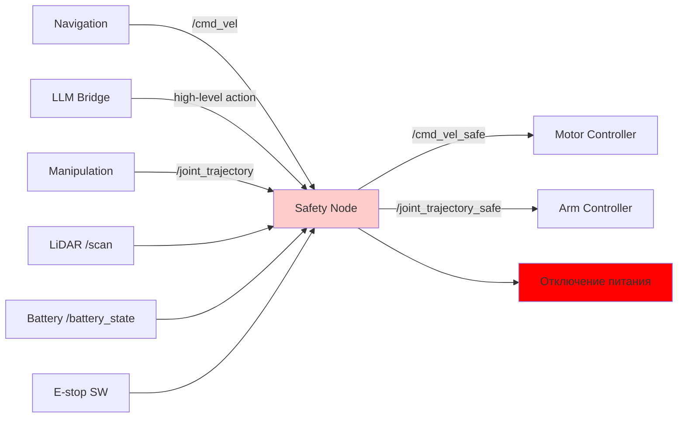

# Safety layer — слой безопасности

## Коротко

Safety layer — набор узлов и правил, которые блокируют опасные действия робота до того, как они дойдут до приводов. Safety layer — последняя линия защиты, когда AI-компоненты (LLM, YOLO) или оператор ошиблись.

## Что это

Safety layer — это не один узел, а архитектурный паттерн:

- **фильтр команд** — safety node проверяет `/cmd_vel`, `/joint_trajectory` и другие команды управления перед отправкой на приводы;
- **E-stop** — аппаратная кнопка + программный сервис `/emergency_stop`;
- **watchdog** — если команды не приходят дольше заданного таймаута → останов;
- **battery monitoring** — при низком заряде — запрет навигации;
- **collision detection** — LiDAR `/scan` → минимальное расстояние → блокировка движения.

## Зачем нужно

Робот весом 100+ кг с манипулятором может нанести травму или разрушить имущество. LLM может галлюцинировать, YOLO может не заметить препятствие, оператор может ошибиться.

Safety layer гарантирует:

- никакой AI не управляет моторами напрямую;
- любую команду можно остановить физической кнопкой;
- при потере связи робот останавливается сам.

## Аналогия

Safety layer — **охранник на КПП завода**. Любой транспорт (команда управления) проходит через КПП. Охранник проверяет: машина не превышает скорость? водитель трезв? груз безопасен? Если нет — шлагбаум закрыт.

## Как работает

### Архитектура



Все команды управления проходят через safety node. Она публикует разрешённые команды в топики `*_safe`.

### 1. E-stop (аппаратный)

Физическая кнопка на корпусе робота, подключённая к GPIO.

```python
import RPi.GPIO as GPIO                        # работа с пинами Raspberry Pi

class EStopMonitor(Node):

    def __init__(self):
        super().__init__('e_stop_monitor')
        GPIO.setmode(GPIO.BCM)                 # нумерация пинов по BCM (GPIO, а не Board)
        GPIO.setup(17, GPIO.IN, pull_up_down=GPIO.PUD_UP)  # пин 17 с подтяжкой к питанию
        GPIO.add_event_detect(17, GPIO.FALLING,  # детект нажатия: HIGH → LOW
            callback=self.on_e_stop)             # при нажатии вызвать on_e_stop
        # сервис программного E-stop
        self.srv = self.create_service(
            Trigger, '/emergency_stop', self.on_software_stop)

    def on_e_stop(self, channel):               # аппаратное нажатие кнопки
        self.get_logger().fatal('E-STOP ACTIVATED!')
        self.shutdown_motors()                  # немедленный останов

    def on_software_stop(self, request, response):  # вызов сервиса
        self.get_logger().warn('Software E-stop')
        self.shutdown_motors()
        response.success = True
        return response

    def shutdown_motors(self):                  # публикует нулевую скорость
        self.cmd_pub.publish(Twist())           # Twist() = все поля 0
```

### 2. Watchdog

Если safety node не получает команды больше `watchdog_timeout` секунд → останов.

```python
class SafetyNode(Node):

    def __init__(self):
        super().__init__('safety_node')
        # объявляем параметры со значениями по умолчанию
        self.declare_parameter('watchdog_timeout', 0.5)  # сек: ждать команду
        self.declare_parameter('max_linear_speed', 0.5)  # м/с: макс. скорость вперёд
        self.declare_parameter('max_angular_speed', 1.0) # рад/с: макс. скорость поворота
        self.declare_parameter('collision_distance', 0.3) # м: мин. расстояние до препятствия

        # подписываемся на входящие команды движения
        self.sub_cmd = self.create_subscription(
            Twist, '/cmd_vel', self.on_cmd, 10)
        # подписываемся на LiDAR для проверки столкновений
        self.sub_scan = self.create_subscription(
            LaserScan, '/scan', self.on_scan, 10)
        # подписываемся на статус батареи
        self.sub_battery = self.create_subscription(
            BatteryState, '/battery_state', self.on_battery, 10)

        # публикуем безопасные команды (после проверок)
        self.pub_cmd = self.create_publisher(
            Twist, '/cmd_vel_safe', 10)

        self.last_cmd_time = self.get_clock().now()   # время последней команды
        self.battery_ok = True                         # флаг: батарея в норме
        self.collision = False                         # флаг: опасное сближение

        self.timer = self.create_timer(0.1, self.check)  # проверка 10 раз/сек

    def on_cmd(self, msg):                            # пришла команда /cmd_vel
        # ограничиваем скорость (нельзя превысить параметры)
        msg.linear.x = min(msg.linear.x,
            self.get_parameter('max_linear_speed').value)
        msg.angular.z = min(msg.angular.z,
            self.get_parameter('max_angular_speed').value)
        self.last_cmd = msg                            # сохраняем команду
        self.last_cmd_time = self.get_clock().now()    # обновляем время

    def on_scan(self, msg):                            # пришли данные LiDAR
        min_dist = min(msg.ranges)                     # ищем минимальное расстояние
        self.collision = min_dist < self.get_parameter(
            'collision_distance').value                # True если опасно близко

    def on_battery(self, msg):                         # пришёл статус батареи
        self.battery_ok = msg.percentage > 20.0        # False если заряд < 20%

    def check(self):                                   # вызывается 10 раз/сек
        elapsed = (self.get_clock().now() - self.last_cmd_time)
        # watchdog: если команда не приходила больше timeout → останов
        if elapsed.nanoseconds > self.get_parameter(
                'watchdog_timeout').value * 1e9:
            self.pub_cmd.publish(Twist())              # публикуем нулевую скорость
            return
        # коллизия или разряд батареи → останов
        if self.collision or not self.battery_ok:
            self.pub_cmd.publish(Twist())
            return
        # всё в порядке → передаём команду на моторы
        self.pub_cmd.publish(self.last_cmd)
```

### 3. Battery monitoring

Подсистема публикует `/battery_state`. Safety node проверяет:

- **> 50%** — всё разрешено;
- **20–50%** — разрешена только навигация к зарядке, манипуляция запрещена;
- **< 20%** — полный запрет движения, только `/emergency_stop`.

### 4. Collision detection

LiDAR `/scan` → минимальное расстояние во front-секторе. Если < `collision_distance` → safety node блокирует `/cmd_vel`:

```bash
ros2 param set /safety_node collision_distance 0.5
```

### 5. Speed limiting

Safety node ограничивает максимальную линейную и угловую скорость через параметры:

```bash
ros2 param set /safety_node max_linear_speed 0.3
ros2 param set /safety_node max_angular_speed 0.5
```

## Граница: AI → policy → safety → motors

**Жёсткое правило**: ни один AI-компонент не управляет приводами напрямую.

```
ПРАВИЛЬНО:
  LLM → /navigate_to_pose action → Nav2 → /cmd_vel → SAFETY → /cmd_vel_safe → motor_controller

НЕПРАВИЛЬНО:
  LLM → /cmd_vel → motor_controller
  YOLO → PWM → motor_driver
```

Правильная цепочка всегда включает три слоя защиты:

1. **Policy layer** — белый список разрешённых действий (что разрешено делать?).
2. **Safety layer** — проверка текущего состояния (безопасно ли сейчас?).
3. **Hardware E-stop** — физическое отключение питания.

## ROS2 Safety Enclaves (DDS Security)

DDS Security позволяет шифровать и аутентифицировать команды между узлами. Safety node может проверять цифровую подпись команды, чтобы убедиться, что `/cmd_vel` пришёл от Nav2, а не от подставного узла.

```bash
# включить безопасность DDS
export ROS_SECURITY_KEYSTORE=/path/to/keystore
export ROS_SECURITY_ENABLE=true
export ROS_SECURITY_STRATEGY=Enforce
```

## Команды

```bash
# проверить состояние safety
ros2 topic echo /safety/status

# симулировать E-stop
ros2 service call /emergency_stop std_srvs/srv/Trigger

# изменить параметры safety
ros2 param set /safety_node max_linear_speed 0.5
ros2 param set /safety_node collision_distance 0.4

# проверить watchdog: перестать слать cmd_vel
# через 0.5 сек робот остановится сам
```

## Ожидаемый результат

- Safety node публикует `/cmd_vel_safe` только если батарея OK, нет коллизий и E-stop не нажат.
- При нажатии E-stop моторы останавливаются за < 100 мс.
- При потере `cmd_vel` робот останавливается через watchdog_timeout.
- LLM и YOLO не могут напрямую управлять приводами — только через цепочку action → safety.

## Типичные ошибки

| Симптом | Причина | Исправление |
|---|---|---|
| Робот не едет, хотя Nav2 выдаёт `/cmd_vel` | Safety node блокирует | Проверить `/battery_state`, E-stop, `collision_distance` |
| Робот продолжает движение после E-stop | HW E-stop не подключён к GPIO | Проверить `GPIO.add_event_detect(17, ...)` |
| Робот едет в препятствие | Collision detection выключен | Убедиться, что `/scan` публикуется и `collision_distance` > 0 |
| LLM управляет моторами напрямую | Нет safety layer | Добавить safety node между LLM и motor controller |
| При перезапуске safety node робот резко тормозит | Watchdog срабатывает при остановке узла | Добавить startup-задержку в safety node |

### Пример в реальном роботе

TIAGo реализует многоуровневую безопасность: twist_mux с 4 уровнями приоритетов (Nav2 < телеоп < джойстик < E-stop),
сервис `/emergency_stop`, диагностика батареи.
В [`3_Robot/TIAgo_humble/docs/safety.md`](../../3_Robot/TIAgo_humble/docs/safety.md) показана архитектура безопасности:
twist_mux, E-stop, battery_monitor и патч diagnostic_aggregator.

## Связанные темы

- [LLM Bridge](llm_bridge.md) — как AI-команды проходят через policy и safety
- [ROS Architecture](ros_architecture.md) — место Safety в подсистемах робота
- [Lifecycle](lifecycle.md) — управляемый запуск узлов подсистем
- [DDS Protocol](dds_protocol.md) — DDS Security enclaves

## Источники

- [ROS2 DDS Security](https://docs.ros.org/en/jazzy/Tutorials/Advanced/Security.html)
- [ROS2 Safety Design patterns](https://design.ros2.org/articles/safety.html)
- [REP-2003: ROS2 Safety](https://www.ros.org/reps/rep-2003.html)
