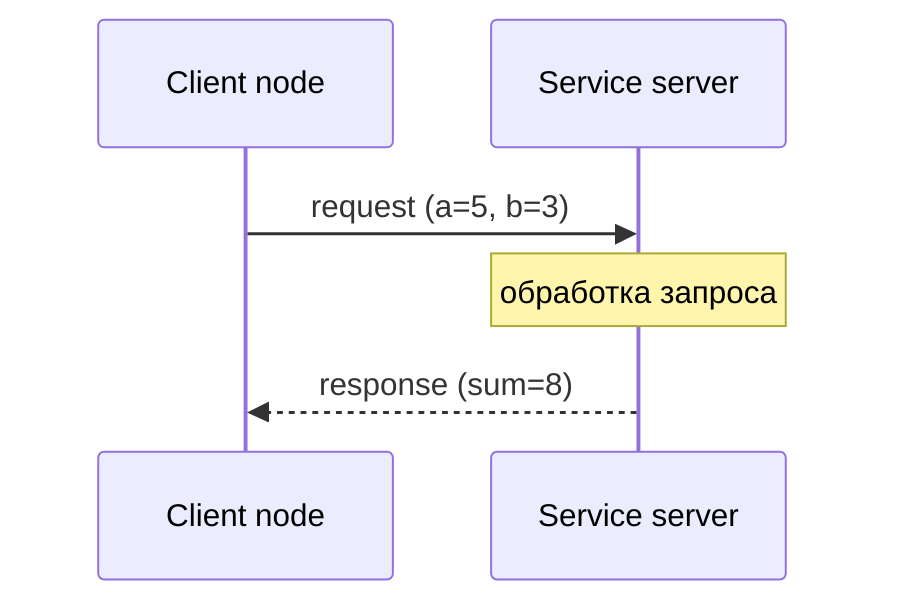

# Service — запрос-ответ в ROS2

## Коротко

Service — механизм для короткой операции, где один узел (client) отправляет запрос, а другой (server) отвечает. В отличие от topic, это связь **точка-точка** с ожиданием ответа.

> *Официальное определение*: «Сервисы — это ещё один метод общения в графе ROS 2. В отличие от топиков, использующих модель издатель-подписчик, сервисы следуют модели клиент-сервер.» — [Services](https://docs.ros.org/en/jazzy/Concepts/Basic/About-Services.html)

## Что такое service

Service — пара «запрос-ответ»:



- **Client** — узел, который вызывает service: отправляет запрос и ждет ответ.
- **Server** — узел, который предоставляет service: принимает запрос, обрабатывает, возвращает ответ.
- **Тип service** — структура из двух частей: `Request` (что отправить) и `Response` (что получить).

## Зачем нужно

Topic отлично подходит для потоков. Но есть задачи, где нужен прямой запрос:

- «Какое сейчас состояние батареи?» — запрос-ответ
- «Активируй emergency stop» — команда с подтверждением
- «Перезагрузи драйвер лидара» — команда с результатом

В этих сценариях topic неудобен: нет гарантии, что subscriber обработал сообщение, нет ответа, нет подтверждения.

## Аналогия

Service — **звонок в справочную службу**. Вы задаете вопрос и ждете ответа. Пока ждете — линия занята. Ответ приходит ровно один раз, и связь завершается.

**Отличие от topic**: topic — это радио (вещает всем, без ответа). Service — телефонный звонок (один на один, с ответом).

## Как работает в ROS2

### Service server

```python
import rclpy  # Основная библиотека ROS 2 для Python
from rclpy.node import Node  # Базовый класс для создания узлов
from example_interfaces.srv import AddTwoInts  # Импортируем тип сервиса для сложения двух чисел


class Server(Node):  # Объявляем класс сервера, наследник от Node
    """
    Класс-сервер для обработки запросов на сложение двух чисел
    """
    
    def __init__(self):  # Конструктор класса (вызывается при создании объекта)
        # Вызываем конструктор родительского класса Node с именем узла 'add_two_ints_server'
        super().__init__('add_two_ints_server')  
        # Это имя будет отображаться в системе ROS 2
        # Позволяет идентифицировать узел в списке активных узлов
        
        # Создаем сервис для обработки запросов типа AddTwoInts с именем '/add_two_ints'
        self.srv = self.create_service(
            AddTwoInts,  # Тип сервиса (содержит структуру запроса и ответа)
            '/add_two_ints',  # Имя сервиса - по этому адресу клиенты будут обращаться
            self.callback  # Функция обратного вызова для обработки запросов
        )
        # create_service() - регистрирует сервис в ROS 2 мастерской системе
        # После создания сервис становится доступен для вызова клиентами
        # self.callback - ссылка на метод (без скобок!), который будет вызван при запросе
        
        # Выводим сообщение о готовности сервиса (для отладки)
        self.get_logger().info('Service /add_two_ints is ready')  
        # get_logger() - возвращает объект для логирования
        # info() - выводит информационное сообщение в консоль
        
    def callback(self, request, response):  
        # Метод-колбэк, который вызывается при поступлении запроса от клиента
        # request - объект запроса (содержит поля a и b)
        # response - объект ответа (содержит поле sum)
        # Этот метод должен обязательно возвращать response (или вызывать исключение)
        
        # Вычисляем сумму чисел из запроса
        response.sum = request.a + request.b  
        # request.a - первое число из запроса клиента
        # request.b - второе число из запроса клиента
        # Присваиваем результат полю sum в объекте ответа
        
        # Логируем полученный запрос и результат для отладки
        self.get_logger().info(
            f'Request: {request.a} + {request.b} = {response.sum}'
        )  # f-строка для форматированного вывода
        # Показывает в консоли: "Request: 5 + 3 = 8"
        
        # Возвращаем заполненный объект ответа клиенту
        return response  
        # Обязательный возврат! Без этого клиент не получит ответ
        # Если не вернуть response, клиент зависнет в ожидании


def main(args=None):  # Главная функция, точка входа в программу
    # Инициализируем ROS 2 (обязательный шаг перед созданием узлов)
    rclpy.init(args=args)  
    # args - аргументы командной строки (можно передавать параметры)
    # Инициализация должна быть выполнена до создания любых узлов
    
    # Создаем объект сервера
    node = Server()  
    # При создании объекта автоматически выполняется __init__
    # Сервис регистрируется в системе и становится доступным для клиентов
    
    # Запускаем цикл обработки событий (spin)
    rclpy.spin(node)  
    # spin() - блокирующий цикл, который обрабатывает входящие события
    # Без этого вызова callback не будут вызваны!
    # spin() будет работать, пока узел не будет остановлен (Ctrl+C)
    # В этом цикле ROS 2 ожидает запросы к сервису и вызывает callback при их получении
    
    # Уничтожаем узел (освобождаем ресурсы)
    node.destroy_node()  
    # destroy_node() - корректно завершает работу узла
    # Удаляет сервис из системы, освобождает память и другие ресурсы
    
    # Завершаем работу ROS 2
    rclpy.shutdown()  
    # shutdown() - освобождает ресурсы, используемые ROS 2
    # Завершает все потоки и процессы, связанные с ROS


# Проверяем, запущен ли файл как основная программа
if __name__ == '__main__':  
    # Если файл запущен напрямую (python server.py), а не импортирован как модуль
    main()  # Вызываем главную функцию
```

Ключевые строки:

| Строка | Что делает |
| --- | --- |
| `self.create_service(AddTwoInts, '/add_two_ints', self.callback)` | Создает service server |
| `callback(self, request, response)` | Принимает запрос и заполняет ответ |
| `response.sum = request.a + request.b` | Вычисляет результат |
| `return response` | Возвращает ответ клиенту |

### Service client

```python
import rclpy  # Основная библиотека ROS 2 для Python
from rclpy.node import Node  # Базовый класс для создания узлов
from example_interfaces.srv import AddTwoInts  # Импортируем тип сервиса для сложения двух чисел


class Client(Node):  # Объявляем класс клиента, наследник от Node
    """
    Класс-клиент для вызова сервиса сложения двух чисел
    """
    
    def __init__(self):  # Конструктор класса (вызывается при создании объекта)
        # Вызываем конструктор родительского класса Node с именем узла 'add_two_ints_client'
        super().__init__('add_two_ints_client')  
        # Это имя будет отображаться в системе ROS 2
        
        # Создаем клиента для сервиса типа AddTwoInts с именем '/add_two_ints'
        self.cli = self.create_client(AddTwoInts, '/add_two_ints')  
        # create_client(ТипСервиса, ИмяТопика) - создает клиентский объект
        # '/add_two_ints' - это имя сервиса, по которому клиент будет искать сервер
        
        # Ожидаем появления сервиса в системе
        while not self.cli.wait_for_service(timeout_sec=1.0):  
            # wait_for_service() - проверяет доступность сервиса
            # timeout_sec=1.0 - ждет максимум 1 секунду за одну попытку
            # Возвращает True, если сервис найден, иначе False
            
            # Если сервис не найден, выводим сообщение в лог
            self.get_logger().info('Waiting for service...')  
            # get_logger() - возвращает объект для логирования
            # info() - выводит информационное сообщение
            
        # Как только сервис найден, отправляем запрос с числами 5 и 3
        self.send_request(5, 3)  
        # Вызываем метод отправки запроса
        
    def send_request(self, a, b):  
        # Метод для отправки запроса к серверу
        # a, b - числа, которые нужно сложить
        
        # Создаем объект запроса
        request = AddTwoInts.Request()  
        # AddTwoInts.Request() - создает пустой запрос
        # У запроса есть поля: a и b (определены в файле .srv)
        
        # Заполняем поля запроса переданными значениями
        request.a = a  # Присваиваем значение полю a
        request.b = b  # Присваиваем значение полю b
        
        # Отправляем запрос асинхронно (не блокируя выполнение)
        future = self.cli.call_async(request)  
        # call_async() - отправляет запрос и сразу возвращает управление
        # Возвращает объект Future (обещание), который будет содержать результат позже
        # Future - это специальный объект, представляющий "еще не готовый" результат
        
        # Регистрируем функцию обратного вызова для обработки ответа
        future.add_done_callback(self.response_callback)  
        # add_done_callback() - добавляет функцию, которая вызовется 
        # автоматически, когда future будет завершен (придет ответ)
        # self.response_callback - ссылка на метод (без скобок!)
        
    def response_callback(self, future):  
        # Метод-колбэк, который вызывается при получении ответа от сервера
        # future - объект Future, который содержит результат
        
        # Получаем ответ из future
        response = future.result()  
        # result() - извлекает результат из future
        # Если произошла ошибка, метод выбросит исключение
        # В ответе есть поле sum (определено в файле .srv)
        
        # Выводим результат в лог
        self.get_logger().info(f'Result: {response.sum}')  
        # f-строка для форматирования вывода
        # response.sum - поле с результатом сложения


def main(args=None):  # Главная функция, точка входа в программу
    # Инициализируем ROS 2 (обязательный шаг перед созданием узлов)
    rclpy.init(args=args)  
    # args - аргументы командной строки (можно передавать параметры)
    
    # Создаем объект клиента
    node = Client()  
    # При создании объекта автоматически выполняется __init__
    # Узел начнет ждать сервис и отправит запрос
    
    # Запускаем цикл обработки событий (spin)
    rclpy.spin(node)  
    # spin() - блокирующий цикл, который обрабатывает входящие события
    # Без этого вызова колбэки (response_callback) не будут вызваны!
    # spin() будет работать, пока узел не будет остановлен (Ctrl+C)
    
    # Уничтожаем узел (освобождаем ресурсы)
    node.destroy_node()  
    # destroy_node() - корректно завершает работу узла
    
    # Завершаем работу ROS 2
    rclpy.shutdown()  
    # shutdown() - освобождает ресурсы, используемые ROS 2


# Проверяем, запущен ли файл как основная программа
if __name__ == '__main__':  
    # Если файл запущен напрямую (python client.py), а не импортирован как модуль
    main()  # Вызываем главную функцию
```

Ключевые моменты:

- `wait_for_service()` — ждет, пока server станет доступен. **Без этой проверки client может вызвать service до того, как server готов.**
- `call_async()` — асинхронный вызов. Client не блокируется на время ожидания.
- `add_done_callback()` — callback, который вызовется, когда ответ придет.

## Выбор: topic или service

| Критерий | Topic | Service |
| --- | --- | --- |
| Направление | Однонаправленный поток | Запрос → Ответ |
| Получатели | Многие | Один |
| Ответ | Нет | Есть |
| Частота | Высокая (10-100 Гц) | Низкая (по запросу) |
| Гарантия доставки | Через QoS | Неявная (есть ответ = доставлено) |
| Пример | `/scan`, `/cmd_vel` | `/emergency_stop`, диагностика |

**Правило**: если данные идут непрерывно и получателей может быть несколько — topic. Если нужен конкретный ответ на конкретный запрос — service.

## CLI-команды для service

```bash
# Список всех доступных services
ros2 service list

# Тип конкретного service
ros2 service type /add_two_ints

# Вызов service из командной строки
ros2 service call /add_two_ints example_interfaces/srv/AddTwoInts "{a: 5, b: 3}"
# Ожидаемый вывод: sum: 8

# Найти все service с заданным типом
ros2 service find example_interfaces/srv/AddTwoInts
```

`ros2 service call` — мощный инструмент отладки. Можно вызвать любой service в системе и увидеть ответ, не запуская Python.

## Пример в роботе

В роботе TIAGo services используются для:

| Service | Тип | Зачем |
| --- | --- | --- |
| `/emergency_stop` | `std_srvs/Trigger` | Активировать аварийную остановку |
| `/reset_motors` | `std_srvs/Trigger` | Сбросить ошибку контроллера моторов |
| `/enable_lidar` | `std_srvs/SetBool` | Включить/выключить лидар |
| `/set_led` | пользовательский | Установить цвет светодиода |

Общая черта: это команды, а не потоки данных.

## Привязка к трем уровням

- **Уровень 1 (лекция)**: преподаватель показывает `ros2 service call`, объясняет отличие от topic.
- **Уровень 2 (самостоятельно)**: эта статья + [практика 04](../2_practice/04_service.md) — написать AddTwoInts server и вызвать из CLI.
- **Уровень 3 (робот TIAGo)**: `/emergency_stop`, `/reset_motors` — все команды, требующие подтверждения.

## Типичные ошибки

| Ошибка | Симптом | Исправление |
| --- | --- | --- |
| Client вызывает service, server не готов | Исключение или бесконечное ожидание | `wait_for_service()` перед вызовом |
| Server не вызывает `spin()` | Service виден в `ros2 service list`, но не отвечает | Добавить `rclpy.spin(server)` |
| Неправильные имена полей | `ros2 service call` возвращает 0 | Сверить имена: `a`, `b`, `sum` для AddTwoInts |
| Server в callback выполняется долго | Client долго ждет ответ | Быстрая обработка в callback. Долгие задачи — action. |
| Путаница service и topic | Студент пытается «подписаться» на service | Service — это вызов, а не подписка |

### Пример в реальном роботе

В TIAGo сервис `/emergency_stop` (тип `std_srvs/srv/Trigger`) — пример короткого запроса-ответа для аварийной остановки.
Также используются сервисы `/llm_command`, `/controller_manager/list_controllers` и другие.
В [`3_Robot/TIAgo_humble/docs/safety.md`](../../3_Robot/TIAgo_humble/docs/safety.md) показана реализация E-stop
через twist_mux и сервис emergency_stop.

## Связанные темы

- [Topics](topics.md) — потоковая передача данных
- [Actions](actions.md) — длительные задачи с прогрессом
- [Nodes](nodes.md) — устройство узла

## Источники

- [Understanding ROS2 Services](https://docs.ros.org/en/jazzy/Tutorials/Beginner-CLI-Tools/Understanding-ROS2-Services/Understanding-ROS2-Services.html)
- [Writing a simple service/client (Python)](https://docs.ros.org/en/jazzy/Tutorials/Beginner-Client-Libraries/Writing-A-Simple-Py-Service-And-Client.html)