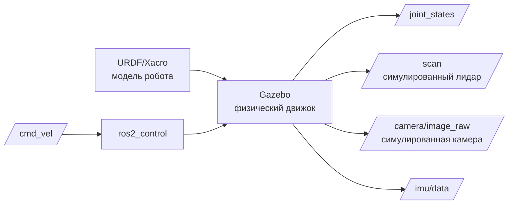

# Simulation — испытательный полигон робота

## Коротко

Simulation-first — принцип разработки: сначала цифровой двойник робота в Gazebo/Ignition, потом реальное железо. Ошибка в симуляции бесплатна. Ошибка на реальном роботе — сломанный сервопривод.

## Что такое симуляция в ROS2

Симуляция — это запуск модели робота в физическом движке (Gazebo Classic, Ignition Gazebo). Модель описана в URDF/Xacro, симулятор считает физику, публикует сенсоры (лидар, камера, IMU) и принимает команды управления через `ros2_control`.



Симулятор:
- **считает физику**: гравитацию, столкновения, инерцию;
- **генерирует сенсоры**: лидар, камера, IMU;
- **принимает команды**: через `ros2_control` — точно так же, как реальный робот.

## Зачем нужен simulation-first подход

1. **Безопасность**: ошибка в алгоритме навигации в симуляции — робот врезался в стену. На реальном роботе — сломанный лидар и поцарапанная мебель.
2. **Скорость**: симуляцию можно ускорить, поставить на паузу, перезапустить.
3. **Воспроизводимость**: в симуляции всегда одинаковые условия — нет «сегодня лидар глючит из-за солнца».
4. **Разработка без железа**: робот стоит дорого, симуляция — бесплатно.

## Аналогия

Симуляция — **авиасимулятор** для пилотов. Прежде чем сесть в настоящий Боинг, пилот отрабатывает взлет, посадку и аварийные ситуации в симуляторе. Там разбиться можно сколько угодно раз.

## Gazebo и Ignition

| | Gazebo Classic 11 | Ignition Gazebo |
| --- | --- | --- |
| Статус | Legacy, но стабилен | Современный, активная разработка |
| Использование | TIAGo (Humble), Nav2 | Новые проекты (Jazzy+) |
| ROS2-интеграция | `gazebo_ros_pkgs` | `ros_gz` (gz-мосты) |

## Запуск симуляции

```bash
# TIAGo в Gazebo Classic
ros2 launch tiago_gazebo tiago_gazebo.launch.py

# Типичная структура launch-файла симуляции
# 1. Запустить Gazebo с миром (world)
# 2. Загрузить модель робота (spawn_entity)
# 3. Запустить ros2_control controllers
# 4. Запустить robot_state_publisher для tf2
```

## Привязка к трем уровням

- **Уровень 1 (лекция)**: объяснение simulation-first, схема URDF → Gazebo → ros2_control → rviz2.
- **Уровень 2 (самостоятельно)**: эта статья. Практика с симуляцией — в расширенных материалах (требует GPU и Gazebo в контейнере).
- **Уровень 3 (робот TIAGo)**: `tiago_gazebo/` — launch-файлы, миры, модели. Контейнер с Gazebo Classic 11 и GPU-пробросом.

### Пример в реальном роботе

TIAGo симулируется в Gazebo Classic 11 с 80+ моделями PAL Robotics, кастомными плагинами и двумя режимами симуляции (public/private).
В [`3_Robot/TIAgo_humble/docs/simulation.md`](../../3_Robot/TIAgo_humble/docs/simulation.md) описана конфигурация Gazebo,
спавн робота, миры (pal_office, pal_kitchen) и GUI через noVNC.

## Связанные темы

- [URDF/Xacro](urdf_xacro.md) — модель робота для симуляции
- [ros2_control](ros2_control.md) — управление приводами в симуляции и реальности
- [tf2](tf2.md) — transforms, публикуемые из URDF
- [Nav2 bridge](nav2_bridge.md) — навигация в симуляции

## Источники

- [Gazebo Documentation](https://gazebosim.org/docs)
- [Using Gazebo with ROS2](https://docs.ros.org/en/jazzy/Tutorials/Advanced/Simulators/Gazebo/Gazebo.html)