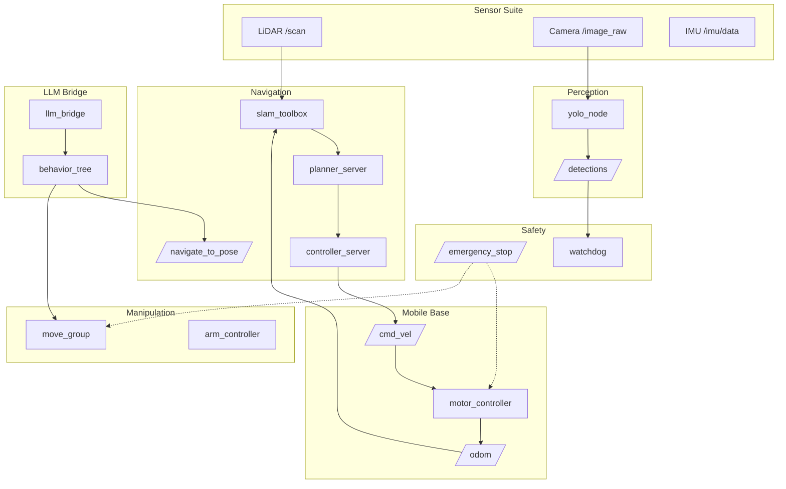

# Архитектурные подсистемы робота

## Коротко

Подсистема — это группа ROS2-узлов с общей зоной ответственности, стандартизированными входами/выходами и чёткими границами. Разбиение робота на подсистемы позволяет разрабатывать, отлаживать и заменять части независимо.

## Что это

В ROS2 не существует специального понятия «подсистема» в API. Подсистема — это **архитектурный паттерн**:

- набор узлов в одном или нескольких namespace;
- единый интерфейс для внешнего мира (topic/service/action);
- внутренние детали скрыты за этим интерфейсом.

## Зачем нужно

Робот TIAGo — это 30+ узлов. Если все они общаются как попало, система превращается в «спагетти-граф». Подсистемы дают:

- **модульность** — замена SLAM-алгоритма не требует правки motor_controller;
- **параллельную разработку** — команда perception не ждёт команду navigation;
- **отладку** — можно тестировать навигацию отдельно, подавая записанный `/scan`;
- **масштабирование** — добавить YOLO = новая подсистема с известным входом (камера) и выходом (`/detections`).

## Аналогия

Подсистема — **отдел компании**. Отдел закупок получает заявки, закупает детали и передаёт на склад. Отдел производства берёт детали со склада и собирает изделие. Каждый отдел знает только свой интерфейс — внутренности могут меняться.

## Как выглядит в ROS2

### Схема подсистем

Типовые подсистемы мобильного манипулятора и их связи:



### Интерфейсы подсистем

| Подсистема | Вход (от других подсистем) | Выход (к другим подсистемам) | Механизм |
|---|---|---|---|
| Sensor Suite | — | `/scan`, `/camera/image_raw`, `/imu/data` | Topics |
| Mobile Base | `/cmd_vel` (Twist) | `/odom` (Odometry) | Topics |
| Navigation | `/scan`, `/odom`, `/tf`, карта | `/cmd_vel` | Action `/navigate_to_pose` |
| Manipulation | Joint states, goal pose | Траектория суставов | Action |
| Perception | `/camera/image_raw` | `/detections` | Topic |
| LLM Bridge | Голос/текст | Goal для Nav2/MoveIt2 | Action |
| Safety | `/battery_state`, `/detections` | `/emergency_stop` | Service |

### Как задать границы

Главное правило: **внешний интерфейс подсистемы не меняется при смене внутренней реализации**.

Хороший пример — Navigation:

- Интерфейс: action `/navigate_to_pose` (PoseStamped → результат).
- Внутри: `planner_server` + `controller_server` + `bt_navigator` + `slam_toolbox`.
- Можно заменить `planner_server` на другой планировщик — action `/navigate_to_pose` останется тем же.

Плохой пример:

- Motor controller напрямую читает `/scan` и сам решает, объезжать препятствие.
- При замене LiDAR на другой нужно править motor controller.
- **Правильно**: `/scan` → Navigation → `/cmd_vel` → Motor controller.

### Namespace — группировка узлов

Подсистемы обычно организуются через namespace:

```
/scan                            # sensor suite
/navigation/navigate_to_pose    # navigation
/manipulation/goal              # manipulation
/perception/detections          # perception
/safety/emergency_stop           # safety
```

Внутри подсистемы namespace может быть глубже:

```
/navigation/slam_toolbox/scan
/navigation/planner_server/...
/navigation/controller_server/...
```

### Lifecycle и подсистемы

Узлы подсистем, управляющих устройствами (Mobile Base, Manipulation), используют [Lifecycle](lifecycle.md) — модель управляемых состояний:

```
Unconfigured → Inactive → Active → Finalized
```

Переходы управляются внешним orchestrator-ом (например, Behavior Tree). Это гарантирует порядок инициализации: сначала драйверы, затем планировщики.

## Привязка к трём уровням

- **Уровень 1 (лекция)**: преподаватель показывает схему подсистем TIAGo и объясняет правило «интерфейс не меняется».
- **Уровень 2 (самостоятельно)**: эта статья — понять архитектурный паттерн подсистем. Посмотреть `ros2 node list` и определить, какие подсистемы работают.
- **Уровень 3 (робот TIAGo)**: в `3_Robot/TIAgo_humble/` все подсистемы реализованы как группы узлов. Таблица интерфейсов — в `3_Robot/TIAgo_humble/AGENTS.md`.

## Команды

```bash
# посмотреть все узлы — определить подсистемы
ros2 node list
# пример вывода:
#   /camera/camera_node           → Sensor Suite
#   /navigation/planner_server    → Navigation
#   /navigation/controller_server → Navigation
#   /manipulation/move_group      → Manipulation

# проверить интерфейс подсистемы
ros2 topic info /cmd_vel          # кто subscriber? Mobile Base
ros2 action info /navigate_to_pose # кто server? Navigation

# посмотреть namespace группировку
ros2 node list | grep navigation
ros2 node list | grep perception
```

## Ожидаемый результат

- `ros2 node list` показывает узлы, сгруппированные по namespace (подсистемам).
- Узел из одной подсистемы подписан только на те topics, которые входят в её интерфейс.
- Замена узла внутри подсистемы (например, planner_server) не требует изменений в других подсистемах.

## Типичные ошибки

| Ошибка | Симптом | Исправление |
|---|---|---|
| Прямое управление моторами из perception | YOLO пишет в `/cmd_vel` | YOLO только публикует `/detections`. Управляет Base — Navigation. |
| Изменение интерфейса подсистемы | После обновления SLAM перестала работать навигация | Интерфейсы (topic type, action definition) — контракт, их нельзя менять без синхронизации всех потребителей. |
| Одна подсистема делает всё | monolithic-узел на 10k строк | Разделить на узлы по принципу одной задачи. |
| Спрятанные внутренние связи | Узлы A и B общаются через topic, который никто не документировал | Документировать все публичные интерфейсы подсистем (см. `AGENTS.md` в `3_Robot/TIAgo_humble/`). |

### Пример в реальном роботе

Архитектура TIAGo делится на 5 подсистем: пользовательский слой (управление), планирование (Nav2, MoveIt2),
восприятие (YOLO, LiDAR, камера), координация (twist_mux, ros2_control), сенсоры/симуляция (Gazebo).
В [`3_Robot/TIAgo_humble/docs/tiago_architecture.md`](../../3_Robot/TIAgo_humble/docs/tiago_architecture.md) показана
карта подсистем с цветовой маркировкой.

## Связанные темы

- [Архитектура ROS2](ros_architecture.md) — общая схема робота
- [Lifecycle](lifecycle.md) — управляемые состояния узлов
- [Nodes](nodes.md) — как написать узел
- [Topics](topics.md), [Services](services.md), [Actions](actions.md) — механизмы связи
- [Управление флотом: ROS_DOMAIN_ID](robots_communication.md) — изоляция подсистем на разных роботах

## Источники

- [ROS2 Concepts (Jazzy)](https://docs.ros.org/en/jazzy/Concepts.html)
- [Design patterns in ROS2 (OSRF)](https://osrf.github.io/ros2multirobotbook/ros2_design_patterns.html)
- [ROS2 medkit: migration guide (SOVD entity model)](https://selfpatch.github.io/ros2_medkit/tutorials/migration-to-manifest.html)
- [ROS2 architecture patterns that scale](https://thomasthelliez.com/blog/ros-2-architecture-patterns-that-scale/)
