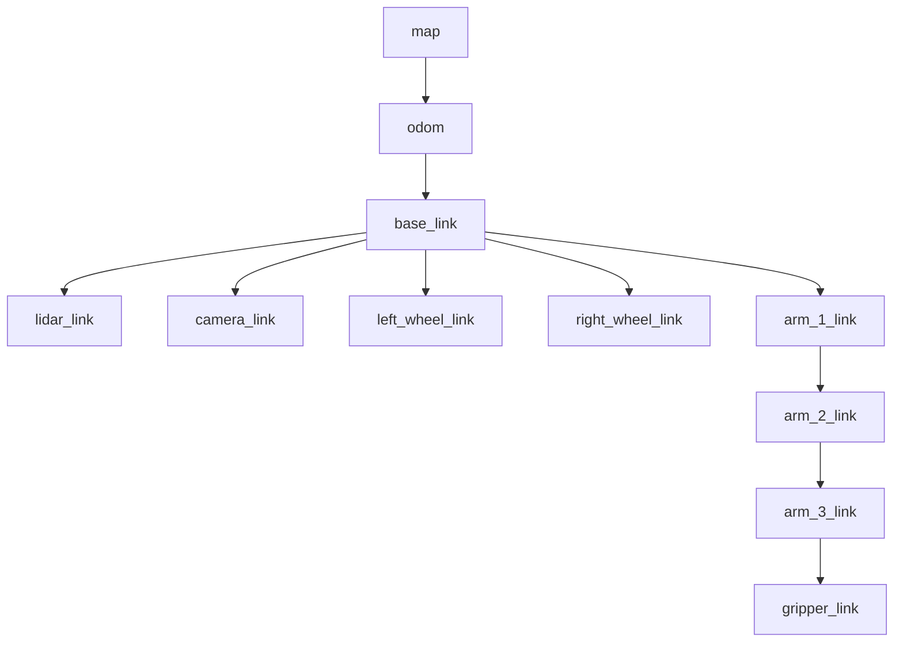

# tf2 — дерево координат робота

## Коротко

tf2 — подсистема ROS2, которая хранит и вычисляет преобразования между координатными системами робота. Каждый датчик, колесо и звено руки имеют свой frame. tf2 знает, как пересчитать координаты между ними.

> *Официальное определение*: «tf2 — это библиотека преобразований второго поколения, которая позволяет отслеживать несколько координатных систем во времени.» — [tf2](https://docs.ros.org/en/jazzy/Concepts/Intermediate/About-Tf2.html)

## Что такое tf2

Любая точка в роботе задана относительно какой-то системы координат (frame):
- Лидар видит препятствие в своем frame `lidar_link`
- Моторы управляют движением в frame `base_link`
- Карта существует в frame `map`

Без tf2 робот не знает, где лидар относительно базы и где база относительно карты.

**tf2** — это база данных transforms (преобразований) между frames. Она позволяет:
- запросить transform между любыми двумя frames в любой момент времени;
- построить дерево координат робота;
- пересчитать координаты из одного frame в другой.

## Зачем нужно

Конкретный пример. Лидар обнаружил препятствие на расстоянии 2 метра в frame `lidar_link`. Навигатору нужно знать, где это препятствие относительно карты (`map`). tf2 проводит цепочку:

```
lidar_link → base_link → odom → map
```

Навигатор вызывает:

```python
transform = buffer.lookup_transform('map', 'lidar_link', time)
```

И получает: лидар находится в точке (1.5, 0.3, 0.8) относительно карты. Дальше он сам пересчитывает координаты препятствия из `lidar_link` в `map`.

## Аналогия

tf2 — **GPS + поэтажный план здания**. Вы знаете свои координаты относительно комнаты, комнату относительно этажа, этаж относительно здания, здание относительно улицы. В любой момент можно сказать: «я нахожусь по адресу ул. Ленина, 5, этаж 3, комната 312».

## Дерево координат



**Важно**: это дерево, а не граф. У каждого frame ровно один родитель. Циклы недопустимы.

### Кто публикует transforms

| Transform | Кто публикует | Тип |
| --- | --- | --- |
| `base_link → lidar_link` | `robot_state_publisher` (из URDF) | Static |
| `base_link → camera_link` | `robot_state_publisher` (из URDF) | Static |
| `odom → base_link` | Контроллер моторов | Dynamic (меняется при движении) |
| `map → odom` | SLAM или AMCL | Dynamic (корректируется) |

- **Static transform** — не меняется. Например, лидар жестко закреплен на базе.
- **Dynamic transform** — меняется во времени. Например, положение базы относительно одометрии.

## Как работает в ROS2

### Публикация статического transform

```python
import rclpy
from rclpy.node import Node
from geometry_msgs.msg import TransformStamped  # сообщение: transform между двумя frame
from tf2_ros import StaticTransformBroadcaster   # публикатор статического transform


class StaticFramePublisher(Node):

    def __init__(self):
        super().__init__('static_frame_publisher')
        self.broadcaster = StaticTransformBroadcaster(self)  # объект для публикации

        t = TransformStamped()                                # создаём transform
        t.header.stamp = self.get_clock().now().to_msg()      # метка времени
        t.header.frame_id = 'world'                           # родительский frame
        t.child_frame_id = 'robot_base'                       # дочерний frame
        t.transform.translation.x = 1.0                       # смещение по X, м
        t.transform.translation.y = 2.0                       # смещение по Y, м
        t.transform.translation.z = 0.0
        t.transform.rotation.w = 1.0                          # кватернион: нет вращения

        self.broadcaster.sendTransform(t)                     # публикуем transform
        self.get_logger().info('Static transform published')
```

### Чтение transform

```python
from tf2_ros import Buffer, TransformListener


class TransformListenerNode(Node):

    def __init__(self):
        super().__init__('tf_listener')
        self.buffer = Buffer()                           # хранит все transforms
        self.listener = TransformListener(self.buffer, self)  # подписывается на /tf
        self.timer = self.create_timer(1.0, self.lookup)  # раз в секунду ищем transform

    def lookup(self):
        try:
            t = self.buffer.lookup_transform(
                'world', 'robot_base', rclpy.time.Time())
            self.get_logger().info(
                f'robot_base relative to world: '
                f'x={t.transform.translation.x:.2f}, '
                f'y={t.transform.translation.y:.2f}')
        except Exception as e:
            self.get_logger().warn(f'Transform not available: {e}')
```

Ключевые объекты:

| Объект | Что делает |
| --- | --- |
| `Buffer` | Хранит историю transforms и вычисляет цепочки |
| `TransformListener` | Подписывается на `/tf` и `/tf_static`, заполняет Buffer |
| `lookup_transform(parent, child, time)` | Находит transform между parent и child |

## CLI-команды

```bash
# echo: показать transform между двумя frames в реальном времени
ros2 run tf2_ros tf2_echo world robot_base
# Вывод:
# - Translation: [1.000, 2.000, 0.000]
# - Rotation: in Quaternion [0.000, 0.000, 0.000, 1.000]

# view_frames: сгенерировать PDF с деревом координат
ros2 run tf2_tools view_frames
# Создает frames.pdf в текущей директории

# Посмотреть содержимое топика /tf_static (статические transforms)
ros2 topic echo /tf_static

# Посмотреть содержимое топика /tf (динамические transforms)
ros2 topic echo /tf
```

## Привязка к трем уровням

- **Уровень 1 (лекция)**: преподаватель показывает схему дерева `map → odom → base_link → ...`, запускает `view_frames`, объясняет почему навигация невозможна без tf2.
- **Уровень 2 (самостоятельно)**: эта статья + [практика 07](../2_practice/07_tf2.md) — static transform broadcaster + listener.
- **Уровень 3 (робот TIAGo)**: tf2-дерево из 20+ frames: `map → odom → base_footprint → base_link → chassis_link → lidar_link, camera_link, left_wheel_link, right_wheel_link, arm_1_link ... arm_7_link, gripper_link`.

## Типичные ошибки

| Ошибка | Симптом | Исправление |
| --- | --- | --- |
| Timestamp mismatch | `lookup_transform` падает с исключением | Использовать `rclpy.time.Time()` для последнего доступного |
| Разные frame_id у pub и sub | Transform не находится | Сверить имена: `world` vs `World` — регистр важен |
| Transform не опубликован | `tf2_echo` пустой | Проверить `sendTransform()` и `spin()` |
| Цикл в дереве | `view_frames` показывает ошибку | У каждого frame ровно один родитель |
| `robot_base` → `world` вместо `world` → `robot_base` | Координаты с неправильным знаком | `parent_frame` и `child_frame` в правильном порядке |

### Пример в реальном роботе

TF-дерево TIAGo включает ~25 фреймов: `map → odom → base_footprint → base_link → arm_1_link → ... → arm_7_link → gripper_link`,
а также `base_laser_link`, `camera_link`, `torso_lift_link`.
В [`3_Robot/TIAgo_humble/docs/tf_frames.md`](../../3_Robot/TIAgo_humble/docs/tf_frames.md) показано полное дерево TF
с командами `view_frames` и `tf2_echo`.

## Связанные темы

- [QoS](qos.md) — настройка надежности доставки `/tf`
- [Nav2 bridge](nav2_bridge.md) — как Nav2 использует tf2 для навигации
- [MoveIt2 bridge](moveit2_bridge.md) — как MoveIt2 использует tf2 для манипуляции

## Источники

- [tf2 Introduction](https://docs.ros.org/en/jazzy/Tutorials/Intermediate/Tf2/Tf2-Main.html)
- [Writing a tf2 static broadcaster (Python)](https://docs.ros.org/en/jazzy/Tutorials/Intermediate/Tf2/Writing-A-Tf2-Static-Broadcaster-Py.html)
- [Writing a tf2 listener (Python)](https://docs.ros.org/en/jazzy/Tutorials/Intermediate/Tf2/Writing-A-Tf2-Listener-Py.html)