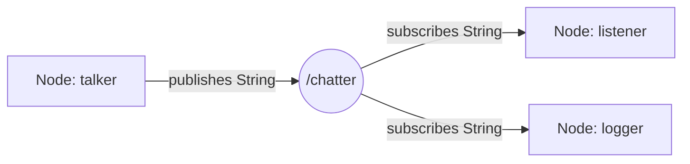
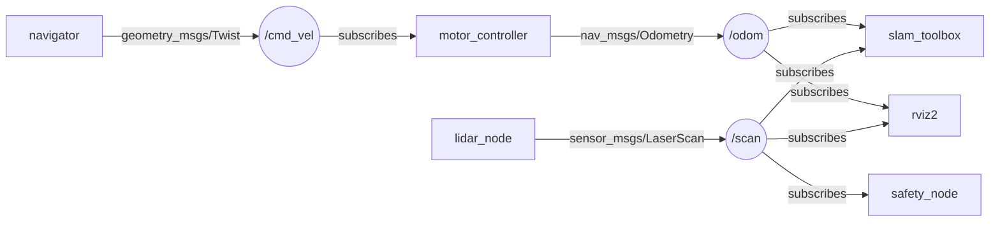

# Topic — обмен сообщениями в ROS2

## Коротко

Topic — именованный поток сообщений. Publisher (отправитель) публикует сообщения в topic, subscriber (подписчик) читает их. Один publisher может отправлять многим subscriber-ам, и наоборот — это связь «многие ко многим».

> *Официальное определение*: «Топики — это важный элемент графа ROS 2, который служит шиной для обмена сообщениями между узлами.» — [Topics](https://docs.ros.org/en/jazzy/Concepts/Basic/About-Topics.html)

## Что такое topic

Topic — это именованный канал с фиксированным типом сообщений:



- **Имя** — например, `/chatter`, `/cmd_vel`, `/scan`. Начинается с `/`.
- **Тип сообщения** — структура данных, которой обмениваются узлы. Например, `std_msgs/String` (строка), `geometry_msgs/Twist` (скорость), `sensor_msgs/LaserScan` (данные лидара).
- **Publisher** — узел, который отправляет сообщения в topic.
- **Subscriber** — узел, который получает сообщения из topic.

Publisher и subscriber не знают друг о друге — они знают только имя topic и тип сообщения. ROS2 сам находит совпадения и связывает их (discovery).

## Зачем нужно

Большинство данных в роботе — это потоки:
- **`/scan`** — лидар публикует измерения 10 раз в секунду
- **`/camera/image_raw`** — камера публикует кадры 30 раз в секунду
- **`/cmd_vel`** — навигатор публикует команды скорости
- **`/odom`** — контроллер моторов публикует одометрию 50 раз в секунду

Topic — естественный способ передачи потоковых данных. Subscriber-ов может быть много: например, данные лидара читают и SLAM, и safety-узел, и визуализатор.

## Аналогия

Topic — **Telegram-канал**. Автор публикует сообщения в канал, подписчики читают. Автор не знает, кто подписан. Подписчики не знают, кто еще читает. Сообщения приходят в том порядке, в котором опубликованы.

**Но**: в ROS2 сообщения имеют строгий тип, а не произвольный текст. Нельзя опубликовать число в topic, который ждет строку.

## Как работает в ROS2

### Publisher

```python
import rclpy                         # библиотека ROS 2 для Python
from rclpy.node import Node          # базовый класс для создания узла
from std_msgs.msg import String      # тип сообщения: строка


class Talker(Node):

    def __init__(self):
        super().__init__('talker')   # регистрируем узел с именем 'talker'
        # создаём publisher: тип String, topic '/chatter', глубина очереди 10
        self.publisher = self.create_publisher(String, '/chatter', 10)
        self.count = 0
        # таймер: раз в 1 секунду вызывает timer_callback
        self.timer = self.create_timer(1.0, self.timer_callback)

    def timer_callback(self):
        msg = String()                          # создаём пустое сообщение
        msg.data = f'Hello {self.count}'        # заполняем поле data
        self.publisher.publish(msg)             # отправляем в topic
        self.get_logger().info(f'Published: {msg.data}')
        self.count += 1
```

Ключевые строки:

| Строка | Что делает |
| --- | --- |
| `self.create_publisher(String, '/chatter', 10)` | Создает publisher для topic `/chatter` с типом `String` и очередью 10 сообщений |
| `msg = String()` | Создает сообщение |
| `msg.data = f'Hello {self.count}'` | Заполняет поле `data` (единственное поле в `std_msgs/String`) |
| `self.publisher.publish(msg)` | Отправляет сообщение в topic |

### Subscriber

```python
class Listener(Node):

    def __init__(self):
        super().__init__('listener')
        # создаём subscriber: тип String, topic '/chatter',
        # callback — функция при получении сообщения, глубина 10
        self.subscriber = self.create_subscription(
            String, '/chatter', self.callback, 10)

    def callback(self, msg):
        self.get_logger().info(f'I heard: {msg.data}')
```

Ключевая строка:

```python
# String — тип сообщения, '/chatter' — имя топика, self.callback — обработчик, 10 — глубина очереди
self.create_subscription(String, '/chatter', self.callback, 10)
```

- `String` — тип сообщения
- `'/chatter'` — имя topic
- `self.callback` — функция, которая вызывается при получении сообщения
- `10` — размер очереди (QoS history depth)

**Callback вызывается каждый раз, когда приходит сообщение.** Если сообщений много — callback вызывается часто. Не делайте в callback долгих операций.

## Типы сообщений

ROS2 поставляется с набором стандартных типов:

| Пакет | Тип | Поля | Где используется |
| --- | --- | --- | --- |
| `std_msgs` | `String` | `data: string` | Текст, отладка |
| `std_msgs` | `Int32`, `Float64` | `data: int/float` | Числа, счетчики |
| `geometry_msgs` | `Twist` | `linear: Vector3, angular: Vector3` | `/cmd_vel` |
| `geometry_msgs` | `Pose` | `position: Point, orientation: Quaternion` | Координаты |
| `sensor_msgs` | `LaserScan` | `ranges: float32[]`, `angle_min`, ... | `/scan` |
| `sensor_msgs` | `Image` | `data: uint8[]`, `width`, `height`, ... | `/camera/image_raw` |
| `nav_msgs` | `Odometry` | `pose: Pose, twist: Twist` | `/odom` |

**В курсе используем `std_msgs/String` и `geometry_msgs/Twist`** — они уже установлены в контейнере и не требуют создания пользовательских `.msg`-файлов.

## CLI-команды для topic

```bash
# Список всех активных topics
ros2 topic list

# Чтение сообщений из topic в реальном времени
ros2 topic echo /chatter

# Публикация одного сообщения из командной строки
ros2 topic pub /chatter std_msgs/String "data: 'Hello from CLI'"

# Частота публикации (сколько сообщений в секунду)
ros2 topic hz /chatter

# Информация о topic: тип, количество publisher/subscriber
ros2 topic info /chatter

# Пропускная способность (байт в секунду)
ros2 topic bw /chatter
```

`ros2 topic pub` особенно полезна для отладки — можно вручную вставить сообщение в любой topic и посмотреть, как реагирует система.

## Пример в роботе



Это реальные topics робота TIAGo. `/scan` читают три узла — SLAM (строит карту), rviz2 (визуализирует), safety_node (проверяет препятствия). Именно для этого нужна модель «многие ко многим».

## Привязка к трем уровням

- **Уровень 1 (лекция)**: преподаватель показывает `ros2 topic echo` и `ros2 topic pub` в реальном времени, объясняет `/cmd_vel`, `/odom`, `/scan`.
- **Уровень 2 (самостоятельно)**: эта статья + [практика 03](../2_practice/03_topic.md) — написать pub/sub и проверить через CLI.
- **Уровень 3 (робот TIAGo)**: topics робота: `/cmd_vel`, `/odom`, `/scan`, `/camera/image_raw`, `/joint_states`.

## Типичные ошибки

| Ошибка | Симптом | Исправление |
| --- | --- | --- |
| Разные типы у pub и sub | Нет соединения, `ros2 topic info` показывает 0 subscriber | Использовать одинаковый тип сообщения |
| Забыли `spin()` | Publisher создан, но сообщения не публикуются | Добавить `rclpy.spin(node)` или `spin_once` |
| QoS mismatch | Pub и sub не соединяются, нет ошибок | Проверить QoS: у pub и sub должны быть совместимы |
| Неправильное имя topic | Subscriber не получает данные | Сверить имена — `/chatter` vs `chatter` (нужен `/`) |
| Забыли `source setup.bash` | `ros2 topic list` не показывает ваш topic | `source ~/ros2_ws/install/setup.bash` |
| Блокирующий код в callback | Subscriber перестает получать сообщения | Callback должен выполняться быстро. Долгие операции — в отдельный поток. |

### Пример в реальном роботе

В TIAGo ключевые топики: `/scan` (лазер), `/odom` (одометрия), `/cmd_vel` (команды скорости),
`/camera/image_raw` (видео), `/joint_states` (состояние суставов).
В [`3_Robot/TIAgo_humble/docs/navigation.md`](../../3_Robot/TIAgo_humble/docs/navigation.md) показано,
как топики `/scan_raw`, `/odom` и `/map` связывают сенсоры с Nav2.

## Связанные темы

- [Services](services.md) — когда topic недостаточно: запрос-ответ
- [Actions](actions.md) — длительные задачи с прогрессом
- [Nodes](nodes.md) — как устроен узел
- [QoS](qos.md) — настройка надежности и истории доставки

## Источники

- [Understanding ROS2 Topics](https://docs.ros.org/en/jazzy/Tutorials/Beginner-CLI-Tools/Understanding-ROS2-Topics/Understanding-ROS2-Topics.html)
- [Writing a simple publisher/subscriber (Python)](https://docs.ros.org/en/jazzy/Tutorials/Beginner-Client-Libraries/Writing-A-Simple-Py-Publisher-And-Subscriber.html)
- [std_msgs documentation](https://docs.ros2.org/latest/api/std_msgs/index.html)