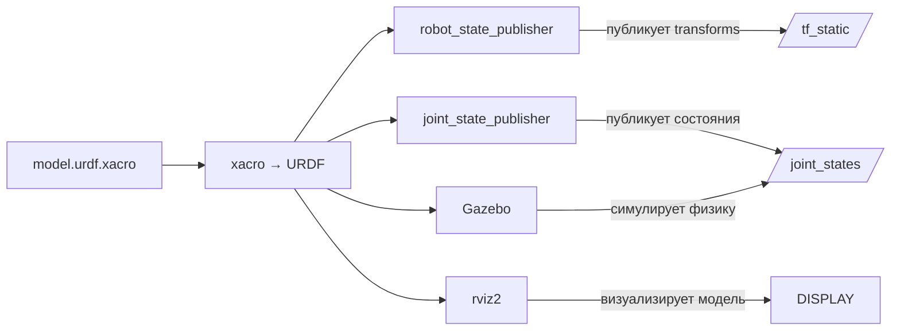

# URDF/Xacro — описание тела робота

## Коротко

URDF (Unified Robot Description Format) — формат описания геометрии, суставов и масс робота. Xacro — макро-язык, который упрощает URDF (переменные, циклы, include). `robot_state_publisher` читает URDF и публикует transforms в tf2.

> *Официальное определение*: «URDF (Unified Robot Description Format) — это формат файла для описания геометрии и организации роботов в ROS.» — [URDF](https://docs.ros.org/en/jazzy/Tutorials/Intermediate/URDF/URDF-Main.html)

## Что такое URDF

URDF — XML-файл, который описывает робота как набор **links** (звеньев) и **joints** (суставов):

```xml
<robot name="simple_bot">
  <!-- Базовая платформа -->
  <link name="base_link">
    <visual>
      <geometry><box size="0.4 0.3 0.2"/></geometry>
    </visual>
  </link>

  <!-- Колесо — соединено с базой через сустав -->
  <joint name="left_wheel_joint" type="continuous">
    <parent link="base_link"/>
    <child link="left_wheel_link"/>
    <origin xyz="0.0 0.15 0.0" rpy="0 0 0"/>
    <axis xyz="0 1 0"/>
  </joint>

  <link name="left_wheel_link">
    <visual>
      <geometry><cylinder radius="0.05" length="0.02"/></geometry>
    </visual>
  </link>
</robot>
```

| Элемент    | Что описывает                                                                                             |
| ---------- | --------------------------------------------------------------------------------------------------------- |
| `<link>`   | Звено: геометрия (box, cylinder, sphere, mesh), масса, инерция, цвет                                      |
| `<joint>`  | Сустав: тип (fixed, revolute, continuous, prismatic), родительский и дочерний link, ось вращения, пределы |
| `<origin>` | Положение и ориентация дочернего элеменета относительно родительского                                     |

## Зачем нужно

Робот — это десятки звеньев и суставов. Без единого формата описания:
- **rviz2** не знает, как выглядит робот;
- **Gazebo** не знает, какие массы и инерции;
- **tf2** не знает, какие transforms публиковать;
- **MoveIt2** не знает, какие суставы и ограничения;
- **Nav2** не знает, где находится база относительно колес.

URDF — единый источник правды о геометрии робота.

## Аналогия

URDF — **технический паспорт** автомобиля. В нем указаны: длина, ширина, колесная база, тип подвески, масса, максимальный угол поворота руля. Без паспорта вы не знаете, поместится ли машина в гараж и каков радиус разворота.

## Xacro: макросы для URDF

URDF быстро становится громоздким (100+ links). Xacro решает это:

```xml
<!-- xacro: переменные -->
<xacro:property name="wheel_radius" value="0.05"/>

<!-- xacro: макрос для повторяющихся частей -->
<xacro:macro name="wheel" params="name side">
  <link name="${name}_wheel_link">
    <visual>
      <geometry>
        <cylinder radius="${wheel_radius}" length="0.02"/>
      </geometry>
    </visual>
  </link>
  <joint name="${name}_wheel_joint" type="continuous">
    <parent link="base_link"/>
    <child link="${name}_wheel_link"/>
    <origin xyz="0.0 ${side * 0.15} 0.0"/>
    <axis xyz="0 1 0"/>
  </joint>
</xacro:macro>

<!-- Использование -->
<xacro:wheel name="left" side="1"/>
<xacro:wheel name="right" side="-1"/>
```

Xacro-файл преобразуется в URDF командой:

```bash
xacro model.urdf.xacro > model.urdf
```

## Как URDF связан с ROS2



- **`robot_state_publisher`** — читает URDF и публикует статические transforms (`base_link → left_wheel_link`, ...) в `/tf_static`.
- **`joint_state_publisher`** — публикует состояния суставов (углы) в `/joint_states`. В симуляции состояния приходят из Gazebo.
- **Gazebo** — использует URDF для создания физической модели: массы, инерции, столкновения.
- **rviz2** — визуализирует модель робота и дерево tf2.

## Привязка к трем уровням

- **Уровень 1 (лекция)**: фрагмент URDF на слайде, объяснение link/joint, схема цепочки URDF → transforms → tf2.
- **Уровень 2 (самостоятельно)**: эта статья + будущая практика с минимальной моделью дифференциальной базы.
- **Уровень 3 (робот TIAGo)**: `tiago_description/urdf/` — Xacro-файлы с 20+ links, 7-DOF рукой, колесами, камерой, лидаром. `robot_state_publisher` публикует всё дерево tf2.

## Типичные ошибки

| Ошибка | Симптом | Исправление |
| --- | --- | --- |
| Неправильные массы/инерции | Робот «улетает» в Gazebo, странная физика | Проверить `<inertial>` в каждом link |
| joint name не совпадает с ros2_control | Контроллер не находит сустав | Имена joints в URDF и YAML контроллера должны совпадать |
| Забыли `robot_state_publisher` | Нет transforms, `tf2_echo` пустой | Добавить `robot_state_publisher` в launch |
| Неправильный тип joint | Сустав не двигается или двигается не так | `continuous` — бесконечное вращение, `revolute` — с пределами, `fixed` — жесткое |

### Пример в реальном роботе

Модель TIAGo генерируется из `tiago.urdf.xacro` с параметризацией: 6 вариантов базы (pmb2, omni_base),
3 типа эндекторов (pal-gripper, pal-hey5, robotiq), 5 моделей сенсоров.
В [`3_Robot/TIAgo_humble/docs/robot_model.md`](../../3_Robot/TIAgo_humble/docs/robot_model.md) показана структура URDF,
аргументы Xacro и список всех link/joint.

## Связанные темы

- [tf2](tf2.md) — transforms из URDF публикуются в tf2
- [Simulation](simulation.md) — Gazebo использует URDF
- [ros2_control](ros2_control.md) — контроллеры связывают joints с ROS2
- [MoveIt2 bridge](moveit2_bridge.md) — планирование движений на основе URDF

## Источники

- [URDF + Xacro](https://docs.ros.org/en/jazzy/Tutorials/Intermediate/URDF/URDF-Main.html)
- [urdf_tutorial](https://docs.ros.org/en/jazzy/p/urdf_tutorial/)