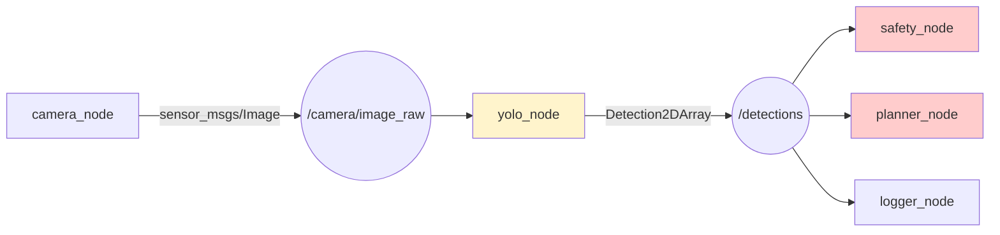

# YOLO в ROS2 — компьютерное зрение робота

## Коротко

YOLO (You Only Look Once) — модель компьютерного зрения, которая находит объекты на изображении. В ROS2 оформляется как узел, который подписан на `/camera/image_raw` и публикует найденные объекты в `/detections`.

**Ключевое правило безопасности**: YOLO публикует факты (класс, bounding box, confidence). YOLO не управляет движением робота. Решения принимают другие узлы.

## Что такое YOLO в ROS2

YOLO-узел — это стандартный ROS2-узел, который:
1. Подписан на topic с изображением (`/camera/image_raw`, тип `sensor_msgs/Image`).
2. Прогоняет каждый кадр через нейросеть YOLO.
3. Публикует результаты в `/detections` (тип `vision_msgs/Detection2DArray`).



**Граница ответственности**: YOLO — это perception (восприятие). Он говорит «вижу человека, confidence 0.95». Что делать с этой информацией — решают control-узлы: safety (остановиться), planner (объехать), logger (записать).

## Зачем нужно

Робот должен понимать, что он видит:
- «Человек в коридоре» → safety: снизить скорость или остановиться
- «Чашка на столе» → манипулятор: цель для захвата
- «Дым на кухне» → safety: сигнал тревоги

Без computer vision робот слеп: знает карту, но не знает, что на ней находится.

## Аналогия

YOLO — **зрение охранника**. Охранник смотрит на мониторы и говорит: «Вижу человека у двери, подозрительный объект в углу». Но охранник не бежит задерживать — он передает информацию тем, кто принимает решения.

## Как устроен YOLO-узел

```python
from sensor_msgs.msg import Image           # стандартный тип для изображений
from vision_msgs.msg import Detection2DArray  # стандартный тип для детекций
from cv_bridge import CvBridge               # конвертер ROS Image ↔ OpenCV


class YoloNode(Node):

    def __init__(self):
        super().__init__('yolo_node')
        self.bridge = CvBridge()                 # для преобразования изображений
        # подписываемся на топик с камеры
        self.subscriber = self.create_subscription(
            Image, '/camera/image_raw', self.image_callback, 10)
        # публикуем результаты детекции
        self.publisher = self.create_publisher(
            Detection2DArray, '/detections', 10)
        self.model = load_yolo_model('yolov8n.pt')  # загружаем модель YOLOv8

    def image_callback(self, msg):
        cv_image = self.bridge.imgmsg_to_cv2(msg)  # ROS Image → numpy.ndarray
        results = self.model(cv_image)               # YOLO: находим объекты

        det_msg = Detection2DArray()                 # формируем сообщение-результат
        det_msg.header = msg.header                  # сохраняем timestamp кадра
        det_msg.detections = self._convert_results(results)
        self.publisher.publish(det_msg)              # публикуем в /detections
```

Ключевые компоненты:

| Компонент | Назначение |
| --- | --- |
| `cv_bridge` | Преобразует `sensor_msgs/Image` → `numpy.ndarray` для OpenCV и обратно |
| `sensor_msgs/Image` | Стандартный тип для изображений в ROS2 |
| `vision_msgs/Detection2DArray` | Стандартный тип для результатов детекции |
| YOLO модель | Любая (v5, v8, v11) — загружается через `ultralytics` или OpenCV DNN |

## Привязка к трем уровням

- **Уровень 1 (лекция)**: схема pipeline `camera → yolo_node → /detections → safety/planner`. Объяснение границы perception/control.
- **Уровень 2 (самостоятельно)**: эта статья. Практика с YOLO и веб-камерой — в расширенных материалах.
- **Уровень 3 (робот TIAGo)**: пакет `tiago_yolo` (запланирован). Камера уже публикует `/head_front_camera/rgb/image_raw` в Gazebo. `pal_detection_msgs` — типы сообщений для bounding box и confidence.

## Граница безопасности

| Что YOLO делает | Что YOLO НЕ делает |
| --- | --- |
| Публикует bounding boxes и классы | Не управляет `/cmd_vel` |
| Публикует confidence score | Не вызывает `/navigate_to_pose` |
| Работает как perception-узел | Не принимает решения о движении |

**Почему это важно**: если YOLO ошибается (false positive — увидел человека там, где его нет), последствия ограничены: лишний bounding box в `/detections`. Safety/planner может проверить другими сенсорами. Если бы YOLO напрямую управлял движением — ложное срабатывание вызвало бы аварию.

### Пример в реальном роботе

В TIAGo пакет `tiago_yolo` (планируется) будет принимать видеопоток с RGB-D камеры через `/camera/image_raw`,
запускать детекцию YOLO и публиковать результаты в `/detections`.
В [`3_Robot/TIAgo_humble/docs/perception.md`](../../3_Robot/TIAgo_humble/docs/perception.md) описана архитектура
восприятия TIAGo и интеграция YOLO с ROS2.

## Связанные темы

- [Topics](topics.md) — YOLO публикует в `/detections`
- [ROS Architecture](ros_architecture.md) — подсистема Perception
- [LLM bridge](llm_bridge.md) — LLM использует данные YOLO для понимания окружения
- [Nav2 bridge](nav2_bridge.md) — planner может использовать `/detections`

## Источники

- [vision_msgs](https://github.com/ros-perception/vision_msgs)
- [cv_bridge](https://github.com/ros-perception/vision_opencv)
- [Ultralytics YOLO](https://docs.ultralytics.com/)