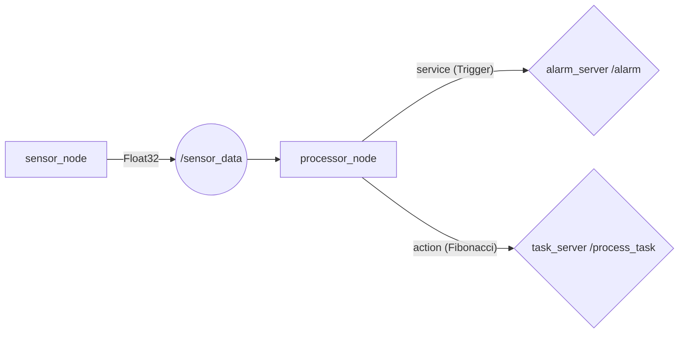

# Мини-проект: Собери свою ROS2-систему

## Цель

Объединить topic (publisher/subscriber), service (server/client) и action (server/client) в единую систему из 4 узлов, запускаемую одним launch-файлом. Увидеть полный ROS Graph со всеми связями и понять, как в реальном роботе один узел (processor_node) совмещает subscriber, service client и action client для принятия решений.

## Предварительные требования

- Выполнены практики [01-07](01_workspace.md)
- Пройдены все три блока по обмену сообщениями (topic, service, action)
- Понимание launch и parameters

## Что получится

Система из 4 узлов, 3 механизмов связи:



| Узел | Роль | ROS2-механизм | Что делает |
|---|---|---|---|
| `sensor_node` | Датчик | Topic publisher | Публикует случайное `Float32` в `/sensor_data` с параметризованной частотой |
| `processor_node` | Обработчик | **Subscriber** + **Service client** + **Action client** (3 механизма в одном узле!) | Подписан на `/sensor_data`. Если значение > порога — вызывает `/alarm` через service и запускает `/process_task` через action |
| `alarm_server` | Сигнализация | Service server | Принимает `/alarm` (тип `Trigger`), возвращает подтверждение |
| `task_server` | Вычислитель | Action server | Принимает `/process_task` (Fibonacci), считает с паузой 1 сек, шлёт feedback, поддерживает cancel |

**Ключевой паттерн**: `processor_node` объединяет subscriber, service client и action client — это реальная архитектура промышленного робота (сенсор → анализ → реакция через service/action).

---

## Шаг 1. Создать пакет

```bash
cd ~/ros2_ws/src
ros2 pkg create --build-type ament_python mini_project \
  --dependencies rclpy std_msgs std_srvs example_interfaces launch launch_ros
```

## Шаг 2. Код sensor_node

Создать `mini_project/sensor_node.py`:

```python
import random                         # Генерация случайных чисел
import rclpy
from rclpy.node import Node
from std_msgs.msg import Float32      # Тип сообщения: 32-битное float


class SensorNode(Node):
    """Датчик: публикует случайное Float32 в /sensor_data с параметризованной частотой"""

    def __init__(self):
        super().__init__('sensor_node')
        # Параметры — задаются из YAML-конфига или командной строки
        self.declare_parameter('publish_rate', 1.0)   # Частота публикации, Гц
        self.declare_parameter('max_value', 10.0)     # Максимальное значение
        rate = self.get_parameter('publish_rate').value
        self.publisher = self.create_publisher(Float32, '/sensor_data', 10)
        period = 1.0 / rate if rate > 0 else 1.0
        self.timer = self.create_timer(period, self.timer_callback)
        self.get_logger().info(f'Sensor started: rate={rate} Hz')

    def timer_callback(self):
        """Генерирует случайное число и публикует в топик"""
        max_val = self.get_parameter('max_value').value
        msg = Float32()
        msg.data = random.uniform(0.0, max_val)  # Случайное число от 0 до max_value
        self.publisher.publish(msg)
        self.get_logger().info(f'Sensor data: {msg.data:.3f}')
```

**Разбор**: publisher с параметризованной частотой. Публикует `Float32` в `/sensor_data`. Значение — случайное число от 0 до `max_value`. Параметры задаются из YAML или через launch-аргументы.

## Шаг 3. Код alarm_server

Создать `mini_project/alarm_server.py`:

```python
import rclpy
from rclpy.node import Node
from std_srvs.srv import Trigger       # Trigger.srv: --- (пустой запрос), → bool success, string message


class AlarmServer(Node):
    """Service server: принимает запрос /alarm, возвращает подтверждение"""

    def __init__(self):
        super().__init__('alarm_server')
        # Сервис типа Trigger — не требует входных данных, возвращает success + message
        self.srv = self.create_service(Trigger, '/alarm', self.callback)
        self.alarm_count = 0
        self.get_logger().info('Alarm server ready')

    def callback(self, request, response):
        """Вызывается при запросе — инкрементирует счётчик и возвращает подтверждение"""
        self.alarm_count += 1
        self.get_logger().warn(
            f'ALARM triggered! Total alarms: {self.alarm_count}')
        response.success = True
        response.message = f'Alarm #{self.alarm_count} confirmed'
        return response
```

**Разбор**: service server типа `Trigger`. Не требует входных данных (request пустой), возвращает `success` и `message`. Считает количество срабатываний — демонстрация, что сервер хранит состояние между вызовами.

## Шаг 4. Код task_server

Создать `mini_project/task_server.py`:

```python
import time
from example_interfaces.action import Fibonacci   # .action: int32 order, ---, int32[] sequence
import rclpy
from rclpy.action import ActionServer            # Action server
from rclpy.node import Node


class TaskServer(Node):
    """Action server: считает Фибоначчи с прогрессом и поддержкой отмены"""

    def __init__(self):
        super().__init__('task_server')
        self.action_server = ActionServer(
            self, Fibonacci, '/process_task', self.execute_callback)
        self.get_logger().info('Task server ready')

    def execute_callback(self, goal_handle):
        """Выполняет задачу: считает числа, шлёт feedback, поддерживает cancel"""
        order = goal_handle.request.order
        self.get_logger().info(f'Processing task: order={order}')
        sequence = [0, 1]
        goal_handle.publish_feedback(
            Fibonacci.Feedback(sequence=sequence))
        for i in range(1, order):
            if goal_handle.is_cancel_requested:
                goal_handle.canceled()
                self.get_logger().info('Task canceled')
                return Fibonacci.Result(sequence=sequence)
            sequence.append(sequence[i] + sequence[i - 1])
            goal_handle.publish_feedback(
                Fibonacci.Feedback(sequence=sequence))
            time.sleep(1.0)  # Имитация длительной операции
        goal_handle.succeed()
        self.get_logger().info(f'Task finished: {sequence}')
        return Fibonacci.Result(sequence=sequence)
```

**Разбор**: action server для Fibonacci. Принимает `order`, считает последовательность с паузой 1 сек, шлет feedback на каждом шаге. Поддерживает cancel через `is_cancel_requested`.

## Шаг 5. Код processor_node

**Это главный узел — он объединяет все три механизма связи в одном узле.**

Создать `mini_project/processor_node.py`:

```python
from example_interfaces.action import Fibonacci
import rclpy
from rclpy.action import ActionClient            # Action client
from rclpy.node import Node
from std_msgs.msg import Float32
from std_srvs.srv import Trigger                 # Trigger service


class ProcessorNode(Node):
    """Главный узел: объединяет subscriber, service client и action client в одном узле

    Это ключевой паттерн промышленной ROS2-архитектуры:
    один узел получает данные (subscriber), анализирует,
    при необходимости вызывает сервис и запускает длительную задачу.
    """

    def __init__(self):
        super().__init__('processor_node')
        # Параметр порога — задаётся из YAML или через launch-аргумент --threshold
        self.declare_parameter('threshold', 7.0)

        # ===== 1. SUBSCRIBER — получает данные от sensor_node =====
        # При каждом сообщении в /sensor_data вызывает data_callback
        self.subscriber = self.create_subscription(
            Float32, '/sensor_data', self.data_callback, 10)

        # ===== 2. SERVICE CLIENT — вызывает alarm_server =====
        # Создаём клиент для сервиса /alarm типа Trigger
        self.alarm_client = self.create_client(Trigger, '/alarm')
        # Блокируемся, пока alarm_server не запустится
        # Без wait_for_service вызов упадёт с «service not available»
        while not self.alarm_client.wait_for_service(timeout_sec=1.0):
            self.get_logger().info('Waiting for /alarm service...')

        # ===== 3. ACTION CLIENT — запускает task_server =====
        # Создаём клиент для action /process_task типа Fibonacci
        self.task_client = ActionClient(self, Fibonacci, '/process_task')
        # Ждём, пока task_server запустится
        self.task_client.wait_for_server()

        self.get_logger().info('Processor ready')

    # --- Subscriber callback (topic) ---
    def data_callback(self, msg):
        """Вызывается при каждом новом значении от сенсора"""
        threshold = self.get_parameter('threshold').value
        self.get_logger().info(
            f'Received: {msg.data:.3f} (threshold: {threshold:.1f})')

        if msg.data > threshold:
            # Превышение порога — запускаем цепочку: alarm (service) + task (action)
            self.get_logger().warn(
                f'Value {msg.data:.3f} exceeds threshold!')
            self.call_alarm()               # Вызвать service
            self.start_task(int(msg.data))  # Запустить action

    # --- Service (alarm) ---
    def call_alarm(self):
        """Отправляет асинхронный запрос к alarm_server — не блокирует узел"""
        future = self.alarm_client.call_async(Trigger.Request())
        future.add_done_callback(self.alarm_response_callback)

    def alarm_response_callback(self, future):
        """Ответ от alarm_server пришёл"""
        response = future.result()
        self.get_logger().info(f'Alarm response: {response.message}')

    # --- Action (task) ---
    def start_task(self, order):
        """Запускает action /process_task с order = текущее значение сенсора (макс. 10)"""
        order = min(order, 10)  # Ограничение, чтобы задача не длилась слишком долго
        goal_msg = Fibonacci.Goal()
        goal_msg.order = order
        self.get_logger().info(f'Starting task: order={order}')
        # Асинхронная отправка goal — с callback на feedback и на ответ сервера
        self.task_client.send_goal_async(
            goal_msg,
            feedback_callback=self.task_feedback_callback
        ).add_done_callback(self.task_goal_callback)

    def task_goal_callback(self, future):
        """Сервер принял или отклонил goal"""
        goal_handle = future.result()
        if goal_handle.accepted:
            self.get_logger().info('Task accepted')
            goal_handle.get_result_async().add_done_callback(
                self.task_result_callback)
        else:
            self.get_logger().warn('Task rejected')

    def task_feedback_callback(self, feedback_msg):
        """Каждый шаг — сервер прислал прогресс (промежуточную последовательность)"""
        seq = feedback_msg.feedback.sequence
        self.get_logger().info(f'Task progress: {seq}')

    def task_result_callback(self, future):
        """Сервер завершил — получили финальную последовательность"""
        result = future.result().result
        self.get_logger().info(f'Task result: {result.sequence}')
```

**Разбор**: один узел — три механизма связи:
1. **Subscriber** — получает данные от sensor_node
2. **Service client** — вызывает alarm_server при превышении порога
3. **Action client** — запускает task_server для обработки

Этот паттерн — реальная архитектура промышленного робота: сенсор публикует поток данных, процессор анализирует, принимает решение и через сервисы/actions запускает реакции.

## Шаг 6. YAML-конфиг

Создать `config/system_params.yaml` — параметры для двух узлов в одном файле:

```yaml
sensor_node:
  ros__parameters:
    publish_rate: 1.0     # Частота публикации, Гц
    max_value: 10.0       # Максимальное значение датчика

processor_node:
  ros__parameters:
    threshold: 7.0        # Порог срабатывания alarm
```

## Шаг 7. Launch-файл

Создать `launch/system.launch.py`:

```python
from launch import LaunchDescription
from launch.actions import DeclareLaunchArgument
from launch.substitutions import LaunchConfiguration, PathJoinSubstitution
from launch_ros.actions import Node
from launch_ros.substitutions import FindPackageShare


def generate_launch_description():
    config = PathJoinSubstitution([
        FindPackageShare('mini_project'),
        'config', 'system_params.yaml'
    ])

    threshold_arg = DeclareLaunchArgument(
        'threshold', default_value='7.0',
        description='Alarm threshold for processor_node'
    )

    sensor = Node(
        package='mini_project', executable='sensor_node',
        name='sensor_node', parameters=[config]
    )
    processor = Node(
        package='mini_project', executable='processor_node',
        name='processor_node',
        parameters=[config, {
            'threshold': LaunchConfiguration('threshold')
        }]
    )
    alarm = Node(
        package='mini_project', executable='alarm_server',
        name='alarm_server'
    )
    task = Node(
        package='mini_project', executable='task_server',
        name='task_server'
    )

    return LaunchDescription([threshold_arg, sensor, processor, alarm, task])
```

## Шаг 8. Сборка и запуск

```bash
cd ~/ros2_ws
colcon build --packages-select mini_project
source install/setup.bash

# Запуск системы одной командой
ros2 launch mini_project system.launch.py
```

Ожидаемый вывод — все 4 узла пишут в лог:

```
[INFO] [sensor_node]: Sensor data: 2.345
[INFO] [processor_node]: Received: 2.345 (threshold: 7.0)
[INFO] [sensor_node]: Sensor data: 7.891
[INFO] [processor_node]: Received: 7.891 (threshold: 7.0)
[WARN] [processor_node]: Value 7.891 exceeds threshold!
[WARN] [alarm_server]: ALARM triggered! Total alarms: 1
[INFO] [processor_node]: Alarm response: Alarm #1 confirmed
[INFO] [processor_node]: Starting task: order=7
[INFO] [task_server]: Processing task: order=7
[INFO] [processor_node]: Task progress: [0, 1]
[INFO] [processor_node]: Task progress: [0, 1, 1]
...
[INFO] [task_server]: Task finished: [0, 1, 1, 2, 3, 5, 8, 13]
```

### Запуск с другим порогом

```bash
ros2 launch mini_project system.launch.py threshold:=3.0
# Теперь alarm срабатывает чаще
```

---

## Проверка результата

| Команда | Ожидаемый результат |
|---|---|
| `ros2 launch mini_project system.launch.py` | 4 узла запущены, логи пишутся |
| `ros2 node list` | `sensor_node`, `processor_node`, `alarm_server`, `task_server` |
| `rqt_graph` | Полный граф: 4 узла + topic `/sensor_data` + service `/alarm` + action `/process_task` |
| `ros2 topic echo /sensor_data` | Поток Float32 |
| `ros2 topic hz /sensor_data` | ~1.0 Hz |
| `ros2 service call /alarm std_srvs/srv/Trigger` | `success: True` |
| `ros2 action list` | `/process_task` |
| `ros2 param get /processor_node threshold` | `7.0` |

### Ручная проверка взаимодействия

Когда система запущена (4 узла):

```bash
# Вручную вставить значение выше порога
ros2 topic pub --once /sensor_data std_msgs/msg/Float32 "data: 9.5"
```

Сразу же:
- `processor_node` выводит «Value exceeds threshold»
- `alarm_server` выводит «ALARM triggered»
- `task_server` начинает считать Fibonacci с order=9

**Это и есть кульминация**: одно сообщение из CLI запускает цепочку из service call и action через processor_node.

---

## Вопросы студентам

1. Сколько механизмов связи использует `processor_node`? Перечислите их.
2. Почему `processor_node` вызывает `/alarm` и запускает `/process_task` именно в callback subscriber-а?
3. Что произойдет, если запустить систему без `alarm_server`? А без `task_server`?
4. Где в коде `processor_node` ограничение `max(order, 10)`? Зачем оно нужно?
5. Как изменить порог срабатывания alarm без перекомпиляции?

---

## Дополнительное задание

1. **Добавьте action cancel**: измените processor_node так, чтобы он вызывал `cancel_goal_async()` через 3 секунды после старта задачи.

2. **Добавьте второй порог**: если значение > 9.0 — процессор вызывает оба: alarm и task. Если значение между 7.0 и 9.0 — только alarm.

3. **Визуализируйте ROS Graph**:

```bash
rqt_graph
```

Сохраните скриншот — это итоговая карта вашей первой ROS2-системы. Сравните с графом робота TIAGo в `3_Robot/TIAgo_humble/`.

---

## Ссылки

- [Архитектура ROS2](../2_knowledge/ros_architecture.md)
- [Topics](../2_knowledge/topics.md), [Services](../2_knowledge/services.md), [Actions](../2_knowledge/actions.md)
- [Launch](../2_knowledge/launch.md), [Parameters](../2_knowledge/parameters.md)