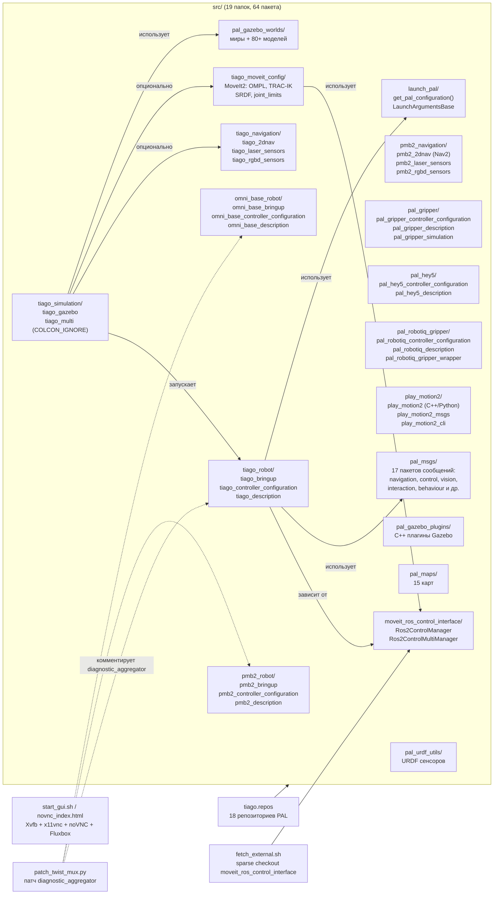
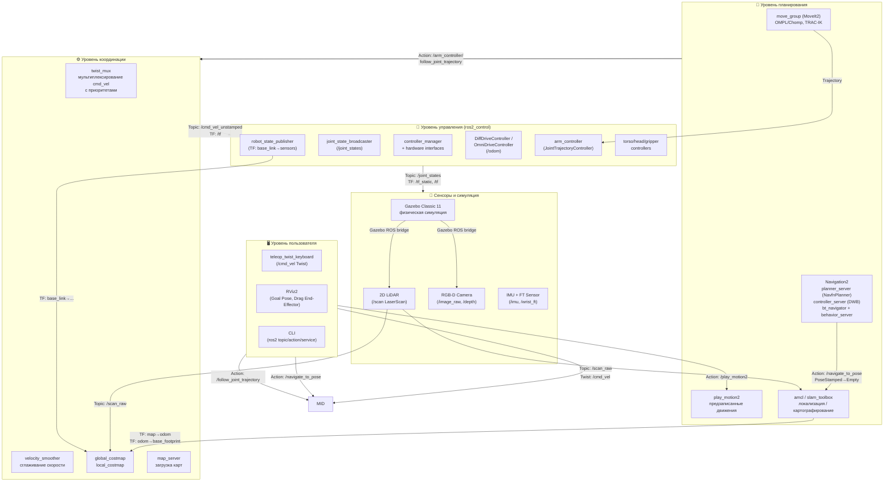
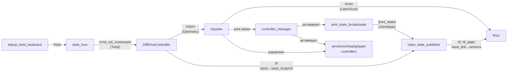
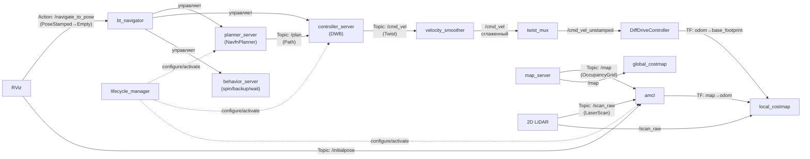
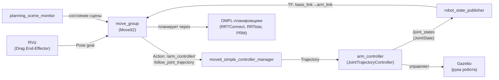
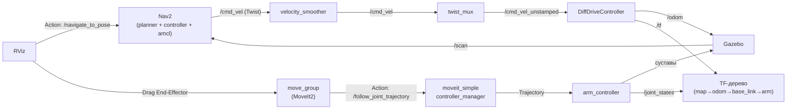
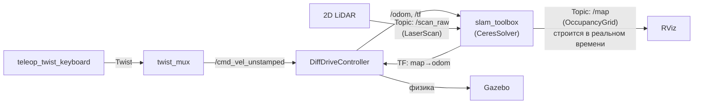

# TIAGo ROS2 Humble — Конфигурация проекта

> Данный файл содержит актуальное описание проекта **виртуального мобильного
> робота TIAGo** для образовательных целей. Описана конфигурация, находящаяся
> в контейнере в директории `ros2_ws/`: пакеты, launch-файлы, контроллеры,
> карты, миры и команды запуска.
>
> Данные о физических характеристиках робота и вариантах исполнения взяты из
> официальной документации [PAL Robotics](https://docs.pal-robotics.com/25.01/tiago.html)
> (PAL OS 25.01).

TIAGo (Take It And Go) — полнофункциональный мобильный манипулятор от
PAL Robotics, используемый в университетах и исследовательских центрах для
изучения широкого спектра робототехнических задач. В данном проекте
реализована **виртуальная модель робота** в симуляции Gazebo с полной
интеграцией ROS2-стека: описание робота (URDF/Xacro), управление
контроллерами (ros2_control), навигация (Nav2), манипуляция (MoveIt2)
и визуализация (RViz). Модель полностью повторяет поведение физического
робота и пригодна для отработки алгоритмов без доступа к реальному
оборудованию.

Образовательные возможности проекта включают три ключевых направления.
**(1) Автономная навигация:** робот оснащён полноценным стеком Navigation2
с планировщиком пути, контроллером движения, AMCL-локализацией, SLAM Toolbox
и системой избегания препятствий — при обнаружении объекта на пути робот
автоматически тормозит и перестраивает маршрут (см. [раздел 6](#6-основные-команды-запуска)).
**(2) Манипуляция:** 7-степенной манипулятор управляется через MoveIt2 —
можно перетаскивать эндектор мышью в RViz, планировать траектории и
выполнять их в симуляции (см. [раздел 6](#6-основные-команды-запуска)).
**(3) Конфигурирование вариантов робота:** проект поддерживает множество
аппаратных конфигураций — сменные эндекторы (PAL-gripper, HEY5, Robotiq),
два типа мобильной базы (дифференциальная и всенаправленная), разные модели
лазеров и камер — что позволяет изучать влияние архитектуры робота на
решение задач.

Все команды для запуска каждого из режимов собраны в разделе
[«Быстрый запуск и тест основных режимов»](#61-быстрый-запуск-и-тест-основных-режимов).

---

## 1. Возможности робота TIAGo

**TIAGo (Take It And Go)** — полнофункциональный мобильный манипулятор от PAL Robotics
для исследований и образования.

### Варианты исполнения

> Источник: официальная документация [PAL Robotics](https://docs.pal-robotics.com/25.01/tiago.html) (PAL OS 25.01).

| Вариант | Масса | База | Рука | Грузоподъёмность |
|---------|-------|------|------|-------------------|
| TIAGo Lite | 60 кг | Дифф. Ø54 см | Нет | — |
| **TIAGo** | 72 кг | Дифф. Ø54 см | 7-DOF | 2 кг |
| TIAGo++ | 72 кг | Дифф. Ø54 см | Две 7-DOF | 2 кг × 2 |
| TIAGo++ OMNI | 95 кг | Омни 71×49 см | Две 7-DOF | 2 кг × 2 |
| TIAGo SEA | 72 кг | Дифф. Ø54 см | 7-DOF SEA | 3 кг |
| TIAGo SEA++ | 72 кг | Дифф. Ø54 см | Две 7-DOF SEA | 3 кг × 2 |

### Технические характеристики

> Источник: официальная документация [PAL Robotics](https://docs.pal-robotics.com/25.01/tiago.html) (PAL OS 25.01).

| Параметр | Значение |
|----------|----------|
| Высота | 110–145 см (ход торса 35 см) |
| Макс. скорость | 1.0 м/с |
| Манипулятор | 7-DOF (4 плечо + 3 запястье), вылет 87 см |
| Эндекторы | PAL-gripper (2-DOF) / Hey5 (19 DOF, 3 активных) |
| Голова | 2-DOF (pan/tilt) с RGB-D камерой |
| Лазер | 2D LiDAR (SICK / Hokuyo) |
| IMU | В базе |
| Sonars | 3 ультразвуковых датчика |
| Силомомент | Датчик в запястье |
| Батарея | 36 В, 20 А·ч |
| Экран | 13.3" touch (опционально) |

### Назначение

- Изучение автономной навигации (Nav2, SLAM)
- Манипуляция и планирование движений (MoveIt2)
- Восприятие (RGB-D, LiDAR, распознавание объектов)
- Human-Robot Interaction
- Интеграция AI-компонентов (LLM, YOLO, VLM)

---

## 2. Используемые технологии

| Технология | Версия | Назначение |
|------------|--------|------------|
| **ROS2** | Humble | Фреймворк робототехники |
| **Gazebo Classic** | 11 | Симулятор (по умолчанию) |
| **Ignition Gazebo** | — | Альтернативный симулятор (флаг `gazebo_version`) |
| **MoveIt2** | Humble | Планирование движений манипулятора |
| **Navigation2** | Humble | Автономная навигация и локализация |
| **ros2_control** | Humble | Управление аппаратными контроллерами |
| **SLAM Toolbox** | — | Построение карт |
| **DDS** | CycloneDDS | Middleware (рекомендован PAL) |
| **Docker** | через DevContainer | Контейнеризация среды |
| **Xvfb + noVNC** | — | GUI через браузер |

### Специфичные для PAL

| Компонент | Назначение |
|-----------|------------|
| **play_motion2** | Воспроизведение предзаписанных движений |
| **twist_mux** | Мультиплексирование команд скорости с приоритетами |
| **launch_pal** | Утилиты: `get_pal_configuration()`, `LaunchArgumentsBase`, `RobotInfoFile`, |
| **pal_msgs** | 17 пакетов собственных ROS2-сообщений (навигация, управление, взаимодействие, детекция) |
| **pal_gazebo_plugins** | Кастомные Gazebo-плагины PAL |
| **pal_gazebo_worlds** | Миры Gazebo + 80+ моделей |
| **pal_maps** | 15 карт помещений |

---

## 3. Архитектура папок проекта



### Назначение папок и ключевых файлов

| Путь | Назначение |
|------|------------|
| `ros2_ws/tiago.repos` | Список 18 репозиториев для `vcs import` |
| `ros2_ws/fetch_external.sh` | Sparse checkout `moveit_ros_control_interface` из `moveit2` (branch `humble`) |
| `ros2_ws/start_gui.sh` | Запуск Xvfb + x11vnc + websockify + Fluxbox |
| `ros2_ws/novnc_index.html` | Страница noVNC с автоконнектом и масштабированием |
| `ros2_ws/patch_twist_mux.py` | Патч: комментирование `diagnostic_aggregator` (ROS1) |
| `src/tiago_robot/` | Ядро TIAGo: описание URDF/Xacro, контроллеры ros2_control, bringup, play_motion2 |
| `src/tiago_simulation/` | Запуск симуляции в Gazebo, спавн робота, навигация в public/private режимах |
| `src/tiago_navigation/` | Nav2-конфигурация для TIAGo (RGB-D сенсоры) |
| `src/tiago_moveit_config/` | MoveIt2: планировщики (OMPL, Chomp), кинематика (KDL, TRAC-IK), пределы |
| `src/pmb2_robot/` | Дифференциальная мобильная база PMB2 |
| `src/omni_base_robot/` | Всенаправленная база OmniBase |
| `src/pmb2_navigation/` | Nav2 + SLAM для базы PMB2/OmniBase |
| `src/pal_gripper/` | PAL-гриппер (2 пальца) |
| `src/pal_hey5/` | Кисть HEY5 (5 пальцев, 3 DOF активных) |
| `src/pal_robotiq_gripper/` | Robotiq: 2F-85, 2F-140, Epick |
| `src/play_motion2/` | Предзаписанные движения (убрать руку, схватить, осмотреть) |
| `src/pal_msgs/` | 17 пакетов PAL-сообщений, сервисов, действий |
| `src/pal_gazebo_worlds/` | Миры Gazebo (pal_office, small_office, home, hospital…) |
| `src/pal_gazebo_plugins/` | Кастомные C++ плагины Gazebo от PAL |
| `src/pal_maps/` | 15 карт для Nav2 (pal_office, small_office, home, hospital...) |
| `src/launch_pal/` | Утилиты: `get_pal_configuration()`, `LaunchArgumentsBase`, `${VAR}`-подстановка |
| `src/pal_urdf_utils/` | URDF-макросы сенсоров (камеры, лазеры, FT-датчики) |
| `src/moveit_ros_control_interface/` | «Мост» MoveIt2 → ros2_control (собран из исходников) |

---

## 4. ROS-пакеты и их назначение

Всего в workspace: **64 ROS-пакета**, объединённых в функциональные группы.

### Архитектура ROS2



Пакеты, задействованные в каждом уровне:

| Уровень | Пакеты |
|---------|--------|
| Пользователь | внешние (`teleop_twist_keyboard`, `rviz2`) |
| Планирование | `tiago_moveit_config`, `pmb2_2dnav` (Nav2), `play_motion2` |
| Координация | `pmb2_2dnav` (costmaps, vel_smoother), `tiago_bringup` (twist_mux) |
| Управление | `tiago_controller_configuration`, `pmb2_controller_configuration`, `tiago_description` |
| Сенсоры | `tiago_laser_sensors`, `tiago_rgbd_sensors`, `pal_gazebo_*`, `pal_urdf_utils` |

### 4.1. Ядро TIAGo

Группа отвечает за **запуск и описание робота**: bringup (ros2_control, twist_mux, джойстик), конфигурацию контроллеров руки/торса/головы, URDF/Xacro-модель робота и launch-файлы для спавна в Gazebo.

| Пакет | Назначение | Папка |
|-------|------------|-------|
| `tiago_bringup` | Запуск: ros2_control, twist_mux, play_motion2, robot_state_publisher, джойстик | `tiago_robot/tiago_bringup/` |
| `tiago_controller_configuration` | ros2_control: arm_controller, torso_controller, head_controller, ft_sensor, gravity_compensation | `tiago_robot/tiago_controller_configuration/` |
| `tiago_description` | URDF/Xacro робота: `tiago.urdf.xacro` с параметрами (arm, end_effector, sensors) | `tiago_robot/tiago_description/` |
| `tiago_gazebo` | Launch-файлы Gazebo: спавн, навигация public/private, bridge, tuck_arm | `tiago_simulation/tiago_gazebo/` |

### 4.2. Навигация TIAGo

Группа отвечает за **навигационную конфигурацию TIAGo**: подключает параметры Nav2, лазерные и RGB-D сенсоры к навигационному стеку.

| Пакет | Назначение | Папка |
|-------|------------|-------|
| `tiago_2dnav` | Модули конфигурации Nav2 для TIAGo | `tiago_navigation/tiago_2dnav/` |
| `tiago_laser_sensors` | Модули конфигурации лазерных сенсоров для TIAGo | `tiago_navigation/tiago_laser_sensors/` |
| `tiago_rgbd_sensors` | Launch + params для RGB-D камеры TIAGo (Astra, Xtion) | `tiago_navigation/tiago_rgbd_sensors/` |

### 4.3. Манипуляция

Группа отвечает за **планирование движений руки**: MoveIt2-конфигурация с планировщиками (OMPL, Chomp), кинематикой (KDL, TRAC-IK) и пределами суставов.

| Пакет | Назначение | Папка |
|-------|------------|-------|
| `tiago_moveit_config` | MoveIt2: планировщики (OMPL, Chomp), кинематика (KDL, TRAC-IK), joint_limits | `tiago_moveit_config/` |

### 4.4. Мобильные базы

Группа отвечает за **управление шасси**: bringup, URDF/Xacro и ros2_control-контроллеры для дифференциальной базы PMB2 и всенаправленной OmniBase, включая их навигационные и сенсорные конфигурации.

| Пакет | Назначение | Папка |
|-------|------------|-------|
| `pmb2_bringup` | Bringup дифференциальной базы PMB2 | `pmb2_robot/pmb2_bringup/` |
| `pmb2_controller_configuration` | ros2_control: DiffDriveController для PMB2 | `pmb2_robot/pmb2_controller_configuration/` |
| `pmb2_description` | URDF/Xacro базы PMB2 | `pmb2_robot/pmb2_description/` |
| `pmb2_2dnav` | Nav2 для PMB2: локализация, навигация, SLAM | `pmb2_navigation/pmb2_2dnav/` |
| `pmb2_laser_sensors` | Лазерные сенсоры PMB2 (SICK-561, SICK-571, Hokuyo) + DLO | `pmb2_navigation/pmb2_laser_sensors/` |
| `pmb2_rgbd_sensors` | RGB-D сенсоры PMB2 | `pmb2_navigation/pmb2_rgbd_sensors/` |
| `omni_base_bringup` | Bringup всенаправленной базы | `omni_base_robot/omni_base_bringup/` |
| `omni_base_controller_configuration` | ros2_control: OmniDriveController | `omni_base_robot/omni_base_controller_configuration/` |
| `omni_base_description` | URDF/Xacro всенаправленной базы | `omni_base_robot/omni_base_description/` |

### 4.5. Эндекторы

Группа отвечает за **схваты**: URDF/Xacro-описания, ros2_control-контроллеры и симуляцию для трёх типов эндекторов — PAL-gripper, кисть HEY5 и линейка Robotiq.

| Пакет | Назначение | Папка |
|-------|------------|-------|
| `pal_gripper_controller_configuration` | ros2_control для PAL-gripper | `pal_gripper/pal_gripper_controller_configuration/` |
| `pal_gripper_description` | URDF PAL-gripper | `pal_gripper/pal_gripper_description/` |
| `pal_gripper_simulation` | Gazebo-симуляция PAL-gripper | `pal_gripper/pal_gripper_simulation/` |
| `pal_hey5_controller_configuration` | ros2_control для кисти HEY5 | `pal_hey5/pal_hey5_controller_configuration/` |
| `pal_hey5_description` | URDF кисти HEY5 | `pal_hey5/pal_hey5_description/` |
| `pal_robotiq_controller_configuration` | ros2_control для Robotiq | `pal_robotiq_gripper/pal_robotiq_controller_configuration/` |
| `pal_robotiq_description` | URDF Robotiq (2F-85, 2F-140) | `pal_robotiq_gripper/pal_robotiq_description/` |
| `pal_robotiq_gripper_wrapper` | Обёртка для Robotiq | `pal_robotiq_gripper/pal_robotiq_gripper_wrapper/` |

### 4.6. Движения

Группа отвечает за **воспроизведение предзаписанных движений**: фреймворк play_motion2 (C++/Python), Action-интерфейс и CLI для команд вроде «убрать руку», «схватить», «осмотреть».

| Пакет | Назначение | Папка |
|-------|------------|-------|
| `play_motion2` | Фреймворк предзаписанных движений (C++/Python) | `play_motion2/play_motion2/` |
| `play_motion2_msgs` | Сообщения/действия для play_motion2 | `play_motion2/play_motion2_msgs/` |
| `play_motion2_cli` | CLI-интерфейс для play_motion2 | `play_motion2/play_motion2_cli/` |

### 4.7. Сообщения PAL

Группа отвечает за **17 пакетов собственных ROS2-интерфейсов PAL Robotics**: сообщения, сервисы и действия для навигации, управления, HRI, компьютерного зрения, детекции и мультироботных сценариев.

| Пакет | Назначение | Папка |
|-------|------------|-------|
| `pal_behaviour_msgs` | Сообщения для системы поведения | `pal_msgs/pal_behaviour_msgs/` |
| `pal_common_msgs` | Общие сообщения PAL | `pal_msgs/pal_common_msgs/` |
| `pal_control_msgs` | Сообщения управления | `pal_msgs/pal_control_msgs/` |
| `pal_detection_msgs` | Сообщения детекции объектов | `pal_msgs/pal_detection_msgs/` |
| `pal_device_msgs` | Сообщения устройств | `pal_msgs/pal_device_msgs/` |
| `pal_interaction_msgs` | Сообщения HRI | `pal_msgs/pal_interaction_msgs/` |
| `pal_motion_model_msgs` | Сообщения моделей движения | `pal_msgs/pal_motion_model_msgs/` |
| `pal_multirobot_msgs` | Мультироботные сообщения | `pal_msgs/pal_multirobot_msgs/` |
| `pal_navigation_msgs` | Навигационные сообщения, действия, сервисы | `pal_msgs/pal_navigation_msgs/` |
| `pal_simulation_msgs` | Сообщения симуляции | `pal_msgs/pal_simulation_msgs/` |
| `pal_tablet_msgs` | Сообщения планшета | `pal_msgs/pal_tablet_msgs/` |
| `pal_video_recording_msgs` | Сервисы видеозаписи | `pal_msgs/pal_video_recording_msgs/` |
| `pal_vision_msgs` | Сообщения компьютерного зрения | `pal_msgs/pal_vision_msgs/` |
| `pal_visual_localization_msgs` | Действия визуальной локализации | `pal_msgs/pal_visual_localization_msgs/` |
| `pal_walking_msgs` | Сообщения ходьбы (для гуманоидов) | `pal_msgs/pal_walking_msgs/` |
| `pal_web_msgs` | Сообщения веб-интерфейса | `pal_msgs/pal_web_msgs/` |
| `pal_wifi_localization_msgs` | Сообщения WiFi-локализации | `pal_msgs/pal_wifi_localization_msgs/` |

### 4.8. Инфраструктура

Группа отвечает за **вспомогательные компоненты**: launch-утилиты PAL, миры и плагины Gazebo, карты для Nav2, URDF-макросы сенсоров и «мост» MoveIt2→ros2_control.

| Пакет | Назначение | Папка |
|-------|------------|-------|
| `launch_pal` | `get_pal_configuration()`, `LaunchArgumentsBase`, `RobotInfoFile`, `${VAR}`-подстановка | `launch_pal/` |
| `pal_gazebo_worlds` | Миры (pal_office, small_office) и 80+ моделей Gazebo | `pal_gazebo_worlds/` |
| `pal_gazebo_plugins` | Кастомные C++ плагины Gazebo | `pal_gazebo_plugins/` |
| `pal_maps` | 15 карт для Nav2 | `pal_maps/` |
| `pal_urdf_utils` | URDF-макросы: камеры (Orbbec Astra, Asus Xtion, RealSense), лазеры (SICK, Hokuyo), FT-датчики | `pal_urdf_utils/` |
| `moveit_ros_control_interface` | Ros2ControlManager + Ros2ControlMultiManager (MoveIt → ros2_control) | `moveit_ros_control_interface/` |

### 4.9. Мета-пакеты

Группа отвечает за **зонтичные пакеты**: объединяют связанные компоненты (робот, симуляция, навигация, базы) в один устанавливаемый пакет для упрощения зависимостей.

| Пакет | Включает | Папка |
|-------|----------|-------|
| `tiago_robot` | tiago_bringup, tiago_controller_configuration, tiago_description | `tiago_robot/tiago_robot/` |
| `tiago_simulation` | tiago_gazebo, tiago_multi | `tiago_simulation/tiago_simulation/` |
| `tiago_navigation` | tiago_2dnav, tiago_laser_sensors, tiago_rgbd_sensors | `tiago_navigation/tiago_navigation/` |
| `pmb2_robot` | pmb2_bringup, pmb2_controller_configuration, pmb2_description | `pmb2_robot/pmb2_robot/` |
| `pmb2_navigation` | pmb2_2dnav, pmb2_laser_sensors, pmb2_rgbd_sensors | `pmb2_navigation/pmb2_navigation/` |
| `omni_base_robot` | omni_base_bringup, omni_base_controller_configuration, omni_base_description | `omni_base_robot/omni_base_robot/` |

---

## 5. TF-дерево

```
map  (глобальная система координат — SLAM/AMCL)
  └── odom  (одометрия — колёсная или DLO)
        └── base_footprint  (проекция робота на пол — Nav2 base_frame_id)
              └── base_link  (корневой фрейм робота)
                    ├── torso_lift_link  (выдвижной торс)
                    │     ├── head_1_link → head_2_link (голова, pan/tilt)
                    │     │     └── camera_link (RGB-D камера)
                    │     └── arm_1_link → arm_7_link (манипулятор 7-DOF)
                    │           └── wrist_ft_link → gripper_link (эндектор)
                    └── base_laser_link (лазерный сканер)
```

**Ключевые фреймы:**
- `map` → `odom` — публикуется AMCL или slam_toolbox
- `odom` → `base_footprint` — публикуется DiffDriveController (public sim) или DLO (private sim)
- `base_footprint` → `base_link` — публикуется robot_state_publisher

---

## 6. Основные команды запуска

### 6.1. Быстрый запуск и тест основных режимов

Ниже — минимальный набор команд для проверки работоспособности
каждого из ключевых режимов робота, с указанием задействованных узлов
и способов управления.

> **Требования для запуска:**
> - **Режимы 2, 4, 5 (навигация):** требуется пакет `ros-humble-nav2-bringup`.
>   Он уже прописан в `.devcontainer/Dockerfile` (строка 59). Если навигация не запускается —
>   пересоберите контейнер или доустановите пакет вручную:
>   ```bash
>   sudo apt-get install -y ros-humble-nav2-bringup
>   ```
> - **Режимы 3, 4 (манипуляция):** `move_group` (MoveIt2) запускается автоматически,
>   но RViz с панелью MotionPlanning — **отдельно**. После запуска основного launch-файла
>   выполните во втором терминале:
>   ```bash
>   ros2 launch tiago_moveit_config moveit_rviz.launch.py
>   ```
>   После запуска MoveIt RViz — **активировать панель MotionPlanning** (иначе элементы управления не появятся):
>   ```bash
>   RVN=$(ros2 node list | grep rviz | tail -1) && ros2 param set "$RVN" robot_description "$(ros2 topic echo /robot_description --once --field data 2>/dev/null)"
>   ```
> - **Режим 1:** при запуске без навигации (`navigation:=False`) теперь автоматически
>   открывается базовый RViz с моделью робота, TF-деревом и лазерным сканером
>   (конфиг: `tiago_gazebo/config/tiago_sim.rviz`).

#### Режим 1: Базовая симуляция

Проверка того, что Gazebo и RViz работают, робот загружается корректно,
все контроллеры активируются.



**Задействованные узлы:**

| Узел | Назначение |
|------|-----------|
| `robot_state_publisher` | Публикует TF-дерево и топик `/robot_description` |
| `controller_manager` (ros2_control) | Загружает и активирует контроллеры |
| `joint_state_broadcaster` | Публикует состояние всех суставов в `/joint_states` |
| `DiffDriveController` | Принимает `/cmd_vel_unstamped` — вращает колёса, публикует одометрию |
| `arm_controller` | JointTrajectoryController — исполняет траектории для 7 суставов руки |
| `torso_controller` | JointTrajectoryController — управляет высотой торса |
| `head_controller` | JointTrajectoryController — pan/tilt головы |
| `gripper_controller` | JointTrajectoryController — открытие/закрытие пальцев эндектора |
| `twist_mux` | Мультиплексирует команды скорости от разных источников с приоритетами |
| `spawn_entity` (gazebo_ros) | Спавн модели робота в мире Gazebo |

| Шаг | Команда |
|-----|---------|
| 1. GUI | `start_gui.sh` → браузер: `http://localhost:6080` |
| 2. Запуск | `ros2 launch tiago_gazebo tiago_gazebo.launch.py is_public_sim:=True` |
| Результат | Gazebo: робот в мире pal_office. RViz: модель, TF-дерево, лазерные лучи. |
| **Управление** | `ros2 run teleop_twist_keyboard teleop_twist_keyboard --ros-args -r cmd_vel:=/mobile_base_controller/cmd_vel_unstamped` — клавиши: `i`=вперёд, `,`=назад, `j`=влево, `l`=вправо, `k`=стоп. |

#### Режим 2: Автономная навигация

Робот самостоятельно планирует маршрут до заданной точки на карте, объезжает
препятствия по данным лазерного сканера. При обнаружении препятствия робот
автоматически тормозит и перестраивает путь.



**Дополнительные узлы (к Режиму 1):**

| Узел | Назначение |
|------|-----------|
| `planner_server` (NavfnPlanner) | Строит глобальный путь от текущей позиции до цели |
| `controller_server` (DWB) | Следует по пути: вычисляет команды скорости, учитывая costmap — тормозит перед препятствиями |
| `bt_navigator` | Выполняет поведенческое дерево: основной цикл «планировать → ехать → перепланировать при ошибке» |
| `behavior_server` | Вспомогательные поведения: spin (разворот на месте), backup (отъезд назад), wait (ожидание) |
| `amcl` (Adaptive Monte Carlo Localization) | Локализация робота на карте — 500-2000 частиц, matching laser scan с картой |
| `map_server` | Загружает сохранённую карту (`.pgm`/`.yaml`) и публикует в топик `/map` |
| `global_costmap` | Глобальная карта стоимости: статические препятствия (стены) + зона инфляции |
| `local_costmap` | Локальная карта стоимости (3×3 м вокруг робота): динамические препятствия + voxel-слой |
| `velocity_smoother` | Сглаживает команды скорости для плавного движения |
| `lifecycle_manager` | Управляет жизненным циклом всех Nav2-узлов: активирует/деактивирует по порядку |

| Шаг | Команда |
|-----|---------|
| Запуск | `ros2 launch tiago_gazebo tiago_gazebo.launch.py navigation:=True is_public_sim:=True` |
| Результат | В RViz: карта (map), AMCL-частицы (зелёные стрелки вокруг робота), costmap (цветные зоны вокруг препятствий), путь (зелёная линия). |
| **Управление** | В RViz: 1) кнопка «**2D Pose Estimate**» — кликнуть на карте для задания начальной позиции робота. 2) «**Navigation2 Goal**» — кликнуть в желаемую точку и потянуть для указания направления. Робот строит маршрут (зелёная линия в RViz) и едет. |
| **Если RViz пустой** | Убедитесь, что `ros-humble-nav2-bringup` установлен (см. требования выше).

**Что можно проверить:** поставить препятствие на пути робота в Gazebo
(Insert → модели, например `Construction Cone`) и наблюдать, как робот
перестраивает маршрут в обход на локальной costmap.

#### Режим 3: Манипуляция через MoveIt2

Планирование и исполнение движений 7-степенного манипулятора:
перетаскивание эндектора мышью в RViz, построение бесконфликтной
траектории и её выполнение в симуляции.



**Дополнительные узлы (к Режиму 1):**

| Узел | Назначение |
|------|-----------|
| `move_group` (MoveIt2) | Основной планировщик: принимает goal-позицию эндектора, планирует траекторию (OMPL/Chomp), отправляет контроллерам на исполнение |
| `planning_scene_monitor` | Отслеживает состояние сцены: робот, объекты, octomap из PointCloud |
| `moveit_simple_controller_manager` | Связывает MoveIt с ros2_control: запускает/останавливает контроллеры по требованию |
| OMPL-планировщики | RRTConnect, RRTstar, PRM, EST, LBKPIECE и др. — алгоритмы поиска траектории в конфигурационном пространстве |

| Шаг | Команда |
|-----|---------|
| 1. Запуск | `ros2 launch tiago_gazebo tiago_gazebo.launch.py moveit:=True is_public_sim:=True` |
| | Запускает Gazebo, робота, контроллеры и `move_group`. Базовый RViz показывает модель робота, TF и LaserScan. |
| 2. MoveIt RViz | `ros2 launch tiago_moveit_config moveit_rviz.launch.py` |
| | Открывает **второй** RViz с панелью MotionPlanning. Именно здесь — управление манипулятором. |
| 3. Активация | Команда ниже — загружает URDF в RViz, активирует панель MotionPlanning. |
| Результат | Два окна RViz: (1) базовое — модель робота и сенсоры; (2) MoveIt — оранжевый маркер на эндекторе, панель Planning. |
| **Управление** | В MoveIt RViz, вкладка **MotionPlanning**: 1) Перетащите оранжевый шар на конце руки в новую позицию. 2) На вкладке «Planning» нажмите **«Plan»** — появится жёлтая траектория. 3) Нажмите **«Execute»** — рука робота двигается по спланированной траектории в симуляции. |

После запуска MoveIt RViz выполните в отдельном терминале команду активации:
```bash
RVN=$(ros2 node list | grep rviz | tail -1) && ros2 param set "$RVN" robot_description "$(ros2 topic echo /robot_description --once --field data 2>/dev/null)"
```
После этого панель MotionPlanning становится активной: появляются планировочные группы, оранжевый маркер на эндекторе, кнопки Plan/Execute.

**Что можно проверить:** смена эндектора и планирование с разными конфигурациями:
```bash
# === Вариант A: кисть HEY5 ===
# Терминал 1: основной запуск
ros2 launch tiago_gazebo tiago_gazebo.launch.py moveit:=True end_effector:=pal-hey5 is_public_sim:=True
# Терминал 2: MoveIt RViz (тот же end_effector!)
ros2 launch tiago_moveit_config moveit_rviz.launch.py end_effector:=pal-hey5
# Терминал 3: активировать панель MotionPlanning
RVN=$(ros2 node list | grep rviz | tail -1) && ros2 param set "$RVN" robot_description "$(ros2 topic echo /robot_description --once --field data 2>/dev/null)"

# === Вариант B: гриппер Robotiq 2F-85 ===
# Терминал 1:
ros2 launch tiago_gazebo tiago_gazebo.launch.py moveit:=True end_effector:=robotiq-2f-85 is_public_sim:=True
# Терминал 2:
ros2 launch tiago_moveit_config moveit_rviz.launch.py end_effector:=robotiq-2f-85
# Терминал 3:
RVN=$(ros2 node list | grep rviz | tail -1) && ros2 param set "$RVN" robot_description "$(ros2 topic echo /robot_description --once --field data 2>/dev/null)"
```

#### Режим 4: Совместный запуск (навигация + манипуляция)

Полный стек: робот может одновременно перемещаться по карте
и выполнять операции манипулятором. Задействованы **все узлы Режимов 1, 2 и 3**.



| Шаг | Команда |
|-----|---------|
| Запуск | `ros2 launch tiago_gazebo tiago_gazebo.launch.py navigation:=True moveit:=True is_public_sim:=True` |
| | Навигация: карта, AMCL, costmap, Goal-управление. `move_group` запущен в фоне. |
| MoveIt RViz | `ros2 launch tiago_moveit_config moveit_rviz.launch.py` (отдельный терминал) |
| Активация | Команда ниже — активирует панель MotionPlanning. |
| Результат | Два окна RViz: навигационное (карта + costmap) и MoveIt (панель MotionPlanning). |
| **Управление** | Комбинируйте: «2D Pose Estimate» + «Navigation2 Goal» для навигации и MotionPlanning для манипуляции — параллельно. |

После запуска MoveIt RViz выполните в отдельном терминале:
```bash
RVN=$(ros2 node list | grep rviz | tail -1) && ros2 param set "$RVN" robot_description "$(ros2 topic echo /robot_description --once --field data 2>/dev/null)"
```

#### Режим 5: SLAM (построение карты)

Робот строит карту незнакомого помещения в реальном времени.
В отличие от Режима 2, карта не загружается — она создаётся
по мере движения робота. Вместо `amcl` + `map_server` работает
**один узел** `slam_toolbox` (CeresSolver, loop closing, разрешение 0.05 м).



| Шаг | Команда |
|-----|---------|
| Запуск | `ros2 launch tiago_gazebo tiago_gazebo.launch.py navigation:=True slam:=True is_public_sim:=True` |
| Результат | RViz показывает серую карту, которая заполняется по мере движения робота. |
| | **Если нет точек лидара:** в RViz нажмите **Add** → **By topic** → `/scan_raw` → **LaserScan**. |
| | Если точек всё равно нет — проверьте, какой топик публикует лазер: `ros2 topic list \| grep scan`. Попробуйте оба варианта (`/scan_raw` и `/scan`). |
| | Проверить, идут ли данные: `ros2 topic echo /scan_raw --once` (должен выдать массив `ranges`). |
| **Управление** | `teleop_twist_keyboard` (см. Режим 1) — поездите по всему помещению, чтобы карта заполнилась полностью. |
| Сохранить | `ros2 run nav2_map_server map_saver_cli -f ~/my_map` — сохранение карты на диск. |
| **Если не запускается** | Убедитесь, что `ros-humble-nav2-bringup` установлен (см. требования в начале раздела). |

#### Режим 6: Мультироботный запуск (ROS1, неактивен)

В репозитории присутствуют launch-файлы для запуска нескольких TIAGo
в одном мире Gazebo (`tiago_multi/launch/multitiago_gazebo.launch`,
`multitiago_gazebo_navigation.launch`). Однако они написаны в формате
ROS1 (`.launch`) и отключены от сборки флагом `COLCON_IGNORE`.
В текущей версии ROS2 Humble режим недоступен — требуется портирование
launch-файлов на Python API (`launch_py`).

---

**Способы управления — сводка:**

| Способ | Что делает | Режимы |
|--------|-----------|--------|
| `teleop_twist_keyboard` (i/,/j/l/k) | Прямое управление скоростью с клавиатуры | 1, 5 |
| «2D Pose Estimate» в RViz | Клик — задать начальную позицию робота на карте | 2, 4 |
| «Navigation2 Goal» в RViz | Клик + потянуть — задать цель и направление | 2, 4 |
| Drag end-effector в RViz | Перетаскивание маркера → Plan → Execute | 3, 4 |
| `ros2 topic pub …/cmd_vel_unstamped` | Прямая отправка Twist-команд в терминал | Любой |

---

### 6.2. Главный launch-файл

```bash
ros2 launch tiago_gazebo tiago_gazebo.launch.py [аргументы]
```

### 6.3. Режимы запуска

| Режим | Команда | Примечание |
|-------|---------|------------|
| **Только симуляция** (Gazebo + RViz) | `ros2 launch tiago_gazebo tiago_gazebo.launch.py` | Базовый RViz: модель, TF, LaserScan |
| **Симуляция + навигация** | `ros2 launch tiago_gazebo tiago_gazebo.launch.py navigation:=True is_public_sim:=True` | Требуется `ros-humble-nav2-bringup` |
| **Симуляция + SLAM** | `ros2 launch tiago_gazebo tiago_gazebo.launch.py navigation:=True slam:=True is_public_sim:=True` | Требуется `ros-humble-nav2-bringup` |
| **Симуляция + MoveIt2** | Шаг 1: `ros2 launch tiago_gazebo tiago_gazebo.launch.py moveit:=True is_public_sim:=True` | Шаг 2: `ros2 launch tiago_moveit_config moveit_rviz.launch.py` |
| **Полный стек** | `ros2 launch tiago_gazebo tiago_gazebo.launch.py navigation:=True moveit:=True is_public_sim:=True` | + отдельно `moveit_rviz.launch.py` |
| **Без RViz** | `… rviz:=False` | |
| **Без Gazebo GUI** | `… gzclient:=False` | |

### 6.4. Аргументы launch-файла

#### Аргументы конфигурации робота

| Аргумент | Допустимые значения | По умолчанию | Описание |
|----------|---------------------|-------------|----------|
| `base_type` | `pmb2`, `omni_base` | `pmb2` | Тип мобильной базы |
| `has_screen` | `true`, `false` | `false` | Наличие экрана на торсе |
| `arm_type` | `tiago-arm`, `no-arm` | `tiago-arm` | Тип манипулятора |
| `arm_motor_model` | `parker`, `ilm` | `parker` | Модель моторов руки |
| `end_effector` | `pal-gripper`, `pal-hey5`, `robotiq-2f-85`, `robotiq-2f-140`, `robotiq-epick`, `custom`, `no-end-effector` | `pal-gripper` | Эндектор |
| `ft_sensor` | `schunk-ft`, `no-ft-sensor` | `schunk-ft` | Силомоментный датчик |
| `wrist_model` | `wrist-2010`, `wrist-2017` | `wrist-2017` | Модель запястья |
| `wheel_model` | `moog`, `nadia` | `moog` | Модель колёс |

#### Аргументы сенсоров

| Аргумент | Допустимые значения | По умолчанию | Описание |
|----------|---------------------|-------------|----------|
| `camera_model` | `orbbec-astra`, `orbbec-astra-pro`, `asus-xtion`, `no-camera` | `orbbec-astra` | Камера на голове |
| `laser_model` | `sick-571`, `sick-561`, `sick-551`, `hokuyo`, `no-laser` | `sick-571` | Лазерный сканер |

#### Аргументы системы

| Аргумент | Тип | По умолчанию | Описание |
|----------|-----|-------------|----------|
| `navigation` | bool | `false` | Включить Navigation2 |
| `advanced_navigation` | bool | `false` | Расширенная навигация |
| `slam` | bool | `false` | Включить SLAM |
| `docking` | bool | `false` | Включить докование |
| `moveit` | bool | `true` | Включить MoveIt2 |
| `is_public_sim` | bool | `false` | **Режим публичной симуляции (обязателен)** |
| `world_name` | str | `pal_office` | Мир Gazebo (см. список ниже) |
| `namespace` | str | `''` | Namespace робота |
| `tuck_arm` | bool | `true` | Убрать руку при старте |
| `rviz` | bool | `true` | Запустить RViz2 |
| `gzclient` | bool | `true` | Запустить Gazebo GUI |
| `gazebo_version` | `classic`, `gazebo` | `classic` | Версия Gazebo |

> **Важно:** `is_public_sim:=True` **обязателен** для публичной симуляции.
> Без него launch-файл использует PAL-внутренние конфигурации (DLO, собственные launch) и
> может требовать отсутствующих пакетов (`diagnostic_aggregator`).

### 6.5. Доступные миры

| world_name | Описание |
|------------|----------|
| `pal_office` | Офис PAL (по умолчанию) |
| `small_office` | Небольшой офис |
| `home` | Домашняя обстановка |
| `hospital` | Больница |
| `hospital_with_aruco` | Больница с ArUco-маркерами |
| `small_house` | Небольшой дом |
| `small_warehouse` | Небольшой склад |
| `corridor_110cm` | Коридор 110 см |
| `corridor_85cm` | Коридор 85 см |
| `corridor_95cm` | Коридор 95 см |
| `navigation_gym` | Полигон для навигации |
| `obstacle_avoidance_world` | Мир с препятствиями |
| `dynamic_obstacle_avoidance_world` | Мир с динамическими препятствиями |
| `willow_garage` | Willow Garage |
| `roscon_es_25` | ROSCon ES 2025 |

### 6.6. Дополнительные команды

```bash
# Управление скоростью (teleop)
ros2 topic pub /mobile_base_controller/cmd_vel_unstamped geometry_msgs/msg/Twist \
  '{linear: {x: 0.5}, angular: {z: 0.0}}' -r 10

# Запуск MoveIt2 отдельно
ros2 launch tiago_moveit_config move_group.launch.py

# Визуализация MoveIt2 в RViz
ros2 launch tiago_moveit_config moveit_rviz.launch.py

# Отдельная навигация (если tiago_gazebo уже запущена)
ros2 launch tiago_gazebo navigation_public_sim.launch.py world_name:=pal_office

# Сохранение карты (после SLAM)
ros2 run nav2_map_server map_saver_cli -f my_map

# Загрузить карту
ros2 service call /map_server/load_map nav2_msgs/srv/LoadMap \
  '{map_url: /path/to/map.yaml}'

# Tuck arm (убрать руку)
ros2 run tiago_gazebo tuck_arm.py

# Посмотреть активные контроллеры
ros2 control list_controllers
```

---

## 7. Контроллеры ros2_control

При запуске активируются следующие контроллеры (зависит от конфигурации):

| Контроллер | Тип | Суставы | Условие |
|------------|-----|---------|---------|
| `joint_state_broadcaster` | `JointStateBroadcaster` | Все | Всегда |
| `torso_controller` | `JointTrajectoryController` | `torso_lift_joint` | Всегда |
| `head_controller` | `JointTrajectoryController` | `head_1_joint`, `head_2_joint` | Всегда |
| `arm_controller` | `JointTrajectoryController` | `arm_1..7_joint` | Если есть рука |
| `ft_sensor_controller` | `ForceTorqueSensorBroadcaster` | — | Если есть рука и FT |
| `gravity_compensation_controller` | `pal_controllers/GravityCompensationController` | 7 суставов руки | Если есть рука и `is_public_sim:=False` |
| `mobile_base_controller` | `DiffDriveController` / `OmniDriveController` | Колёса | Всегда |
| `gripper_controller` | `JointTrajectoryController` | Эндектор | Если есть рука |

**Параметры мобильной базы (PMB2 DiffDrive):**
- `wheel_radius: 0.0985 м`
- `wheel_separation: 0.4044 м`
- `max_linear_vel: 1.0 м/с`
- `max_angular_vel: 1.05 рад/с`

**Параметры мобильной базы (OmniBase OmniDrive):**
- `wheel_radius: 0.0762 м`
- `max_linear_vel: 1.0 м/с` (X и Y)
- `max_angular_vel: 2.09 рад/с`

---

## 8. Конфигурация Navigation2 (Nav2)

Основной конфигурационный файл: `pmb2_2dnav/config/nav_public_sim.yaml`

| Компонент | Плагин | Ключевые параметры |
|-----------|--------|-------------------|
| **AMCL** | `nav2_amcl::DifferentialMotionModel` | 500–2000 частиц, `laser_model_type: likelihood_field`, `scan_topic: /scan_raw` |
| **Planner** | `NavfnPlanner` | `tolerance: 0.5`, `allow_unknown: true` |
| **Controller** | DWB | `max_vel_x: 1.0`, `max_vel_theta: 1.0`, 7 critic-функций |
| **Global Costmap** | static + obstacle + inflation | `robot_radius: 0.275`, `resolution: 0.05`, `inflation_radius: 0.55` |
| **Local Costmap** | voxel + inflation | `rolling_window: true`, `width: 3 × height: 3 м` |
| **BT Navigator** | — | `navigate_w_replanning_and_recovery.xml` |
| **SLAM Toolbox** | `CeresSolver` | `mode: mapping`, `resolution: 0.05`, `max_laser_range: 20.0` |

---

## 9. Структура ROS2-проекта

### Workspace

```
ros2_ws/
├── src/       # Исходные пакеты (64 пакета)
├── build/     # Результаты сборки (не редактировать)
├── install/   # Установленные пакеты (source install/setup.bash)
├── log/       # Логи сборки
├── tiago.repos
├── fetch_external.sh
├── start_gui.sh
├── novnc_index.html
└── patch_twist_mux.py
```

### Система сборки

```bash
# Сборка всех пакетов
cd ros2_ws && colcon build --symlink-install

# Сборка конкретного пакета
colcon build --packages-select tiago_gazebo

# Сборка с игнорированием тестов (быстрее)
colcon build --symlink-install --cmake-args -DBUILD_TESTING=OFF
```

### Зависимости

- **Системные** — `rosdep install --from-paths src --ignore-src -r -y`
- **Внешние репозитории** — `vcs import src < tiago.repos` (18 PAL-репозиториев)
- **Sparse checkout** — `fetch_external.sh` (moveit_ros_control_interface)

### Конфигурационная система PAL

PAL использует собственную систему конфигурации:

- **`launch_pal`** — библиотека Python-утилит для launch-файлов
- **`get_pal_configuration(path)`** — загружает YAML-конфиг по иерархическому пути, подставляя `${VAR}` из `robot_info`
- **`LaunchArgumentsBase`** — базовый класс для аргументов launch
- **`RobotInfoFile`** — файл `/etc/robot_info/conf.d/...` с параметрами конкретного робота
- **EMPY-шаблоны** (`.em`) — генерация конфигов под разные аппаратные варианты

Пример использования утилит PAL в launch-файлах:

```python
from launch_pal import get_pal_configuration
from launch_pal.arg_utils import CommonArgs, TiagoArgs, LaunchArgumentsBase

# Загрузка конфигурации
config = get_pal_configuration(
    'pmb2_2dnav/config/nav_public_sim.yaml',
    parameters={'base_type': base_type}
)
```

---

## 10. Запуск GUI

Проект поддерживает два варианта вывода графических приложений (Gazebo, RViz).

### Вариант 1 (по умолчанию): VNC/браузер

Работает на всех ОС без установки X11-сервера.

```bash
# Терминал 1: запустить виртуальный дисплей
start_gui.sh

# Браузер: http://localhost:6080

# Терминал 2: симуляция
ros2 launch tiago_gazebo tiago_gazebo.launch.py is_public_sim:=True
```

### Вариант 2: прямой X11

Для Ubuntu (X11 или Wayland/XWayland). Требует `xhost +local:docker`.

См. `.devcontainer/devcontainer.json` (Вариант 2) — `DISPLAY=:1`, `--network=host`.

---

## 11. Примечания

- **`diagnostic_aggregator`** — ROS1-пакет, не портирован в ROS2 Humble.
  Закомментирован в трёх `twist_mux.launch.py`. На управление не влияет — теряется
  только визуализация диагностики в RViz.

- **`moveit_ros_control_interface`** — нет deb-пакета для Humble.
  Собирается из исходников `moveit2` (sparse checkout) через `fetch_external.sh`.

- **`launch_pal`** использует ветку `master` (не `humble-devel`, как остальные репозитории),
  так как `foxy-devel` не содержит необходимых модулей (arg_utils, conditions).

- **CycloneDDS** рекомендуется PAL для надёжной работы. Настройка DDS-профиля —
  в файлах конфигурации DomainParticipant.

- **`tiago_tutorials`** клонируется, но не содержит пакетов — репозиторий-заглушка
  для будущих туториалов.

---

## 12. Привязка к темам лекции по ROS2

Проект виртуального робота TIAGo используется как **Уровень 3** (архитектурный пример)
в курсе лекций по ROS2. Ниже — соответствие тем лекции компонентам проекта TIAGo.

| № | Тема лекции | Папки и пакеты TIAGo | Режимы и демонстрация |
|---|------------|----------------------|----------------------|
| 1 | Что такое ROS2 | `TIAgo_configuration.md`, `AGENTS.md` | Схема подсистем робота (раздел 3), вступительный текст о middleware как среде для связи программ |
| 2 | ROS Graph и middleware | `tiago_robot/`, `tiago_gazebo/` | `rqt_graph` в Режиме 1 — граф из 10+ узлов (robot_state_publisher, контроллеры, twist_mux, gazebo_ros). Показать, как сообщение проходит от pub к sub через DDS |
| 3 | Установка и окружение | `.devcontainer/`, `ros2_ws/` | DevContainer как пример готовой ROS2-среды: Dockerfile, devcontainer.json, postCreateCommand |
| 4 | Workspace, package, colcon | `ros2_ws/` | Структура workspace (раздел 9): `src/`, `build/`, `install/`, `log/`; `colcon build --symlink-install`; `vcs import` из `tiago.repos` |
| 5 | Node, Executor, callbacks | `tiago_bringup/` (twist_mux, play_motion2, robot_state_publisher), `tiago_controller_configuration/` | Узлы запускаются и обмениваются сообщениями через `spin()`. `rqt_graph` + `ros2 node info` показывают связи |
| 6 | Topic, publisher, subscriber | `tiago_controller_configuration/`, `tiago_gazebo/`, `tiago_description/` | Topics: `/cmd_vel` → `DiffDriveController`, `/odom` ← одометрия колёс, `/scan` ← лазер, `/joint_states` ← состояние суставов. Демо: `ros2 topic echo /scan`, `ros2 topic pub /cmd_vel` |
| 7 | Service и client | `tiago_controller_configuration/` (через ros2_control) | Services: `controller_manager/list_controllers`, `controller_manager/load_controller`, `map_server/map` (Nav2). Демо: `ros2 service call /controller_manager/list_controllers` |
| 8 | Action server и action client | `pmb2_navigation/pmb2_2dnav/`, `tiago_moveit_config/` (move_group) | Actions: `/navigate_to_pose` (goal → feedback: расстояние до цели → result: done/aborted). MoveIt2: `/arm_controller/follow_joint_trajectory`. Демо в Режимах 2, 3 |
| 9 | Parameters и launch | `tiago_bringup/launch/` (56 launch-файлов), конфиги в `*/config/` (170 YAML) | `tiago_gazebo.launch.py` с 22 аргументами → запускает 6 подсистем. YAML: `nav_public_sim.yaml` (390 строк параметров Nav2), `arm_controller.yaml`. Демо: `ros2 param get` |
| 10 | tf2 | `tiago_description/` (URDF/Xacro + robot_state_publisher), `pmb2_2dnav/config/` (AMCL) | TF-дерево (раздел 5): `map → odom → base_footprint → base_link → arm/head/sensors`. Демо: `tf2_echo map base_link`, `view_frames` |
| 11 | QoS | `pmb2_2dnav/config/nav_public_sim.yaml` | QoS для `/scan` (best_effort, depth 10 — можно терять кадры), `/cmd_vel` (reliable — нельзя терять). Демо: `ros2 topic info /scan --verbose` |
| 12 | Lifecycle | `pmb2_navigation/pmb2_2dnav/` (Nav2-узлы — все lifecycle-managed) | **Реализовано:** Nav2-узлы (`planner_server`, `controller_server`, `amcl`) управляются `lifecycle_manager`. Демо: `ros2 lifecycle list /controller_server`. **Не реализовано:** TIAGo-собственные узлы (`twist_mux`, `robot_state_publisher`) — обычные (не lifecycle). При необходимости можно переписать как `LifecycleNode` с состояниями configure/activate/deactivate |
| 13 | Simulation-first: URDF, Gazebo, ros2_control | `tiago_description/urdf/tiago.urdf.xacro`, `tiago_gazebo/`, `tiago_controller_configuration/config/`, `pal_gazebo_worlds/`, `pal_gazebo_plugins/` | URDF/Xacro: 7-DOF рука, torso, голова, база. Gazebo: Режим 1 + 15 миров. ros2_control: 9 контроллеров (раздел 7). RViz2: модель, TF, лазер, камера |
| 14 | Мост к Nav2 | `pmb2_navigation/pmb2_2dnav/` (nav_public_sim.yaml, 390 строк), `pmb2_laser_sensors/`, `pal_maps/` (15 карт) | Режим 2: 10 узлов Nav2 — planner_server (NavfnPlanner), controller_server (DWB), bt_navigator, amcl, costmaps. Демо: goal в RViz, объезд препятствий |
| 15 | Мост к MoveIt2 | `tiago_moveit_config/` (move_group.launch.py, config/srdf/, config/kinematics*, config/ompl_planning.yaml) | Режим 3: drag-to-move в RViz → Plan (OMPL RRTConnect) → Execute (JointTrajectoryController). KDL/TRAC-IK, joint limits, planning scene |
| 16 | Мост к YOLO | `pal_msgs/pal_detection_msgs/`, `pal_msgs/pal_vision_msgs/`, GZ bridge: `/head_front_camera/rgb/image_raw` | **Не реализовано.** Близкое: `pal_detection_msgs` содержит типы сообщений (bounding box, confidence). Как реализовать: создать ROS2-узел `yolo_node`, подписать на `/head_front_camera/rgb/image_raw`, публиковать в `/detections` (`vision_msgs/Detection2DArray`). Показать схему: `camera → YOLO → /detections → safety/planner` |
| 17 | Мост к LLM bridge | `play_motion2/` (предзаписанные движения), `play_motion2_msgs/` (action-интерфейс), `pal_msgs/pal_behaviour_msgs/`, `pal_msgs/pal_interaction_msgs/` | **Не реализовано.** Близкое: `play_motion2` — высокоуровневые команды («убрать руку», «открыть гриппер», «осмотреть предмет»), идеальный API для LLM. Как реализовать: LLM-узел получает голосовую команду «принеси чашку» → переводит в цепочку play_motion2 + Nav2 goal + MoveIt2 plan. Показать схему: `голос → LLM → action sequence → play_motion2 + /navigate_to_pose + move_group` |
| 18 | Мини-проект | Все подсистемы вместе | Режим 4: совместный запуск `navigation:=True moveit:=True is_public_sim:=True` — робот одновременно навигирует и манипулирует |

---

*Создано на основе официальной документации PAL Robotics 25.01,
исходных кодов PAL Robotics на GitHub, и анализа workspace.*
