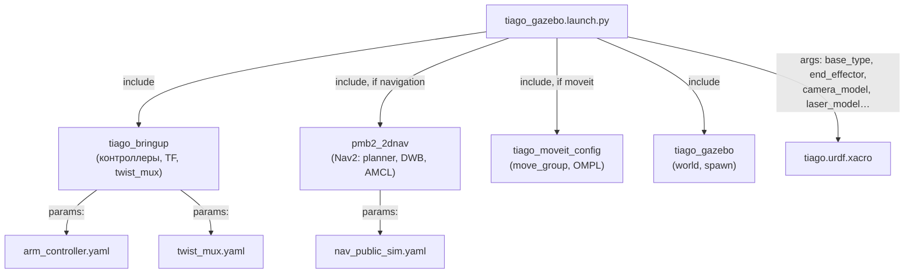

# Launch и параметры — запуск TIAGo

Launch-файлы TIAGo — это Python-скрипты, которые запускают десятки узлов, задают им параметры, аргументы и включают/отключают подсистемы через булевы флаги.

> Связь с теорией: [`2_knowledge/launch.md`](../../2_knowledge/launch.md) — launch-файлы, [`2_knowledge/parameters.md`](../../2_knowledge/parameters.md) — параметры и YAML.

---

## Реализация в TIAGo

**56 launch-файлов** и **170+ YAML-конфигов** в workspace. Основной launch-файл:

```bash
ros2 launch tiago_gazebo tiago_gazebo.launch.py [аргументы]
```

**Главные аргументы:**

| Аргумент | Значения | По умолчанию | Описание |
|---|---|---|---|
| `base_type` | `pmb2`, `omni_base` | `pmb2` | Тип базы |
| `arm_type` | `tiago-arm`, `no-arm` | `tiago-arm` | Наличие руки |
| `end_effector` | `pal-gripper`, `pal-hey5`, `robotiq-2f-85`, … | `pal-gripper` | Эндектор |
| `camera_model` | `orbbec-astra`, `asus-xtion`, `no-camera` | `orbbec-astra` | Камера |
| `laser_model` | `sick-571`, `sick-561`, `hokuyo`, `no-laser` | `sick-571` | Лазер |
| `navigation` | `true`, `false` | `false` | Включить Nav2 |
| `moveit` | `true`, `false` | `false` | Включить MoveIt2 |
| `slam` | `true`, `false` | `false` | Включить SLAM |
| `is_public_sim` | `true`, `false` | `true` | Режим симуляции |

**Основные YAML-конфиги:**

| Конфиг | Пакет | Назначение |
|---|---|---|
| `nav_public_sim.yaml` | `pmb2_2dnav` | Nav2 planner, controller, costmaps |
| `arm_controller.yaml` | `tiago_controller_configuration` | Параметры arm_controller |
| `twist_mux.yaml` | `tiago_bringup` | Приоритеты источников cmd_vel |
| `tiago_motions_general.yaml` | `tiago_bringup` | Предзаписанные движения play_motion2 |

---

## Как это выглядит



---

## Команды проверки

```bash
# Запуск с конкретными аргументами
ros2 launch tiago_gazebo tiago_gazebo.launch.py navigation:=True moveit:=True is_public_sim:=True

# Посмотреть все параметры узла
ros2 param list /controller_manager

# Получить значение параметра
ros2 param get /controller_manager use_sim_time

# Изменить параметр на лету
ros2 param set /controller_manager use_sim_time true

# Посмотреть launch-аргументы (без запуска)
ros2 launch tiago_gazebo tiago_gazebo.launch.py --show-arguments
```

---

## Типичные ошибки

| Ошибка | Симптом | Исправление |
|---|---|---|
| Неверный путь к YAML | Параметр не виден (`ros2 param list` пустой) | Проверить `data_files` в `setup.py` |
| Аргумент не передан | Xacro собирает модель с default-значением | Явно указать все аргументы в launch |
| Launch-файл не установлен | `ros2 launch` не находит файл | Проверить `setup.py: data_files` |
| `use_sim_time` не включён | TF-дерево рассинхронизировано | Установить `use_sim_time:=True` |

---

## Расширяющий материал

### `launch_pal` — фреймворк PAL для launch-файлов

Вместо стандартного `launch_ros`, PAL использует собственную обёртку `launch_pal`, которая добавляет:
- `get_pal_configuration()` — загрузка конфигурации робота из переменных окружения
- `LaunchArgumentsBase` — базовый класс для launch-аргументов с типизацией и значениями по умолчанию
- `${VAR}`-подстановка — как в bash, но внутри launch-файлов (расширение `Substitution`)

Пример:
```python
from launch_pal import LaunchArgumentsBase, get_pal_configuration

class TiagoGazeboLaunchArguments(LaunchArgumentsBase):
    base_type = LaunchConfiguration('base_type', default='pmb2')
    arm_type = LaunchConfiguration('arm_type', default='tiago-arm')
```

### 56 launch-файлов и 170 YAML — как они связаны

Архитектура запуска строится по принципу **include-дерева**:
- `tiago_gazebo.launch.py` — корневой, 22 аргумента
- → включает `tiago_bringup.launch.py` (контроллеры, TF, twist_mux)
- → включает `pmb2_navigation.launch.py` (если `navigation:=True`)
- → включает `tiago_moveit_config` launch (если `moveit:=True`)
- → включает Gazebo world + spawn (всегда)

Каждый launch-файл использует свой набор YAML-конфигов, которые лежат рядом в `config/`.

---

## Ссылки

- [Creating a launch file (Jazzy)](https://docs.ros.org/en/jazzy/Tutorials/Intermediate/Launch/Creating-Launch-Files.html)
- [tiago_gazebo.launch.py](../ros2_ws/src/tiago_simulation/tiago_gazebo/launch/tiago_gazebo.launch.py)
- [TIAgo_configuration.md — аргументы launch](../TIAgo_configuration.md#64-аргументы-launch-файла)
