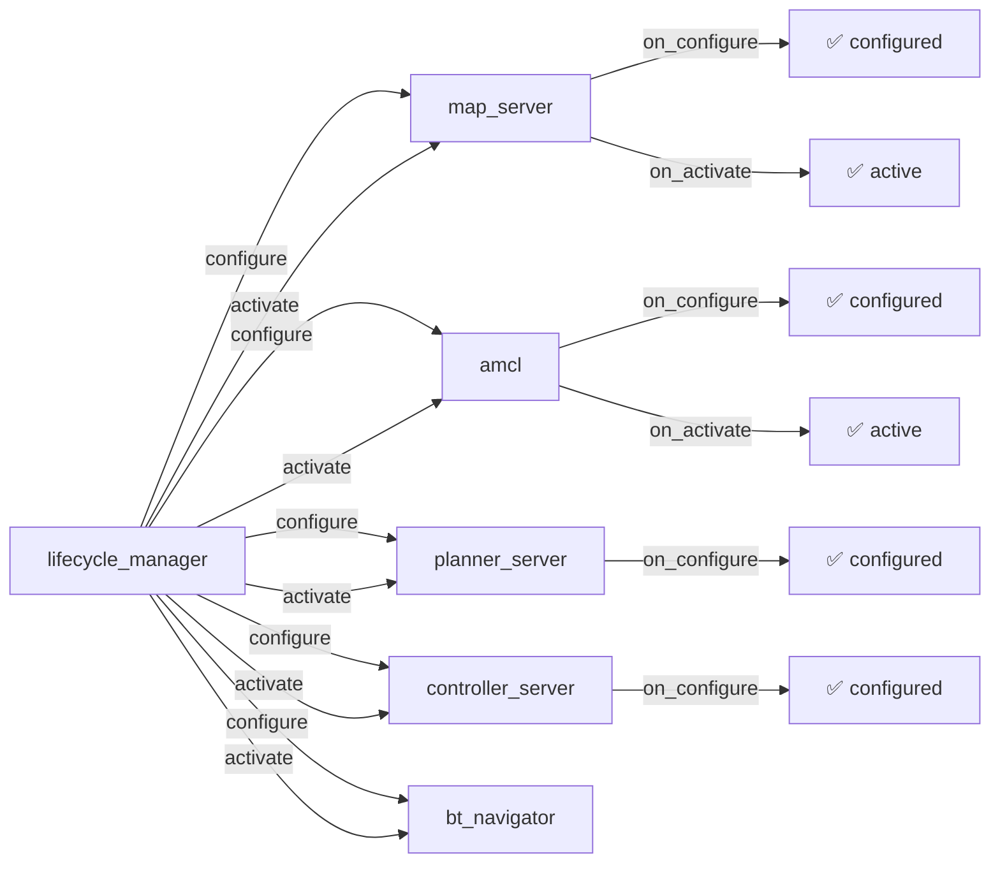

# Lifecycle-узлы TIAGo — управляемый жизненный цикл

Lifecycle node имеет состояния (unconfigured, inactive, active, finalized) и переходы между ними. Это гарантирует, что узел полностью готов к работе, прежде чем начнёт принимать данные.

> Связь с теорией: [`2_knowledge/lifecycle.md`](../../2_knowledge/lifecycle.md) — lifecycle node, состояния, переходы.

---

## Реализация в TIAGo

Все узлы Nav2 — lifecycle nodes. Управляются через `lifecycle_manager`.

| Узел | Пакет | Назначение |
|---|---|---|
| `planner_server` | Nav2 | Планировщик пути |
| `controller_server` | Nav2 | Локальный контроллер DWB |
| `bt_navigator` | Nav2 | Поведенческое дерево |
| `amcl` | Nav2 | Локализация |
| `lifecycle_manager` | Nav2 | Управляет жизненным циклом узлов Nav2 |

**Порядок активации (задаётся в lifecycle_manager):**
1. `map_server` → загружает карту
2. `amcl` → начинает локализацию
3. `planner_server` → готов к планированию
4. `controller_server` → готов к движению
5. `bt_navigator` → готов к навигации

Если один узел не активировался — вся цепочка останавливается.

---

## Как это выглядит



---

## Команды проверки

```bash
# Посмотреть состояние lifecycle узла
ros2 lifecycle list /amcl

# Перевести узел в другое состояние
ros2 lifecycle set /amcl configure    # unconfigured → inactive
ros2 lifecycle set /amcl activate     # inactive → active
ros2 lifecycle set /amcl deactivate   # active → inactive
ros2 lifecycle set /amcl cleanup     # inactive → unconfigured

# Проверить, все ли Nav2-узлы активны
ros2 node list | while read node; do
    echo "=== $node ==="
    ros2 lifecycle list $node 2>/dev/null || echo "(not a lifecycle node)"
done
```

---

## Типичные ошибки

| Ошибка | Симптом | Исправление |
|---|---|---|
| Узел не активирован | Nav2 не работает, команды игнорируются | Вызвать `lifecycle_manager` или вручную `lifecycle set ... activate` |
| Узел в finalized | Не принимает переходы | Узел нужно пересоздать (shutdown → restart) |
| Забыли configure перед activate | Ошибка «cannot transition» | Сначала configure, потом activate |
| Lifecycle manager не запущен | Все узлы в unconfigured | Добавить lifecycle_manager в launch |

---

## Расширяющий материал

### Lifecycle Manager Nav2

`lifecycle_manager` — это узел, который:
- отслеживает состояние lifecycle-узлов
- активирует их в правильном порядке
- при ошибке одного узла — деактивирует всю цепочку и повторяет попытку
- предоставляет сервисы `/manage_nodes`, `/is_lifecycle_finished`

В TIAGo lifecycle_manager — часть Nav2 (пакет `pmb2_2dnav`). Он запускается автоматически при `navigation:=True`.

### Bond (heartbeat) — контроль жизни узлов

Lifecycle-узлы Nav2 поддерживают **bond** (heartbeat-соединение). Если lifecycle_manager перестаёт получать heartbeat от узла (узел упал), он деактивирует всю цепочку и переводит систему в безопасное состояние. Это критично для робота: если `controller_server` упал во время движения — нужно немедленно остановить колёса.

### Как PAL использует managed nodes для моторов

PAL Robotics рекомендует делать драйверы моторов, лазеров и камер lifecycle nodes (хотя в Gazebo-симуляции это необязательно). Причины:
1. Мотор не должен получать `/cmd_vel`, пока не настроен порт (конфигурация → `on_configure`)
2. Лазер не должен публиковать сканы, пока не проведена самодиагностика (`on_activate`)
3. Аварийная остановка через `on_deactivate` — корректное завершение без «зависания» приводов

В симуляции это симулируется через `GazeboSystemHardware`, но в реальном TIAGo каждый драйвер — lifecycle node.

---

## Ссылки

- [About Lifecycle (Jazzy)](https://docs.ros.org/en/jazzy/Concepts/Intermediate/About-Lifecycle.html)
- [Nav2 Lifecycle Manager](https://docs.nav2.org/configuration/packages/configuring-lifecycle.html)
- [TIAgo_conf_improv_plan.md Раздел 4](../TIAgo_conf_improv_plan.md#4-пример-lifecyclenode-тема-12)
