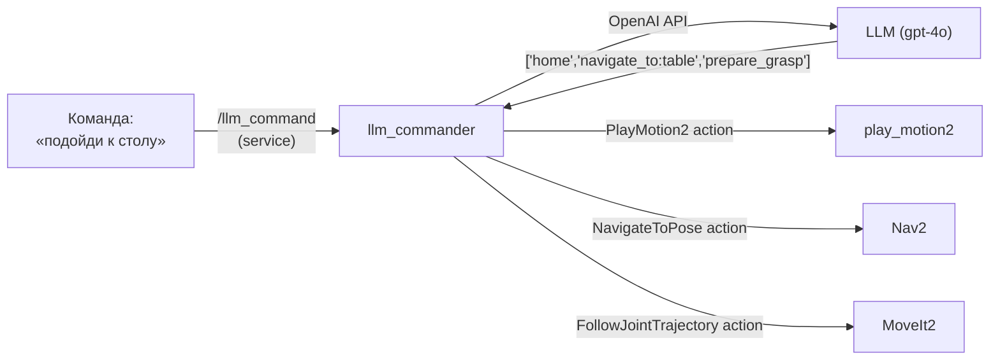

# LLM Bridge — голосовое управление TIAGo

LLM bridge принимает текстовую команду, отправляет её в большую языковую модель, получает последовательность ROS2-действий и выполняет их: движения руки через play_motion2, навигация через Nav2, манипуляция через MoveIt2.

> Связь с теорией: [`2_knowledge/llm_bridge.md`](../../2_knowledge/llm_bridge.md) — архитектура LLM bridge, policy layer, safety layer.
>
> **Статус:** в процессе реализации (пакет `tiago_llm_bridge`).

---

## Реализация в TIAGo

| Компонент | Пакет | Статус |
|---|---|---|
| LLM commander | `tiago_llm_bridge` (новый) | 🚧 В разработке |
| play_motion2 actions | `play_motion2` | ✅ Работает: 10 предзаписанных движений |
| Nav2 action | `pmb2_2dnav` | ✅ `/navigate_to_pose` |
| MoveIt2 action | `tiago_moveit_config` | ✅ `/arm_controller/follow_joint_trajectory` |

**Архитектура:**

```
голос (ASR) → текст → /llm_command (service) → LLM (OpenAI API) →
→ ["unfold_arm", "navigate_to:table", "home"] →
→ play_motion2 → Nav2 → MoveIt2
```

**Параметры** (из `config/llm_config.yaml`):
- `api_key_env: "OPENAI_API_KEY"` — переменная окружения с ключом API
- `model: "gpt-4o"` — модель LLM
- `system_prompt: ""` — системный промпт (опционально)

---

## Как это выглядит



---

## Команды проверки (после реализации)

```bash
# Запустить симуляцию
ros2 launch tiago_gazebo tiago_gazebo.launch.py is_public_sim:=True

# Запустить LLM bridge
export OPENAI_API_KEY="sk-..."
ros2 launch tiago_llm_bridge llm_bridge.launch.py

# Отправить команду
ros2 service call /llm_command std_srvs/srv/Trigger '{data: "подойди к столу и возьми чашку"}'
```

---

## Типичные ошибки

| Ошибка | Симптом | Исправление |
|---|---|---|
| Нет API-ключа | LLM возвращает fallback-движение 'home' | Установить `OPENAI_API_KEY` |
| Неверная команда | LLM генерирует неизвестное действие | Действие игнорируется, логируется WARN |
| LLM генерирует не JSON | Парсинг падает | Обработка JSONDecodeError → fallback |

---

## Расширяющий материал

### PlayMotion2 как safety envelope

LLM bridge не генерирует движения — он выбирает из **списка разрешённых предзаписанных движений**: `home`, `unfold_arm`, `prepare_grasp`, `open`, `close`, `wave`, `reach_floor`, `reach_max`, `head_tour`, `inspect_surroundings`. Это ключевой механизм безопасности: LLM может ошибиться в генерации, но не может заставить руку принять неизвестную позу.

Любое действие вне этого списка игнорируется с предупреждением `Unknown action`.

### Tool calling vs free-form prompt

Production-версия LLM bridge использует **function calling** (tool calling) — LLM не генерирует произвольный JSON, а выбирает из предопределённых функций с известными аргументами. Это даёт:
- предсказуемый формат ответа (не ломается парсинг)
- валидацию аргументов на стороне LLM (модель сама проверяет типы)
- возможность расширять список функций без правки промпта

Версия в проекте (`llm_commander.py`) использует упрощённый free-form промпт для демонстрации.

### Управление API-ключами в контейнере

API-ключ не должен храниться в коде или YAML-конфиге. Варианты для контейнера:
- передача через `-e OPENAI_API_KEY=...` при `docker run`
- через файл `.env` в `devcontainer.json` (`"runArgs": ["--env-file",".devcontainer/.env"]`)
- через `os.environ.get()` с fallback-значением (как в реализации)

Второй вариант — предпочтительный: ключ не попадает в Git.

---

## Ссылки

- [MCP Specification](https://modelcontextprotocol.io/)
- [OpenAI Function Calling](https://platform.openai.com/docs/guides/function-calling)
- [TIAgo_conf_improv_plan.md Раздел 3](../TIAgo_conf_improv_plan.md#3-новый-пакет-tiago_llm_bridge--llm-commander-тема-17)
