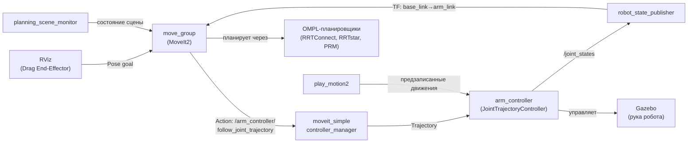

# Манипуляция TIAGo — MoveIt2

TIAGo оснащён 7-DOF манипулятором (4 плечо + 3 запястье). MoveIt2 планирует траектории руки с учётом модели робота, столкновений и ограничений суставов.

> Связь с теорией: [`2_knowledge/moveit2_bridge.md`](../../2_knowledge/moveit2_bridge.md) — стек MoveIt2, MoveGroup, планирование.

---

## Реализация в TIAGo

| Компонент | Пакет | Назначение |
|---|---|---|
| Планировщик | `tiago_moveit_config` | `move_group` — основной интерфейс MoveIt2 |
| Планировщики траекторий | `tiago_moveit_config` | OMPL (RRTConnect, RRTstar, PRM), Chomp |
| Кинематика | `tiago_moveit_config` | KDL, TRAC-IK (решение обратной кинематики) |
| Мост к ros2_control | `moveit_ros_control_interface` | Передача траекторий от MoveIt → ros2_control |
| Предзаписанные движения | `play_motion2` | `play_motion2` action server |

**Ключевые топики:**
- `/joint_states` — текущее состояние суставов
- `/robot_description` — URDF-модель (получает move_group)

**Ключевые actions:**
- `/arm_controller/follow_joint_trajectory` — исполнение траектории руки
- `/play_motion2` — воспроизведение предзаписанного движения

**Параметры:**
- `tiago_moveit_config/config/kinematics.yaml` — кинематические настройки
- `tiago_moveit_config/config/joint_limits.yaml` — пределы суставов
- `tiago_moveit_config/config/ompl_planning.yaml` — OMPL-планировщики

---

## Как это выглядит



---

## Команды проверки

```bash
# Терминал 1: симуляция + MoveIt2
ros2 launch tiago_gazebo tiago_gazebo.launch.py moveit:=True is_public_sim:=True

# Терминал 2: MoveIt RViz
ros2 launch tiago_moveit_config moveit_rviz.launch.py

# Терминал 3: активация панели MotionPlanning
RVN=$(ros2 node list | grep rviz | tail -1) && \
ros2 param set "$RVN" robot_description "$(ros2 topic echo /robot_description --once --field data 2>/dev/null)"

# Проверить move_group
ros2 node info /move_group

# Проверить play_motion2
ros2 action send_goal /play_motion2 play_motion2_msgs/action/PlayMotion2 "{motion_name: 'home', skip_planning: false}"
```

---

## Типичные ошибки

| Ошибка | Симптом | Исправление |
|---|---|---|
| MoveIt RViz без панели | Нет оранжевого маркера на эндекторе | Выполнить команду активации (шаг 3) |
| Планирование не удаётся | «Planning failed» в логе | Цель вне рабочей области; self-collision; joint limits |
| play_motion2 не находит движение | «Motion not found» | Проверить `tiago_bringup/config/motions/` |
| Контроллер не активен | MoveIt ждёт «waiting for controller» | `ros2 control set_controller_state arm_controller active` |

---

## Расширяющий материал

### Переключение эндекторов с разной кинематикой

TIAGo поддерживает три типа эндекторов: PAL-gripper (2-DOF), HEY5 (19 DOF, 3 активных), Robotiq 2F-85/2F-140. MoveIt2-конфигурация для каждого своя:

```bash
# PAL-gripper (по умолчанию)
ros2 launch tiago_gazebo tiago_gazebo.launch.py moveit:=True end_effector:=pal-gripper

# HEY5
ros2 launch tiago_gazebo tiago_gazebo.launch.py moveit:=True end_effector:=pal-hey5

# Robotiq 2F-85
ros2 launch tiago_gazebo tiago_gazebo.launch.py moveit:=True end_effector:=robotiq-2f-85
```

Каждый эндектор требует свой launch-аргумент при запуске `moveit_rviz.launch.py` (с тем же `end_effector`), иначе RViz покажет не ту модель.

### Компенсация гравитации

TIAGo использует `GravityCompensationController` — особая конфигурация arm_controller, которая компенсирует вес руки, чтобы эндектор можно было двигать мышью в RViz без «падения» модели. Параметры в `tiago_controller_configuration/config/`.

### play_motion2 как шаблон безопасности

`play_motion2` — фреймворк предзаписанных движений: `home`, `unfold_arm`, `prepare_grasp`, `open`, `close`, `wave`, `reach_floor`, `reach_max`, `head_tour`, `inspect_surroundings`. Каждое движение — JSON-массив целевых углов суставов с проверкой на столкновения. Это **шаблон безопасного API**: LLM bridge не генерирует движения — он выбирает из списка разрешённых.

### Почему `moveit_ros_control_interface` собран из исходников

В официальном репозитории `moveit2` (humble) пакет `moveit_ros_control_interface` отсутствует в deb-пакетах. PAL (и этот проект) используют `fetch_external.sh` для sparse checkout этого пакета из исходников — классический production приём для работы с недостающими зависимостями.

---

## Ссылки

- [MoveIt2 Documentation](https://moveit.picknik.ai/)
- [TIAgo_configuration.md Режим 3](../TIAgo_configuration.md#режим-3-манипуляция-через-moveit2)
- [play_motion2 `tiago_bringup/config/motions/`](../ros2_ws/src/tiago_robot/tiago_bringup/config/motions/tiago_motions_general.yaml)
