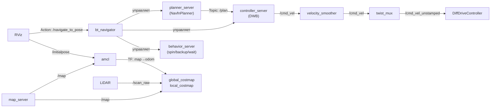

# Навигация TIAGo — Nav2

TIAGo использует Navigation2 для автономного перемещения по карте: построение маршрута, объезд препятствий, локализация.

> Связь с теорией: [`2_knowledge/nav2_bridge.md`](../../2_knowledge/nav2_bridge.md) — общее устройство Nav2, action `/navigate_to_pose`, costmap.

---

## Реализация в TIAGo

| Компонент            | Пакет                | Узел                            |
| -------------------- | -------------------- | ------------------------------- |
| Планировщик пути     | `pmb2_2dnav`         | `planner_server` (NavfnPlanner) |
| Локальный контроллер | `pmb2_2dnav`         | `controller_server` (DWB)       |
| Поведенческое дерево | `pmb2_2dnav`         | `bt_navigator`                  |
| Recovery поведения   | `pmb2_2dnav`         | `behavior_server`               |
| Локализация          | `pmb2_2dnav`         | `amcl`                          |
| Lifecycle manager    | `pmb2_2dnav`         | `lifecycle_manager`             |
| Карта                | `pal_maps`           | `map_server`                    |
| SLAM                 | (через `slam:=True`) | `slam_toolbox`                  |

**Ключевые топики:**
- `/scan_raw` (sensor_msgs/LaserScan) — вход: данные лазера
- `/odom` (nav_msgs/Odometry) — вход: одометрия
- `/map` (nav_msgs/OccupancyGrid) — карта (из map_server или SLAM)
- `/cmd_vel` (geometry_msgs/Twist) — выход: команда скорости → velocity_smoother → twist_mux

**Ключевые actions:**
- `/navigate_to_pose` (nav2_msgs/NavigateToPose) — основная цель навигации
- `/compute_path_to_pose`, `/follow_path` — внутренние

**Параметры:** `pmb2_navigation/pmb2_2dnav/config/nav_public_sim.yaml`

---

## Как это выглядит



---

## Команды проверки

```bash
# Запуск (терминал 1, после start_gui.sh)
ros2 launch tiago_gazebo tiago_gazebo.launch.py navigation:=True is_public_sim:=True

# Проверить, что Nav2 узлы активны
ros2 node list | grep -E "planner|controller|bt_navigator|amcl"

# Посмотреть action
ros2 action info /navigate_to_pose

# Проверить карту
ros2 topic echo /map --once

# Проверить локализацию
ros2 topic echo /amcl_pose --once
```

После запуска в RViz: **2D Pose Estimate** (указать позицию) → **Navigation2 Goal** (указать цель).

---

## Типичные ошибки

| Ошибка | Симптом | Исправление |
|---|---|---|
| Нет карты | `/map` пустой, RViz без подложки | Добавить `map_server` в launch или запустить SLAM |
| AMCL не локализуется | Частицы размазаны, робот «не знает где он» | Указать 2D Pose Estimate в RViz |
| `/cmd_vel` не приходит | Робот стоит после отправки goal | Проверить lifecycle_manager: все ли Nav2-узлы в active? |
| Nav2 не установлен | `planner_server` не найден | `sudo apt install ros-humble-nav2-bringup` |

---

## Расширяющий материал

### DLO vs DiffDriveController — два источника одометрии

| Источник | Пакет | Когда используется | Особенность |
|---|---|---|---|
| `DiffDriveController` | ros2_control | `is_public_sim:=True` | Одометрия по вращению колёс — погрешность накапливается |
| `DLO` (LiDAR+IMU) | Внешний | `is_public_sim:=False` | Одометрия по сканам лазера + IMU — точнее, но сложнее |

В public-режиме одометрию считает `DiffDriveController` (просто и наглядно). В private — используется `DLO` или `gazebo_ros` state publisher. Для обучения предпочтителен public-режим.

### AMCL vs SLAM Toolbox — когда что

| Сценарий | Инструмент | Что делает |
|---|---|---|
| Есть карта, нужно локализоваться | `amcl` | 500–2000 частиц, matching scan → map |
| Карты нет, нужно построить | `slam_toolbox` | CeresSolver, loop closing, online mapping |

Одновременный запуск обоих — ошибка. Переключение через launch-аргумент `slam:=True`/`False`.

### Поведенческие деревья (Behavior Trees)

Nav2 в TIAGo использует не жёсткий код, а поведенческие деревья — последовательность узлов: «спланировать путь → поехать → если ошибка: перепланировать → если не получилось: spin (разворот) → backup (отъезд) → wait (ожидание)».
Дерево загружается из `pmb2_2dnav/config/nav2_behavior_tree.xml`.

### Lifecycle Manager Nav2

Все узлы Nav2 — lifecycle nodes. `lifecycle_manager` активирует их в правильном порядке:
1. `map_server` → `amcl` → `planner_server` → `controller_server` → `bt_navigator`
2. Если один узел не активировался — вся цепочка останавливается

---

## Ссылки

- [Nav2 Documentation](https://docs.nav2.org/)
- [TIAgo_configuration.md Режим 2](../TIAgo_configuration.md#режим-2-автономная-навигация)
