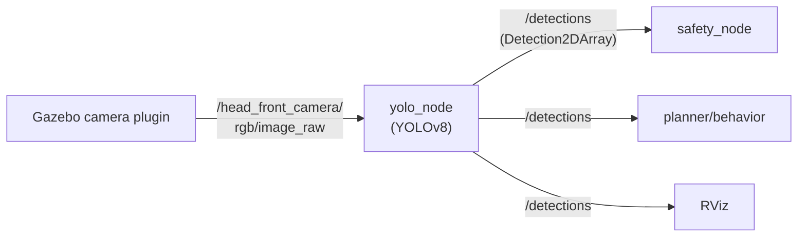

# Восприятие TIAGo — YOLO камера

YOLO-узел подписывается на видеопоток с головной камеры TIAGo, прогоняет кадр через YOLOv8 и публикует найденные объекты в `/detections`.

> Связь с теорией: [`2_knowledge/yolo_bridge.md`](../../2_knowledge/yolo_bridge.md) — YOLO как ROS2-узел, граница perception/control.
>
> **Статус:** в процессе реализации (пакет `tiago_yolo`).

---

## Реализация в TIAGo

| Компонент | Пакет (проект) | Статус |
|---|---|---|
| Камера (в Gazebo) | встроенный плагин | ✅ Работает: `/head_front_camera/rgb/image_raw` |
| YOLO-узел | `tiago_yolo` (новый) | 🚧 В разработке |
| Тип сообщения | `vision_msgs/Detection2DArray` | 🚧 |

**Планируемая архитектура:**

```
camera (Gazebo) → /head_front_camera/rgb/image_raw → yolo_node (YOLOv8 nano)
  → /detections (vision_msgs/Detection2DArray)
```

**Параметры YOLO-узла** (из `config/yolo_params.yaml`):
- `model: "yolov8n.pt"` — модель (nano, быстрая, ~6 MB)
- `confidence_threshold: 0.5` — порог уверенности
- `input_topic: "/head_front_camera/rgb/image_raw"`
- `output_topic: "/detections"`

**Зависимости:** `rclpy`, `cv_bridge`, `sensor_msgs`, `vision_msgs`, `ultralytics`

---

## Как это будет выглядеть



---

## Команды проверки (после реализации)

```bash
# Терминал 1: симуляция
ros2 launch tiago_gazebo tiago_gazebo.launch.py is_public_sim:=True

# Терминал 2: YOLO
ros2 launch tiago_yolo yolo_bringup.launch.py

# Терминал 3: проверка детекций
ros2 topic echo /detections

# Посмотреть, что видит камера
ros2 topic echo /head_front_camera/rgb/image_raw --once | od -A x -t x1z -v | head -5
```

---

## Типичные ошибки

| Ошибка | Симптом | Исправление |
|---|---|---|
| Модель не загружается | YOLO падает при старте | `pip install ultralytics`, модель скачается сама |
| Нет кадров с камеры | `/head_front_camera/rgb/image_raw` пуст | Проверить, что Gazebo запущен с камерой (лаунч без `camera_model:=no-camera`) |
| cv_bridge не найден | ImportError при старте | `sudo apt install ros-humble-cv-bridge` |

---

## Расширяющий материал

### PAL использует `pal_detection_msgs`, не `vision_msgs`

В официальных пакетах PAL детекции передаются через `pal_detection_msgs/msg/Detection2D` — это нестандартный тип, отличный от `vision_msgs/Detection2D`. Если вы пишете узел, совместимый с официальной кодовой базой PAL, используйте `pal_detection_msgs`. Если для курса — `vision_msgs` (стандарт ROS2).

### cv_bridge и video_recording_msgs

PAL использует `pal_video_recording_msgs` для управления видеозаписью: сервисы start/stop записи с камеры. Это пример, как PAL расширяет стандартный ROS2-стек под специфические нужды (запись экспериментов).

### Почему YOLO — отдельный пакет, а не часть tiago_gazebo

YOLO имеет тяжёлые зависимости (PyTorch, ultralytics), которые не нужны для базовой симуляции. Вынос в отдельный пакет `tiago_yolo` позволяет:
- не раздувать Docker-образ для тех, кому Perception не нужен
- обновлять YOLO-модели без пересборки контейнера
- отключать perception одной командой (не включать в launch)

---

## Ссылки

- [vision_msgs](https://github.com/ros-perception/vision_msgs)
- [cv_bridge](https://github.com/ros-perception/vision_opencv)
- [TIAgo_conf_improv_plan.md Раздел 2](../TIAgo_conf_improv_plan.md#2-новый-пакет-tiago_yolo--yolo-detection-node-тема-16)
