# RMW и DDS — транспорт TIAGo

TIAGo использует Cyclone DDS в качестве RMW-реализации (ROS Middleware). DDS отвечает за обнаружение узлов, сериализацию и передачу данных по сети.

> Связь с теорией: [`2_knowledge/rmw.md`](../../2_knowledge/rmw.md) — RMW как адаптер, [`2_knowledge/dds_protocol.md`](../../2_knowledge/dds_protocol.md) — DDS протокол, [`2_knowledge/discovery.md`](../../2_knowledge/discovery.md) — discovery.

---

## Реализация в TIAGo

| Компонент | Значение |
|---|---|
| Middleware | DDS (CycloneDDS) |
| RMW | `rmw_cyclonedds_cpp` |
| ROS_DOMAIN_ID | 0 (по умолчанию) |
| Discovery | Автоматический (SPDP + EDP по multicast UDP) |
| Transport | UDP multicast/unicast, Shared Memory (в одном процессе) |

**Где зафиксировано:**
- В `.bashrc` контейнера: `export RMW_IMPLEMENTATION=rmw_cyclonedds_cpp`
- В `ROS_DOMAIN_ID` — значение не задано явно, используется 0

---

## Как это выглядит

```mermaid
graph LR
    NODE1["Node: talker"] -->|"publish()"| RCL["rcl/rclcpp/rclpy"]
    RCL -->|"RMW API"| RMW["rmw_cyclonedds_cpp"]
    RMW -->|"DDS write"| DDS["CycloneDDS"]
    DDS -->|"UDP multicast"| NET["Сеть / Shared memory"]
    NET -->|"UDP receive"| DDS2["CycloneDDS"]
    DDS2 -->|"DDS read"| RMW2["rmw_cyclonedds_cpp"]
    RMW2 -->|"callback"| NODE2["Node: listener"]
```



---

## Команды проверки

```bash
# Какой RMW используется
printenv RMW_IMPLEMENTATION

# Диагностика ROS2
ros2 doctor
ros2 doctor --report

# Проверить discovery
ros2 node list          # все узлы должны быть в списке
ros2 topic list         # все топики должны быть видны

# Проверить domain ID
ros2 topic info /chatter
```

---

## Типичные ошибки

| Ошибка | Симптом | Исправление |
|---|---|---|
| Разные RMW | Узлы не видят друг друга | Все узлы должны использовать одинаковую RMW |
| Разные ROS_DOMAIN_ID | Узлы не видят друг друга | Проверить `echo $ROS_DOMAIN_ID` на всех терминалах |
| Multicast заблокирован | Discovery не работает | Проверить сетевые настройки: multicast должен быть разрешён |
| Fast DDS вместо Cyclone | Робот работает, но нестабильно | Установить `RMW_IMPLEMENTATION=rmw_cyclonedds_cpp` |

---

## Расширяющий материал

### Почему PAL рекомендует CycloneDDS

PAL Robotics рекомендует CycloneDDS (а не Fast DDS по умолчанию) по нескольким причинам:
- **Стабильность multi-robot:** CycloneDDS показывает меньше сбоев discovery при работе нескольких роботов в одной сети
- **Несколько сетевых интерфейсов:** TIAGo может иметь Ethernet и Wi-Fi одновременно; CycloneDDS корректно обрабатывает мультихоминг
- **Историческая совместимость:** PAL использует CycloneDDS с первых версий ROS2 на своих роботах

### XML-конфигурация Cyclone в контейнере

CycloneDDS может быть дополнительно настроен через XML-файл (переменная `CYCLONEDDS_URI`):

```bash
export CYCLONEDDS_URI='<CycloneDDS><Domain><General><DontRoute>true</DontRoute></General></Domain></CycloneDDS>'
```

Этот флаг отключает маршрутизацию DDS-трафика между разными сетевыми интерфейсами — полезно, если робот подключён и к Ethernet, и к Wi-Fi, и вы не хотите дублирования трафика.

### DDS tuning для multi-robot

При работе нескольких TIAGo в одной сети каждый должен иметь уникальный `ROS_DOMAIN_ID` (0–101, по REP-2000). Это критически важно: два робота с одинаковым domain ID будут получать команды друг друга.

```bash
export ROS_DOMAIN_ID=1   # первый робот
export ROS_DOMAIN_ID=2   # второй робот
```

---

## Ссылки

- [About Different Middleware Vendors](https://docs.ros.org/en/humble/Concepts/Intermediate/About-Different-Middleware-Vendors.html)
- [CycloneDDS Documentation](https://cyclonedds.io/docs/)
- [REP-2000: ROS_DOMAIN_ID](https://www.ros.org/reps/rep-2000.html)
