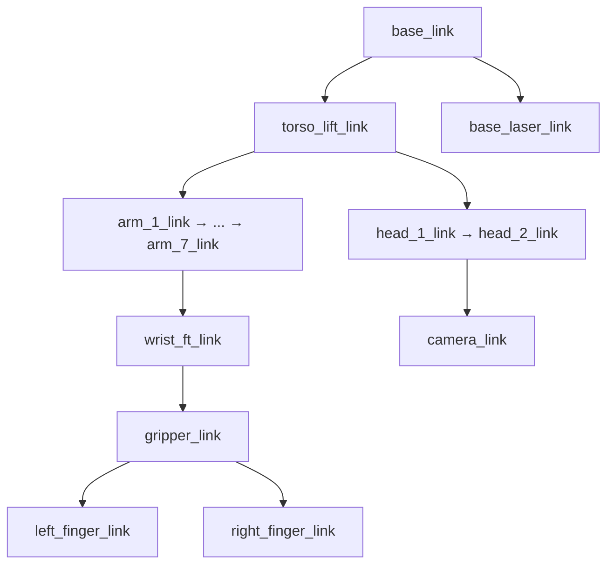

# URDF/Xacro — модель робота TIAGo

URDF (Unified Robot Description Format) — формат описания геометрии, суставов и масс робота. Xacro — макро-язык, который делает URDF компактным и параметризуемым.

> Связь с теорией: [`2_knowledge/urdf_xacro.md`](../../2_knowledge/urdf_xacro.md) — links, joints, Xacro-макросы.

---

## Реализация в TIAGo

| Компонент | Пакет | Файл |
|---|---|---|
| Главная модель | `tiago_description` | `robots/tiago.urdf.xacro` |
| Мобильная база PMB2 | `pmb2_description` | `robots/pmb2.urdf.xacro` |
| Манипулятор | `tiago_description` | папка `urdf/` с Xacro-компонентами |
| Сенсоры (камера, лазер) | `pal_urdf_utils` | Модульные макросы |
| Эндекторы | `pal_gripper_description`, `pal_hey5_description`, `pal_robotiq_description` | Xacro для каждого |

**Ключевые links:**
- `base_link` — корневой фрейм робота
- `torso_lift_link` — выдвижной торс (ход 35 см)
- `arm_1_link` … `arm_7_link` — 7 суставов манипулятора
- `wrist_ft_link` — силомоментный датчик
- `gripper_link` — база эндектора (далее: пальцы)

**Ключевые joints:**
- `torso_lift_joint` — призматический (высота)
- `arm_1_joint` … `arm_7_joint` — вращательные (7-DOF)
- `head_1_joint`, `head_2_joint` — pan/tilt головы
- `gripper_left_finger_joint`, `gripper_right_finger_joint` — пальцы

---

## Как это выглядит



---

## Команды проверки

```bash
# Посмотреть URDF-модель
ros2 topic echo /robot_description --once | xmllint --format - | less

# Посмотреть joint limits
ros2 topic echo /robot_description --once | xmllint --format - | grep -A5 limit

# Текущие углы суставов
ros2 topic echo /joint_states --once
```

---

## Типичные ошибки

| Ошибка | Симптом | Исправление |
|---|---|---|
| Неправильные массы/инерции | Робот «улетает» в Gazebo | Проверить `<inertial>` в каждом link |
| Имена joints не совпадают | Контроллер не находит сустав | Имена в URDF и в YAML ros2_control должны совпадать |
| Забыт `robot_state_publisher` | Нет transforms, tf2_echo пуст | Добавить узел в launch |
| Xacro не собран | URDF не генерируется | `xacro tiago.urdf.xacro > tiago.urdf` |

---

## Расширяющий материал

### Параметрическая сборка модели

Одна Xacro-модель `tiago.urdf.xacro` собирает робота из параметров, которые передаются через launch-аргументы:

```bash
ros2 launch tiago_gazebo tiago_gazebo.launch.py \
    base_type:=pmb2 \
    arm_type:=tiago-arm \
    end_effector:=pal-hey5 \
    camera_model:=orbbec-astra \
    laser_model:=sick-571
```

Внутри Xacro: `$(arg base_type)` → include нужного URDF-фрагмента базы, `$(arg end_effector)` → подключение правильного эндектора. Это позволяет из одной модели собрать 20+ конфигураций робота без дублирования кода.

### `pal_urdf_utils` — переиспользуемые URDF-компоненты

PAL вынес общие URDF-компоненты в отдельный пакет `pal_urdf_utils`:
- макросы камер: Orbbec Astra, Asus Xtion, Intel RealSense
- макросы лазеров: SICK-561, SICK-571, Hokuyo
- макросы FT-датчиков

Это позволяет подключить сенсор одной строкой Xacro:
```xml
<xacro:include filename="$(find pal_urdf_utils)/urdf/sensors/sick_571.urdf.xacro"/>
<xacro:sick_571 parent="base_link" name="base_laser" />
```

### Управление видимостью collision и inertial

Для симуляции все link должны иметь корректные `<inertial>` (иначе Gazebo считает нулевые массы). Для RViz достаточно только `<visual>`. TIAGo использует Xacro-флаги `collision_ar_mode` для переключения между режимами без редактирования модели.

---

## Ссылки

- [URDF Tutorials (Jazzy)](https://docs.ros.org/en/jazzy/Tutorials/Intermediate/URDF/URDF-Main.html)
- [tiago.urdf.xacro](../ros2_ws/src/tiago_robot/tiago_description/robots/tiago.urdf.xacro)
- [pal_urdf_utils макросы](../ros2_ws/src/pal_urdf_utils/)
- [TIAgo_configuration.md — варианты исполнения](../TIAgo_configuration.md#варианты-исполнения)
