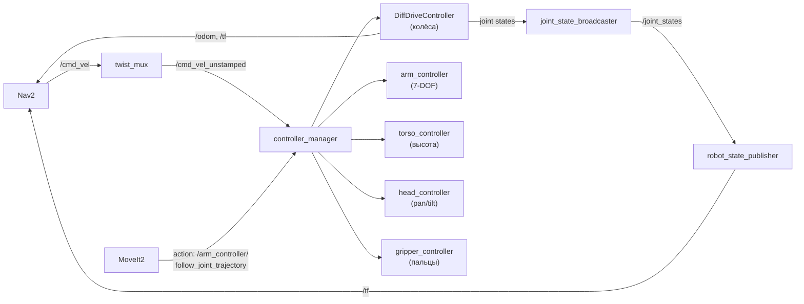

# ros2_control — управление приводами TIAGo

ros2_control — слой между ROS2-командами и приводами робота (реальными или симулированными). Принимает команды скорости и траектории, передаёт их моторам, публикует состояние суставов и одометрию.

> Связь с теорией: [`2_knowledge/ros2_control.md`](../../2_knowledge/ros2_control.md) — controller_manager, hardware interfaces, цепочка управления.

---

## Реализация в TIAGo

| Контроллер | Тип | Пакет | Назначение |
|---|---|---|---|
| `DiffDriveController` | `diff_drive_controller` | `pmb2_controller_configuration` | Управление колёсами, одометрия |
| `arm_controller` | `joint_trajectory_controller` | `tiago_controller_configuration` | 7 суставов руки |
| `torso_controller` | `joint_trajectory_controller` | `tiago_controller_configuration` | Выдвижной торс |
| `head_controller` | `joint_trajectory_controller` | `tiago_controller_configuration` | Pan/tilt головы |
| `gripper_controller` | `joint_trajectory_controller` | (зависит от эндектора) | Открытие/закрытие пальцев |
| `joint_state_broadcaster` | `joint_state_broadcaster` | общий | Публикация `/joint_states` |
| `ft_sensor_controller` | `fts_broadcaster` | PAL | Силомоментный датчик |

**Ключевые пакеты конфигурации:**
- `tiago_controller_configuration` — контроллеры руки, торса, головы
- `pmb2_controller_configuration` — контроллеры дифференциальной базы

---

## Как это выглядит



---

## Команды проверки

```bash
# Список контроллеров
ros2 control list_controllers

# Состояние конкретного контроллера
ros2 control list_controllers --verbose

# Hardware interfaces
ros2 control list_hardware_interfaces

# Переключение состояния контроллера
ros2 control set_controller_state arm_controller active

# Проверить joint_states
ros2 topic echo /joint_states --once
```

---

## Типичные ошибки

| Ошибка | Симптом | Исправление |
|---|---|---|
| Контроллер в inactive | Узел не принимает команды | Активировать через `ros2 control set_controller_state ... active` |
| Имена joints не совпадают | Контроллер не находит сустав | Проверить URDF vs YAML: имена должны совпадать |
| `gazebo_ros2_control` plugin отсутствует | Gazebo не реагирует на команды | Добавить plugin в URDF внутри тега `<gazebo>` |
| DiffDriveController не активируется | Колёса не вращаются | Проверить `wheel_separation` и `wheel_radius` в конфиге |

---

## Расширяющий материал

### Несколько hardware interfaces: sim vs real

TIAGo поддерживает два типа hardware interfaces:
- `GazeboSystemHardware` — когда робот в симуляции (используется в этом проекте)
- `RealRobotHardware` — когда робот на реальном железе (через ROS2-Control)

Переключение между ними — на уровне YAML-конфига: достаточно поменять `type:` в `ros_controllers.yaml`, код узлов не меняется.

### Gravity compensation controller

`arm_controller` в TIAGo имеет особый режим — `GravityCompensationController`. Когда активен, он удерживает руку в заданной позе, компенсируя силу тяжести. Это позволяет:
- двигать эндектор мышью в RViz без «падения» модели
- безопасно останавливать руку в любой позе при отмене траектории

Параметры: `tiago_controller_configuration/config/arm_controller.yaml`, раздел `gravity_compensation`.

### Controller switching на лету

controller_manager ros2_control позволяет переключать контроллеры без остановки всей системы. Например, при смене эндектора (PAL-gripper → HEY5 → Robotiq) нужно:
1. Деактивировать текущий gripper_controller
2. Загрузить новый (из соответствующего пакета)
3. Активировать

Это делается одной командой: `ros2 control switch_controllers --deactivate old --activate new`.

---

## Ссылки

- [ros2_control Documentation](https://control.ros.org/)
- [TIAgo_configuration.md — контроллеры](../TIAgo_configuration.md#41-ядро-tiago)
- [tiago_controller_configuration](../ros2_ws/src/tiago_robot/tiago_controller_configuration/config/)
