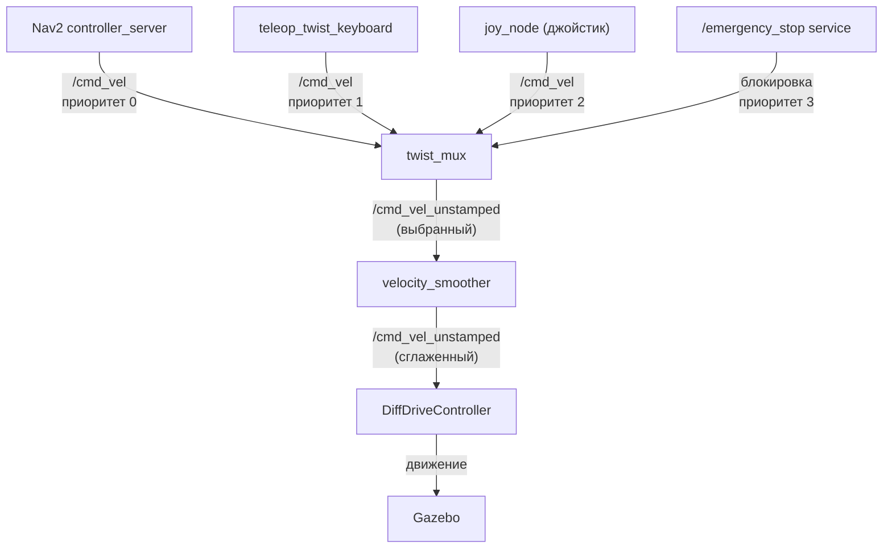

# Safety — архитектура безопасности TIAGo

Несколько уровней защиты: аппаратный E-stop, приоритеты команд скорости (twist_mux), мониторинг батареи, watchdog контроллеров.

> Связь с теорией: [`2_knowledge/safety.md`](../../2_knowledge/safety.md) — safety layer, E-stop, watchdog, DDS Security.

---

## Реализация в TIAGo

| Компонент | Узел/Пакет | Назначение |
|---|---|---|
| Приоритеты скорости | `twist_mux` | 4 уровня приоритета для источников `/cmd_vel` |
| Сглаживание | `velocity_smoother` | Плавное ускорение/торможение |
| E-stop | `/emergency_stop` service | Аварийная остановка |
| Батарея | `/battery_state` | Мониторинг заряда (в симуляции — симулируется) |
| Controller Manager | `ros2_control` | Watchdog контроллеров |

**4 уровня приоритетов twist_mux:**

| Приоритет | Источник | Пример |
|---|---|---|
| 0 (низкий) | Nav2 controller_server | Автономная навигация |
| 1 | teleop_twist_keyboard | Ручное управление с клавиатуры |
| 2 | joy_node (джойстик) | Оператор с пультом |
| 3 (высокий) | emergency_stop | Аварийная остановка |

**Принцип:** если активен источник с более высоким приоритетом — команды от низкоприоритетных источников игнорируются. Если E-stop активен — робот не едет ни при каких обстоятельствах.

---

## Как это выглядит



---

## Команды проверки

```bash
# Проверить twist_mux
ros2 topic echo /mobile_base_controller/cmd_vel_unstamped

# Вызвать E-stop
ros2 service call /emergency_stop std_srvs/srv/Trigger

# Посмотреть battery
ros2 topic echo /battery_state --once

# Проверить состояние контроллеров
ros2 control list_controllers
```

---

## Типичные ошибки

| Ошибка | Симптом | Исправление |
|---|---|---|
| Робот не реагирует на телеоп | `/cmd_vel` не доходит до колёс | Проверить, не активен ли E-stop; проверить приоритеты twist_mux |
| Дёрганое движение | twist_mux переключается между источниками | Отключить неиспользуемые источники |
| Патч diagnostic_aggregator | Ошибка при сборке | `patch_twist_mux.py` комментирует diagnostic_aggregator |

---

## Расширяющий материал

### Патч `diagnostic_aggregator` — ROS1 → ROS2 workaround

TIAGo использует `twist_mux` из официального набора PAL, который в конфигурации упоминает `diagnostic_aggregator` — пакет ROS1, не портированный на ROS2 Humble. Вместо форка twist_mux (что сломало бы совместимость с PAL), проект использует скрипт `patch_twist_mux.py`, который комментирует строки с `diagnostic_aggregator` в YAML-конфиге.

Это классический production приём: не менять чужой код, а адаптировать конфигурацию пост-фактум.

### Safety node — что делать, если его нет

В текущей версии TIAGo нет отдельного `safety_node` — его роль выполняют:
- `twist_mux` (приоритеты скорости)
- `controller_manager` (watchdog контроллеров)
- `/emergency_stop` service (E-stop через стандартный ROS2-интерфейс)

Если safety_node появится (например, как изолированный пакет), его задачами будут:
- подписка на `/battery_state` (аварийная остановка при низком заряде)
- подписка на `/detections` (остановка при обнаружении человека на пути)
- мониторинг `/joint_states` (аварийная остановка при превышении лимитов)

---

## Ссылки

- [twist_mux конфигурация](../ros2_ws/src/tiago_robot/tiago_bringup/config/twist_mux.yaml)
- [patch_twist_mux.py](../ros2_ws/patch_twist_mux.py)
- [TIAgo_configuration.md — twist_mux](../TIAgo_configuration.md#4-архитектура-ros2)
