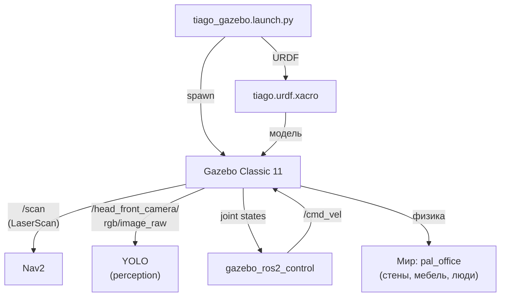

# Симуляция TIAGo — Gazebo Classic 11

TIAGo работает в симуляции Gazebo Classic 11. Модель робота описана в URDF/Xacro, физический движок Gazebo считает динамику, публикует сенсоры и принимает команды управления через `ros2_control`.

> Связь с теорией: [`2_knowledge/simulation.md`](../../2_knowledge/simulation.md) — simulation-first подход, Gazebo, URDF.

---

## Реализация в TIAGo

| Компонент | Пакет | Назначение |
|---|---|---|
| Физический движок | Gazebo Classic 11 | Симуляция физики, сенсоров |
| Миры | `pal_gazebo_worlds` | 80+ моделей, 15+ миров (office, home, hospital…) |
| URDF/Xacro | `tiago_description` | Модель робота |
| ros2_control bridge | `gazebo_ros2_control` | Связь Gazebo ↔ ros2_control |
| Плагины | `pal_gazebo_plugins` | Кастомные C++ плагины PAL |

**Основные launch-файлы симуляции:**
- `tiago_gazebo.launch.py` — главный launch (Gazebo + спавн + контроллеры)
- Внутри: `spawn_entity` (gazebo_ros) — спавнит модель робота в мире

**Параметры запуска:**
- `is_public_sim:=True` — public-режим (DiffDriveController)
- `is_public_sim:=False` — private-режим (DLO)
- `world_name` — выбор мира Gazebo (pal_office по умолчанию)

---

## Как это выглядит



---

## Команды проверки

```bash
# Базовый запуск симуляции
ros2 launch tiago_gazebo tiago_gazebo.launch.py is_public_sim:=True

# Какой мир используется (по умолчанию: pal_office)
ros2 launch tiago_gazebo tiago_gazebo.launch.py world_name:=pal_office

# Проверить, что Gazebo запущен
ros2 topic echo /clock --once

# Посмотреть модели в мире
gz model --list        # Gazebo Classic CLI
```

---

## Типичные ошибки

| Ошибка | Симптом | Исправление |
|---|---|---|
| Gazebo не запускается | Ошибка «cannot connect to gzserver» | Пересобрать контейнер; проверить `start_gui.sh` |
| Робот «улетает» | Модель взлетает или проваливается | Проверить `<inertial>` в URDF — массы должны быть > 0 |
| Нет `/clock` | Топик времени пуст | Gazebo не публикует `/clock` — проверить `use_sim_time:=True` |
| Зависание на `spawn_entity` | Launch ждёт, модель не появляется | Проверить Gazebo GUI (вкладка: World — есть ли model?) |
| Нет сенсоров | `/scan` пуст, `/image_raw` пуст | Проверить модель камеры/лазера в аргументах launch |

---

## Расширяющий материал

### 80+ моделей Gazebo от PAL

`pal_gazebo_worlds` включает не только миры, но и отдельные модели мебели, людей, предметов — более 80 объектов. Это позволяет:
- ставить препятствия на пути робота (Insert → Construction Cone)
- создавать реалистичные сценарии (офис, дом, больница)
- проверять навигацию с динамическими препятствиями

### Кастомные C++ Gazebo-плагины PAL

В пакете `pal_gazebo_plugins` находятся C++-плагины, которые добавляют поведение, отсутствующее в стандартных `libgazebo_ros_*`:
- `PalGazeboRosCamera` — камера с RGB + Depth + синхронизацией
- `PalGazeboRosLaser` — 2D LiDAR с настраиваемым шумом
- `PalGazeboRosIMU` — IMU с дрейфом (реалистичная симуляция)

Эти плагины подключаются через URDF-тег `<gazebo>`:
```xml
<gazebo reference="base_laser_link">
    <sensor type="ray" name="laser">
        <plugin name="laser_plugin" filename="libPalGazeboRosLaser.so"/>
    </sensor>
</gazebo>
```

### Переключение миров (office/home/hospital)

TIAGo может работать в разных мирах без каких-либо изменений в коде — достаточно указать `world_name`:

```bash
ros2 launch tiago_gazebo tiago_gazebo.launch.py world_name:=small_office
ros2 launch tiago_gazebo tiago_gazebo.launch.py world_name:=home
ros2 launch tiago_gazebo tiago_gazebo.launch.py world_name:=hospital
```

Каждый мир имеет свою карту (в `pal_maps/`) для Nav2, своё расположение мебели и сценарий использования.

---

## Ссылки

- [Gazebo Classic Tutorials (Jazzy)](https://docs.ros.org/en/jazzy/Tutorials/Advanced/Simulators/Gazebo/Gazebo.html)
- [pal_gazebo_worlds](../ros2_ws/src/pal_gazebo_worlds/)
- [TIAgo_configuration.md — команды запуска](../TIAgo_configuration.md#6-основные-команды-запуска)
